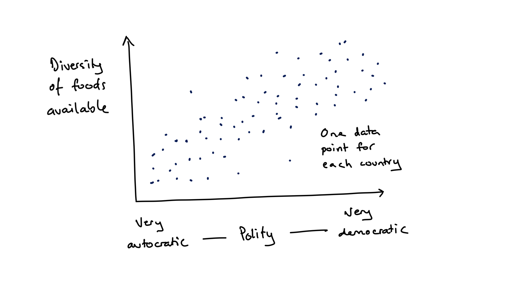
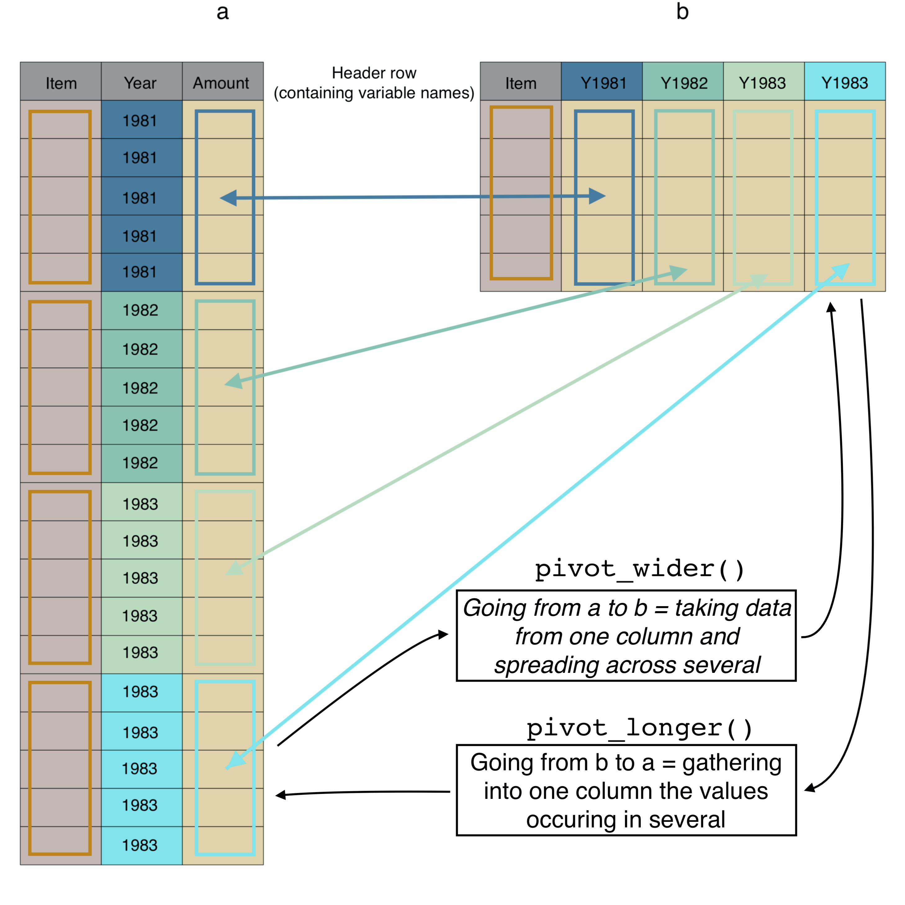

**At least say how we could improve country name matching. And that this is an interoperability issue...**


#  Are diets more diverse in more democratic countries? {#WFD-food-pol}


## About this Workflow Demonstration

This Workflow Demonstation (WD) is primarily a supplement to the material in the book *Insights from Data with R* by Petchey, Beckerman, Childs, and Cooper. If you don't understand something here, have a look at that book (perhaps again), or search for help, or get in touch with us.


##  Introduction to the study and data

In this WD we will look at the diversity of food available to people living in different countries. And we will explore one potential influence of this diversity---the political system (e.g. democratic) of the country. Why this? Why not?

There are likely lots of factors governing the diversity of food available to the population of a country, and political system is just one. We could also look at gross domestic product, location, population size, and so on. But let's keep things relatively simple and straightforward for the moment. You can make things more complex if you choose to look further into the question. Just wait until after you've mastered the simpler though perhaps still challenging enough material in this WD.

To be clear, we are asking the question of whether the diversity of food available to the population of a country is associated with the political system of that country. We hypothesise that more freedom will result in more diversity of food availability (figure \@ref(fig:insight-sketch-2)). We will restrict ourselves to two variables: diversity of food available and political system. Let's explore two measures of diversity: the richness of food items, which is just the number of different food types, and a measure of diversity known as the Shannon index, which is greater if there are more food types and if the amount of each is more evenly distributed among them. As far as we know, the analyses are novel. Any insights will be new! Though, since the findings are not published / peer reviewed, they should be treated as preliminary and (as usual) be critically assessed.

```{r insight-sketch-2, fig.cap='A hypothetical outcome of the demonstration study of relationship between the political system of a country and the diversity of food available.', out.width='70%', fig.asp=.75, fig.align='center', echo=FALSE}

```


The data about what food is available to the people of a country is from the *FAO Food balance data* and that about the political system is from the *Polity&trade; IV Project dataset*. Hence there will be something fundamentally new in this WD: importing two different datasets and then merging them together. This turns out to be quite a lot of work!

As you work through this chapter, try following along with the [workflow/checklist on this web page](UPDATE). 


## Understanding the data

As mentioned in the book, a number of features of data determine the types of insights we can get from it, and how much we might trust those insights. Though we start with two datasets, we will have only one after we merge them. Here are the features of that one dataset, and how these affect the insights we might reveal.

* **Number of variables:** We will have only three variables, the food diversity, the political system, and the year. This is to keep the question and how to answer it simple. It is likely, however, that factors as well as, or other than, the political system of a country affect the food diversity available. Further analyses should explore these other factors (though we do not attempt them here). 


* **Number of observations:** You will see that we have nearly 200 observations (the number of countries in the final dataset) for each year in the study. So in total we have multiple hundreds of observations (later we see exactly how many), which is quite a lot when one has only two variables. This means we have quite good potential to see patterns that could (if there were fewer observation) otherwise be unclear.


* **Variables describing interventions/manipulations**: This is not a randomised experiment; none of the variables describes a manipulation/intervention that is accompanied by a control. Hence we are exploring relationships and will not be able to make inferences about causation.


* **Amount of correlation among explanatory variables:** We will only have two explanatory variables (political system and year). Because we will remove the year variable (explore data independent of year), in a sense, we will have no correlation between explanatory variables. Recall that inference is harder if we have multiple explanatory variables and there was some correlation among them. So we are keeping things simple and easy, at least in terms of inference.


* **How independent are observations:** Each observation is of a country in a year. I.e. we have multiple observations for each country, and these make up a time series. Put another way, we have "repeated measures" of each country. Hence two observations close together in time are less independent than two far apart in time, and two from the same country are less independent than two from different countries. There are other sources of non-independence that we will pay less attention to, such as geographic closeness, political history, and climate. It would be interesting to investigate their importance, however.


##  A little preparation

Make a new folder for this Workflow Demonstration (WD), and in it a folder called in `data` (this will contain any datasets for this WD/project). In *RStudio* create an *RStudio* project and save it in the project folder (not the `data` folder). Close *RStudio* and double click on the project file to re-open *RStudio*. Create a new R script file. In this new script file make a comment about what it will contains, and then load some libraries.


```{r message=FALSE, warning=FALSE}
# Load the libraries we use
library(dplyr)
library(ggplot2)
library(readr)
library(stringr)
library(lubridate)
library(tidyr)
library(vegan)
library(ggbeeswarm)
```


```{block, type="action"}
Install the `vegan` and `ggbeeswarm` library if you have not already done so, otherwise `library(vegan)` and `library(ggbeeswarm)` will not work. Look at the **Packages** section of the Getting Acquainted chapter of the book if you need help with installation.
```

Then save the file and give it a filename that is intuitive, unique, and memorable, so it is easy to search for and find.


##   Polity data: origins, acquire, import, clean, tidy, NAs, duplicates

### Data origins and acquisition

 A *Polity* is a political entity. The Polity&trade; IV Project aimed to code the characteristics of states in the world for the purposes of comparative quantitative analysis (i.e. what we're about to do!). The project and resulting datasets are used for monitoring regime change and for studying effects of regime authority. Nevertheless, the data "should be treated and interpreted with due caution. Its primary utility is in investigative research which should be augmented by more detailed analysis."; quoted from page 16 of the [Dataset User's Manual](https://www.systemicpeace.org/inscr/p4manualv2016.pdf) by Monty G. Marshall, Ted Robert Gurr, and Keith Jaggers. Find out more about the project at the [Center for Systemic Peace](http://www.systemicpeace.org/polityproject.html) website.

You can acquire the complete dataset from [this web page of the Center for Systemic Peace](http://www.systemicpeace.org/inscrdata.html). Scroll down to the section *Polity IV: Regime Authority Characteristics and Transitions Datasets* and click on the *Excel Series* link to the right of the *Polity IV Annual Time-Series, 1800-2017* box. The downloaded file is an Excel spreadsheet. We recommend you open this in Excel and save it as a `csv` file, but we'll also show below how to read the Excel file into R.

Looking at the dataset in Excel or something similar, you will see that the dataset has 17'061 observations and 36 variables. We will work with only three of the variables:

* **country** - a character variable containing the country name.
* **year** - a numeric variable containing the year.
* **polity2** - a numeric variable giving the *revised combined polity score* from +10 (strongly democratic) to -10 (strongly autocratic).

The *revised combined polity score*, according to the *Dataset User's Manual* is a score varying from -10 for the most autocratic of polities, up to +10 for the most democratic, that "provides a convenient avenue for examining general regime effects in analyses". (The manual also states a number of reasons for treating the variable with caution.)

### Data import

If you did the preparation mentioned above, made a project, made a `csv` file from the Excel file, and put the data file in the data folder of that project, and you started R by double clicking on the RProject file (or switching to this project), the following code should import the data:

```{r}
rm(list = ls())
pol <- read_csv("data/p4v2015.csv")
```

If you want to read direct from the Excel file, use this (you will need to install the __readxl__ package if you have not already done so):

```{r eval=FALSE}
library(readxl)
pol <- read_excel("data/p4v2015.xls")
```

Is RStudio showing the correct number of rows and columns (you would have had to look at the file in Excel (or another spreadsheet program to know this)? Is it showing the appropriate variable types for each of the three variables? The `Country` variable should be a character variable, the other two should be numeric.

### Tidy and clean

We only want to work with three of the 36 variables, so we use the `select` function to keep only these, and at the same time rename them to standardise the variable names by making them all begin with an upper case letter and then have lower case:

```{r}
pol <- pol %>%
  select(Country = country,
         Year = year,
         Polity2 = polity2)
```


```{block, type="info"}
Please note that here and below we do not describe at all or in much detail the R code used. This is because it is described in detail in the book.
```

Because we assign the result of this `select` operation to `pol` we are getting rid of the previous version of `pol` with this new one.

The data set has only one observation (of Polity) per row, so it is already tidy... we do not need to gather observations from multiple columns into one.

### Deal with NAs

As usual, we should see if there are any NAs in the data, understand what they might result from, and decide what how to treat them. The next code makes a new dataset `pol_nas` that contains the rows that contain a missing value in any of the three variables.

```{r}
pol_nas <- pol %>%
  filter_all(any_vars(is.na(.))) 
pol_nas
```

This dataset contains 235 rows, and viewing it we see that it is only the `polity2` variables that contains NAs. I.e. there are 235 missing `Polity2` values.

A brief perusal of the *Dataset User's Manual* reveals a clue about why some of all of these NAs exist: "Cases of foreign “interruption” are treated as “system missing."

Let us decide to treat these missing values as unimportant for further analyses, and to not include them in any further analyses, by removing them from the dataset. We know this should leave us with 17,061 - 235 = 16,826 rows of data:

```{r}
pol <- pol %>%
  na.omit()
```

You should see that we do, indeed, now have 16,826 rows of data.

We might now like to clean up a little, by removing the `pol_nas` dataset from R (you will see it dissapear from the *Environment* pane):

```{r}
rm(pol_nas)
```


### Check for innapropriate duplicate observations

We expect there to not exist any more than one Polity score per country per year. We check this by first selecting only the `Country` and `Year` variables, then getting any duplicate rows with the `duplicated` function. The `duplicated` function returns a vector of TRUE and FALSE, where TRUE means a row is a duplicate. We can then get the `sum` of this vector to count the number of TRUEs (i.e. number of duplicated rows).

```{r}
pol %>%
  select(Country, Year) %>%
  duplicated() %>%
  sum()
```

Interesting. There are two cases that contain duplicates. Let's see which Country-Year combinations these are:

```{r}
pol %>%
  select(Country, Year) %>%
  filter(duplicated(.))
```

And look at the duplicated cases:

```{r}
pol %>%
  filter(Country == "Yugoslavia",
         Year == 1991)
```

```{r}
pol %>%
  filter(Country == "Ethiopia",
         Year == 1993)
```

Looking through the *Dataset User's Manual* does not readily shed light on these duplicates. Let's remove both cases of duplication by taking the average `Polity2` score. This should result in a dataset with 16,824 rows.

```{r}
pol <- pol %>%
  group_by(Country, Year) %>%
  summarise(Polity2 = mean(Polity2))
```


```{block, type="warning"}
We just made a decision about how to deal with the duplicated scores. We took the mean. There are other things we could have done (e.g. use a different measure of central tendency, such as the median). So we have made an arbitrary choice in our analysis pathway. We went down one path when we could have chosen another. We need to 1) recognise and record when we make decisions like this, and 2) check to see if our conclusions are robust to variation in what we choose to do. (Here, conclusions would not be affected by using the median, as there are only two values being averaged.)
```

Let us again check for duplicate Country-Year combinations:

```{r}
pol %>%
  select(Country, Year) %>%
  duplicated() %>%
  sum()
```

Good, there are now no duplicated cases.

### Check ranges of numeric variables

Its a good idea to check if numeric variables contain any unexpected values. From the *Dataset User's Manual* we expect the `Year` variable to be values including the 19th, 20th, and 21st centuries, and the `Polity2` variable to have a minimum of -10 and maximum of 10. Write code to check these are true in the imported data. Make the summary dataset and have a look at it for yourself. You should see that the expected ranges of the year and polity variables are respected.

```{r}
pol_summ <- pol %>%
  summarise(min_year = min(Year),
            max_year = max(Year),
            min_pol = min(Polity2),
            max_pol = max(Polity2))
```

We will now save this dataset so we don't have to run all that code every time:

```{r}
write_rds(pol, "data/pol.RDS")
```


## First insights from the polity data

Before we move on to the FAO dataset, lets have quick look at some features of the Polity data. 

Let's look at the frequency distributions of the two numeric variables. We will do this efficiently by first gathering the information in the two variables into one, then plotting. This is the method used and described in detail in the *Insights* book. Here is the code that produces figure \@ref{fig:pol1}:

```{r pol1, fig.cap='Frequency distributions of the polity score and of the year in which observations were made.', out.width='100%', fig.asp=.75, fig.align='center'}
pol %>%
  pivot_longer(names_to = "Variable", values_to = "Value", cols = 2:3) %>%
  ggplot() +
  geom_histogram(aes(x = Value), bins = 21) +
  facet_wrap( ~ Variable, scales = "free", nrow = 2)
```

The `Polity2` variable is numeric with a minimum values of -10 and a maximum of 10 (as we already knew). The most common polity score is very democratic (+10), there are relatively few moderately democratic polity score, and there are a number of several levels of autocratic polity scores. That is, the distribution appears somewhat bimodial. We must be aware, that these are distributions of each score, with many scores for each country. 

The `Year` variable is distributed with more values in the later years than earlier years---it makes some sense that we have more information about the recent than about the distant past. None of the three variables have any missing values, so we expect to see no warnings about excluded data points, and to not have to deal with any other issues caused by missing values. Great!

Try to write code to find out each of these:

* Number of countries in the dataset.
* Number of years in the dataset, and first year, and last year.
* How many records (years of data) for each country.
* First and last year of data for each country.
* Whether there are gaps (years without data) in each country.
* Number of countries with gaps (i.e. no data in some years).
* Number of countries with records in each year.
* Temporal change in polity in some countries that interest you.
* Graphs to visualise these where appropriate.

Answers for some of these are below.

Number of countries, years, first year and last year:

```{r}
pol %>%
  summarise(num_countries = length(unique(Country)),
            num_years = length(unique(Year)),
            first_year = min(Year),
            last_year = max(Year))
```

For each country, number of years of records, first year, last year, number of years between first and last, and if there are gaps of no data:

```{r}
per_country_pol <- pol %>%
  group_by(Country) %>%
  summarise(num_years = length(unique(Year)),
            first_year = min(Year),
            last_year = max(Year),
            years_interval = last_year - first_year +1,
            gaps = num_years != years_interval)
```

Number of countries with gappy information:

```{r}
per_country_pol %>%
  summarise(sum(gaps))
```


Code for a graph of the number of countries with records in each year:

```{r eval=FALSE}
pol %>%
  group_by(Year) %>%
  summarise(num_countries = length(unique(Country))) %>%
  ggplot() +
  geom_point(aes(x=Year, y=num_countries))
```


Change in polity in some countries of interest (to the authors at least) (the code below produces figure \ref{fig:pol2}:

```{r pol2, fig.cap='Change in polity in some countries of interest (to the authors at least)', out.width='100%', fig.asp=.75, fig.align='center'}
countries_of_interest <- c("Bhutan", "Brasil", "Cuba", "Cambodia",
                           "Estonia", "Yugoslavia", "Australia")
pol %>%
  filter(Country %in% countries_of_interest) %>%
  ggplot() +
  facet_wrap(~ Country) +
  geom_point(aes(x=Year, y=Polity2, col=Country)) +
  geom_line(aes(x=Year, y=Polity2, col=Country))
```

*Insight* That the polity score of a country can change so greatly has implications for our subsequent analyses. For example, calculating and using a mean polity score for each country (average across years) may be unwise as it would ignore such temporal change.


## Acquire, import, check the FAO Food balance sheet data

Let us now move on to the dataset we use to get the food diversity measure for each country. The dataset gives, for various *Areas* in the world, such as countries and continents, the annual supply and use of various food *Items* such as "Wheat and products", "Honey", and "Crustaceans". Supply and use includes what are called *Elements* of the food supply equation; elements such as "Production", Import Quantity", and "Food supply quantity (kg/capita/yr)". The words *Area*, *Item*, and *Element* are emphasised because they are variables in the dataset, as described further below. There is a lot of important information about this data available on the [FAO Food Balance Sheet Metadata]( http://www.fao.org/faostat/en/#data/FBS/metadata) web page web page. And even more in the [Food Balance Sheet Methodology Handbook](http://www.fao.org/economic/ess/fbs/ess-fbs02/en/).

The full dataset is 206 MB and can be downloaded from the FAO web page. Importing this takes about 4 seconds on a reasonably fast laptop. As you will see below, we will make a smaller dataset (about 15 MB) and save it, so we don't have to work with the full dataset.

The full dataset has 238,560 rows and 113 variables. The first nine variables are:

* **Area.code** - A numeric variable containing number codes for the *Area* variable.
* **Area** - A character variable containing the geographic area that a row is about, for example, a country name or a continent name.
* **Item.code** - A numeric variable containing number codes for the food items in the *Item* variable.
* **Item** - A character variable containing the food item a row is about.
* **Element.code** - A numeric variable contains number codes for the *Element* variable.
* **Element** - A character variable showing the particular supply or utlilisation element a row is about. These are the elements of the food balance equation.
* **Unit** - The units of measure of the quantity in the row.
* **Y1961** - A numeric variable giving the quantity in year 1961
* **Y1961F** - A character variable giving information about the data (F is for Flag), such as "Official data", "FAO data", etc.

The *Definitions and standard button* on this web page http://www.fao.org/faostat/en/#data/FBS/metadata leads to much much more information about the variables and entries.

** Seems that the data have been updated online!!! and don't include many years.**

You could get the FAO food balance data from the [FAO website](http://www.fao.org/faostat/en/#data/FBS/metadata). The datafile you would get is called `FoodBalanceSheets_E_All_Data.csv` and is 206 MB, i.e. it is quite big. We need, however, only a small amount of the information in this dataset. So to make things easier for ourselves and for you, we created a smaller dataset containing only the data we need, and saved it as an *RDS* type of file. This file type fits more data into a smaller space---the resulting file `FoodBalanceSheets_E_All_Data_reduced.Rdata` is 1.9MB. You can download that data here: [direct download small FAO balance sheet data](data/FoodBalanceSheets_E_All_Data_reduced.Rdata).

If you do want to go through the process of getting the 206MB file, and reducing it down to something more manageable, feel free to use the next code below, otherwise skip over this. It's pretty straightforward, apart from two things.

First, we give the `read_csv` an argument you didn't previously see: `encoding`. This helps `read_csv` properly recognise otherwise problematic symbols. In this case, it ensure that country names such as *Côte d'Ivoire* don't cause problems (the "ô" can otherwise do so).

Second, the penultimate line saves the produced tibble `ff` to a `Rdata` type of data file; though even that new type of instruction should be quite transparent to you by now.

```{r eval=FALSE}
# Get the full food balance sheet dataset *All data* from the FAO website:
# http://www.fao.org/faostat/en/#data/FBS/metadata.
# Reduce the size of the FAO data, so easier to deal with
# import FAO data
fbs <- read_csv("data/FoodBalanceSheets_E_All_Data.csv",
               locale = locale(encoding = 'ISO-8859-1'))
# First fix some variable names:
names(fbs) <- str_replace_all(names(fbs), c(" " = "_"))
# Remove all non-countries
fbs <- filter(fbs, Country_Code < 5000)
# keep only some of the elements
fbs <- filter(fbs, Element %in% c("Food supply quantity (kg/capita/yr)"))
# remove some other variables that won't be used
fbs <- select(fbs, -Country_Code, -Item_Code,
             -Element_Code, -Element, -Unit,
             -ends_with("F"))
# save the reduced file
saveRDS(fbs, "data/FoodBalanceSheets_E_All_Data_reduced.Rdata")
rm(fbs)
```

The next line reads in that smaller dataset:

```{r eval=TRUE}
#rm(list = ls())
fbs <- readRDS("data/FoodBalanceSheets_E_All_Data_reduced.Rdata")
```

Feel free to have a look at the dataset with the `glimpse` function. We `select` a few columns first, as otherwise the output is rather long due to there being 112 variables in the dataset.

```{r}
fbs %>%
  select(Country, Item, Y1961, Y1971, Y1981, Y1991, Y2001, Y2011) %>%
  glimpse()
```

There are 17'953 observations/rows in the dataset. The country and food item variables are character variables, the year variables (which contain amounts of food for each year) contain numeric (double) variables.

Now find the number of countries and the number of food items:

```{r}
fbs %>%
  summarise(num_countries = length(unique(Country)),
            num_food_items = length(unique(Item)))
```


There are 182 countries, so 11 fewer than in the Polity data. We will later check which ones are not in the Polity data, and if any in the Polity data are not in the FAO data. There are 114 food `Items`... wow, that's a lot of different types of food! Take a look at some of the values... it's quite interesting to see what's recorded.

If the data contained every possible combination of country and item we would expect 182 * 114 = 20'748 observations. That there are only 17'953 tells us that some combinations are missing. We will find out which these are and deal with them appropriately!

The six variables we `glimpse` above, with names like `Y1961` each contain  amounts of food available (food supply quantities in kg per capita per year) in the year referred to in the variable name (i.e. 1961) and are, as expected, numeric.

We will examine for missing values and duplicates after tidying the data, as it is then more efficient to do so.

### Tidy the FAO data {#tidying-FAO}

The FAO data is not tidy. You should be able to figure out in what respect it is "dirty". Have a think about this before reading on.

Yes! ... The same information is spread across multiple columns/variables, such that there are multiple observations in each row. More specifically, the data for each year is in a separate column---data for different years are spread across columns---each row contains lots of observations each from a different year.

It is not that this is a bad or unexpected arrangement for the data. It is, in fact, a quite compact arrangement. But it is not so easy for us to work with in R, so we will change it to be "tidy".

Before we make the data tidy, let's try to figure out how many rows it should have when tidy. We will gather food item quantity information that is currently spread across columns and put it in one column. A visualisation of a simplified version of the dataset is in Figure \@ref(fig:long-wide).

Again, how many rows should there be: the answer is the amount of information that's in the columns that we want to gather into a single column. In the untidy/wide data there are 55 variables containing the data we wish to gather (because we are not gathering the information from `Country` or `Item`). Each of those variables has 17,953 rows, so we expect the long/tidy data to have 55 * 17,953 = 987,415 rows.


```{r long-wide, fig.cap='The same data (a) in long/tidy format and (b) in wide format, with colours and arrows linking the same data in the two different formats.', out.width='100%', fig.asp=.75, fig.align='center', echo=FALSE}

```

Let's now make the data tidy, and clean up the year variable. We first gather all the same data from columns three through 57 (`3:57`) into a new variable called `Food_Supply_Quantity` and put the information about which year each observation belongs to in a new variable called `Year`. Because the column names begin with Y (e.g. `Y1961`) we then need to keep only the 2nd through to 5th character in the `Year` variable (using the `substr` function), and convert the result to a numeric type variable (with the `as.numeric` function), doing all this within a `mutate` in order to replace the old year variable with the converted one. Let's then `glimpse` the data. Here's the code for all that:

```{r eval=TRUE}
fbs_long <- fbs %>%
  pivot_longer(names_to = "Year",
               values_to = "Food_Supply_Quantity",
               cols = 3:57) %>%
  mutate(Year = as.numeric(substr(Year, 2, 5)))
glimpse(fbs_long)
```

We see that as expected the new tibble contains 987,415 observations. Excellent! This near-magical gather function has done a lot of very tedious work for us, very quickly. 

Do a few things now for yourself:

* Check we still have 182 countries and 114 food items (114).
* Confirm that the data covers the years 1961 through 2015.
* Confirm the distribution of the food supply quantity variable has lots of small values, and a few large. Is this what you would expect? Perhaps supply is large for a few basic foods (e.g. grains) and then there are lots of relatively rare food items.
* Confirm that only the food supply quantity variable contains missing values, and that there are 158,307 of them.

Beware that at present we are looking at the distribution including data from across years and countries. We will soon look more closely at this distribution.


### Clean the FAO data

Are all the years represented in the dataset? Let's look at the unique values of the year variable:

```{r}
fbs_long %>%
  pull(Year) %>%
  unique()
```

Yes, every year from 1961 to 2015 is represented (by at least one observation). There are 55 years in the dataset.


### Check for innapropriate duplicate observations

As before, we should check for innapropriate duplicate observations. Do we think there can be/should be any duplicated rows in this dataset? That would be the exactly the same value of Country, Item, Year, and Food Supply Quantity. Lets check:

```{r dupe-1, cache = FALSE}
duplicated_records <- fbs_long %>%
  filter(duplicated(.))
```

Note that the resulting tibble contains only one example of each duplicate (look at the data with `View(duplicated_rows)`.

And have a look at one of these duplicates:

```{r}
fbs_long %>%
  filter(Country == "Afghanistan",
         Item == "Eggs",
         Year == 1961)
```

There are 9,287 rows that are duplicated (not unique). Let's assume (somewhat dangerously perhaps) that these are mistaken duplicate entries, and so reduce to a dataset with only unique rows:

```{r dupe-2, cache = FALSE}
fbs_long <- unique(fbs_long)
```

Now, if we're being really paranoid, we might wonder if there were ever two different values of food supply recorded for the same country in the same year. Put another way, if we look at only the Country, Year, and Item variables, do we see duplicated rows? 

```{r dupe-3, cache = FALSE}
part_duplicated_records <- fbs_long %>%
  select(Country, Item, Year) %>%
  duplicated() %>%
  filter(fbs_long, .)
```

Looking at the result we see there are `r nrow(part_duplicated_records)` rows with duplicated `Country`, `Year`, and `Item`. This is weird. And these these duplicates are only for food items "Eggs" and "Milk - Excluding Butter". We have no idea why there are multiple entries for these two items! Here's an example of one of the duplicates:

```{r}
filter(fbs_long,
       Country == "Albania",
       Item == "Eggs",
       Year == 1961)
```

In the same year, for the same country, for the same item, there are two values of Food_Supply_Quantity: 1.5 and 1.8. But it's quite reasonable to think there should be only one. Let's solve this problem by rather arbitrarily calculating one value, the average, of these duplicated records:

```{r failing, cache = FALSE}
fbs_long <- fbs_long %>%
  group_by(Country, Year, Item) %>%
  summarise(Food_Supply_Quantity = mean(Food_Supply_Quantity))
```

```{block, type="info"}
Time to tell the truth. It took us a some considerable time to realise there were duplicated records in the FAO dataset. We only realised there must be duplicates when we tried to get the numbers to add up below. They did not before we removed the duplicates, and this led us to find the duplicates. Once we found them, we removed them above. In the text above, it may look like we were really smart to think they might occur, check for them, find them, and remove them. In reality we were not so smart. We were, however, absolutely determined to understand why the numbers did not add up. You must also be as strict in your work. After we found the duplicates in this dataset, we also looked in the Polity data, found some, and then decided to add a check for duplicates to all our Workflow Demostrations, and to advise you to make this a standard sanity check when you start looking at a dataset.
```

That was a major step forward. Now we know our dataset has only unique observations.

### Checking something else...

Now let's do another sanity check. Because there are 182 countries and 114 food items we know there could be 20,748 observations for each year. Let's see how many there really are:

```{r}
obs_per_year <- fbs_long %>%
  group_by(Year) %>%
  summarise(num = n())
```

There are only 17,589 observation per year. Either not all countries reported in all years, not all items were reported by each country in each year, or both!

First let's see how many countries there are per year:

```{r}
countries_per_year <- fbs_long %>%
  group_by(Year) %>%
  summarise(num = length(unique(Country)))
```

There are indeed 182 countries per year. All countries are included in all years.

Let's see how many Items each country reported (across all years):

```{r here_xxx}
items_per_country <- fbs_long %>%
  group_by(Country) %>%
  summarise(num = length(unique(Item)))
```

Aha. Not all items were reported by all countries. Turkmenistan reported on the fewest (62), while China reported on the most (110). Let's see if the sum of the number of items reported by each country is the number of observations per year.

```{r}
items_per_country %>%
  summarise(total = sum(num))
```

Yes! This is the same as the number of observations per year. All this pretty much guarantees that each country consistently (across all years) reported on a constant set of the items, or there is an observation for this set of items in each year.

```{block, type="safety"}
We didn't just now find out anything new about the data, but we did confirm that we understand it properly. Checks and balances increase confidence.
```


### Missing values

Now let's look at the missing values:

```{r}
fbs_long %>%
  summarise_all(list( ~ sum(is.na(.)))) %>%
  glimpse()
```

We still have 158,307 missing values. Why? Where are they coming from?

Let's dig a bit deeper by getting the number of observations per year, and the number and proportion of these that are missing values:

```{r}
obs_per_year <- fbs_long %>%
  group_by(Year) %>%
  summarise(num = n(),
            num_na = sum(is.na(Food_Supply_Quantity)),
            prop_na = num_na / num)
```

And take a look at the data using `View(obs_per_year)`. We can also see quite a bit if we plot the summary data (\@ref(fig:long-wide)) with the following code:

```{r fao-pol1, fig.cap='The number of observations, the number of missing values and the proportion of missing values in each year of the data.', out.width='100%', fig.asp=.75, fig.align='center', echo=FALSE}
obs_per_year %>%
  pivot_longer(names_to = "Variable", values_to = "Value",
               cols = c(num, num_na, prop_na)) %>%
  ggplot() +
  geom_point(aes(x = Year, y = Value)) +
  facet_wrap(~ Variable, scales = "free", ncol = 1)
```

We see that from 1961 to 1991 there are around 2,500 (15%) missing values per year.  From 1992 to 2011 there are less than 5% of the values are missing, and from 2012 to 2015 (the last year in the dataset) most or all the values are missing. Can you think of why there might be fewer missing values after 1991?

Let's look at one country (its identity might give you a clue)... Belarus. Let's get the number of values, missing values, and proportion of missing values for Belarus in each year.

```{r}
Belarus_obs_per_year <- fbs_long %>%
  filter(Country == "Belarus") %>%
  group_by(Year) %>%
  summarise(num = n(),
            num_na = sum(is.na(Food_Supply_Quantity)),
            prop_na = num_na / num)
```

Looking at this dataset we see that all values are missing until 1992, and then there are no missing values until 2012, when all are again missing. It's probably clear by now that all values are missing until 1992 because Belarus only became an independent state in 1991. Likely there are lots of other countries in the dataset that have missing values for this reason. 

There's some stuff going on:

* Belgium and Luxembourg did not separately report data during the period 1992-1999, and instead reported jointly. Then from 2000 until 2011 reported separately, so there we have lots of missing values.
* Some countries ceased to exist in their former state, e.g. Czechoslovakia after 1993 contains only missing values due to its dissolution into the Czech Republic and Slovakia.
* Similarly, the USSR reports only missing values after 1991 when the USSR ceased to exist.

And why more missing values from 2012 to 2015? Actually, the description of the data on the FAO web site says the data is from 1961 to only 2013, so it's not surprising that 2014 and 2015 are empty. We will remove these years. We don't know why there are more missing values in 2012 and 2013, so let's also remove those:

```{r}
fbs_long <- filter(fbs_long, Year < 2012)
```

### More cleaning

This seems still rather messy! Let's aim for a dataset that contains only country/year combinations where a country actually existed (i.e. there were not all NAs reported). And also a dataset in which there is an entry for all 114 food items for each country-year combination (by putting zeros in for no reported item). (Note that this could be quite dangerous, as its possible that an item not being reported is not because it was not present in that country and year. It may have been not reported for other reasons.)

First we get a list of the years in which each country does not contain all missing values. This we will use as a master list of years and countries to include in our analysis. We will not include year/country combinations where there were only missing values (the reason we need to be this specific is that we will soon turn the missing values into zeros). Let's get that list of country/year combinations to include:

```{r}
country_year_not_all_missing <- fbs_long %>%
  group_by(Country, Year) %>%
  summarise(keep = n() != sum(is.na(Food_Supply_Quantity))) %>%
  filter(keep) %>%
  select(-keep) %>%
  ungroup()
```

Does that look rather complicated? The difficult(ish) line is the summarise, in which we create a new variable `keep` that is TRUE or FALSE depending if all values of `Food_Supply_Quantity` are NA or not. The `n()` give the number of values, the `sum(is.na(Food_Supply_Quantity))` gives the number of NAs, and the `!=` asks if the two are not the same, and returns TRUE if so. The other lines should be possible for you to work out (though not necessarily easy).

Note that there are 8,272 combinations of years and countries in the dataset. This is an important number. It is the number of data points we should have data for after we calculate the diversity of food available in each country in each year.

Recall that we already decided to assume that when a country did not report a value for an item that this means there was always zero supply of that food item, so the country did not bother including it in the reported, i.e. it's really a zero. Hence we're going to pad out the data so that all countries report on all 114 items, with zero `Food Supply Quantity` for the items they did not report.

First we make a dataset with all combinations of `Country`, `Year`, and `Item`. It should have 182 * 51 * 182 = 1,058,148 rows. We use the quite lovely `expand.grid` function, which creates all possible combinations of the variables it's given. We give it all the unique values of `Country`, `Year`, and `Item`, and it expands them to give all possible combinations. Each argument to `expand.grid` should be a name-value pair, and the name should be the same in the original data, to aid further operations:

```{r}
all_cases <- expand.grid(Country = unique(pull(fbs_long, Country)),
                         Year = unique(pull(fbs_long, Year)),
                         Item = unique(pull(fbs_long, Item))) 
```

Super. This has 1,058,148 rows as expected. Now we want to only keep from this the country/year combinations for which we already found there were countries that existed. There are 8,272 of these and each should have 114 items, so we should get 943,008 observations. We do this with a `left_join` to keep only the cases of the join that have values in the first (left) dataset in the join:

```{r}
temp2 <- left_join(country_year_not_all_missing, all_cases)
```

We get a warning, and know that we should never ignore warnings. The warning is *Column `Country` joining character vector and factor, coercing into character vector*. This is caused because `expand.grid` automatically converts character variables to factors. We can stop this happening (by adding the argument `stringsAsFactors = FALSE` in our call to `expand.grid` and hopefully the remove the warning:

```{r}
all_cases <- expand.grid(Country = unique(pull(fbs_long, Country)),
                         Year = unique(pull(fbs_long, Year)),
                         Item = unique(pull(fbs_long, Item)),
                         stringsAsFactors = FALSE)
temp2 <- left_join(country_year_not_all_missing, all_cases)
```

Perfect... and we still have the expected number of 943,008 observations.

Next we do another left join to add the food supply quantity data (in `fbs_long`) to the cases/observations we want to keep (in `temp2`)

```{r}
temp3 <- left_join(temp2, fbs_long)
```

Good, we still have 943'008 observations.

The number of missing values is now 139,252 (please confirm this for yourself). Each of these is a case when a country reported values for some items in a year, but did not report values for others, and these others are given a value of NA. As we said above, we're going to assume these are real zeros, and so we need to turn them all into zeros:

```{r}
fbs_final <- temp3 %>%
  mutate(Food_Supply_Quantity = ifelse(!is.na(Food_Supply_Quantity),
                                       Food_Supply_Quantity,
                                       0))
```

No missing values now (again, please confirm this for yourself). And we have a dataset that we very well understand. Let's check again though.

We should have 114 items reported per country per year:

```{r}
items_per_country_per_year <- fbs_final %>%
  group_by(Country, Year) %>%
  summarise(num = length(unique(Item)))
```

And we should have varying numbers of countries per year:

```{r}
countries_per_year <- fbs_final %>%
  group_by(Year) %>%
  summarise(num = length(unique(Country)))
```

And the sum of the number of countries per year multiplied by 114 should equal 943,008:

```{r}
countries_per_year %>%
  summarise(total = sum(num) * 114)
```

Yes! Wow! Can you believe so much effort was needed to make a solid foundation of data! And we're not even there yet... we still have a particularly "involved" bit of wrangling work to do: we need to merge/join the FAO and the Polity datasets. But first...

### Calculating our response variables

The final step of preparation of the FAO data is to calculate our response variables. Our question is about food diversity so we need response variables that quantify this. We will use number of items available per year, and diversity of items available per year, where diversity accounts for the amount of each item as well as number of items using the Shannon index. 

```{r}
fbs_div <- fbs_final %>%
  group_by(Country, Year) %>%
  summarise(richness = sum(Food_Supply_Quantity>0),
            diversity = diversity(Food_Supply_Quantity,
                                        index = "shannon"))
```

Excellent. We have 8,272 data points, exactly as we should. (We previously saw this was the number of combinations of country and year for which not all data was NA. I.e. the number of rows in `country_year_not_all_missing`).

We will now save this dataset so we don't have to run all that code every time:

```{r}
write_rds(fbs_div, "data/fbs_div.RDS")
```


## Merge the two datasets

First let's clear R and reload the two datasets:

```{r message=FALSE, echo=FALSE, warning=FALSE}
library(dplyr)
library(ggplot2)
library(readr)
library(stringr)
library(lubridate)
#library(skimr)
library(tidyr)
library(vegan)
library(ggbeeswarm)
#library(ggridges)
```

```{r}
rm(list=ls()) # clear R
pol <- read_rds("data/pol.rds")
fbs_div <- read_rds("data/fbs_div.RDS")
```

The final step of data preparation is to merge the Polity and FAO data. The main issue we must deal with before we do the merge is to make the country names in the two dataset **interoperable**. That is, we must ensure that we can match country names. If both datasets had been made with **interoperability** in mind, they would have used a standard naming of countries, such as ISO (International Organisation for Standardization) 3166-1 (this code denotes the standard for country naming).

At present we have a `Country` variable in both datasets. This contains an English language name for each country. Take a look at some of the names in the FAO derived food diversity dataset; here we find names containing the string `United`:

```{r}
fbs_div %>% filter(str_detect(Country, "United")) %>%
  pull(Country) %>%
  unique()
```

And also in the Polity dataset the counrty names containing `United`:

```{r}
pol %>% filter(str_detect(Country, "United")) %>%
  pull(Country) %>%
  unique()
```

The FAO data uses "United States of America" while the polity data uses "United States".

Here's another example:

```{r}
pol %>% filter(str_detect(Country, "Tanz")) %>%
  pull(Country) %>%
  unique()
```
```{r}
fbs_div %>% filter(str_detect(Country, "Tanz")) %>%
  pull(Country) %>%
  unique()
```

What a mess!!! These are not the only mismatches. We need a standard.

Both *original* datasets contain country *codes* as well as names. First look at the FAO food balance raw data. It contains the variable "Country Code" (beware that the code reads in the original 200 MB data file):

```{r message = FALSE}
fbs_temp <- read_csv("data/FoodBalanceSheets_E_All_Data.csv",
               locale = locale(encoding = 'ISO-8859-1'))
fbs_country <- fbs_temp %>%
  select(Country, Country_Code='Country Code') %>%
  unique() %>%
  filter(Country_Code < 5000)
```

Let us put the code into the `fbs_div` dataset. There both contain the common `Country` variable we want to merge by:

```{r}
fbs_div <- left_join(fbs_div, fbs_country)
```

It is not immediately clear what this code is, however, i.e. what standard. Digging into their metadata a bit we can find a page of *Definitions and Standards*: http://www.fao.org/faostat/en/#definitions. In the tab *Country/Region* we find a dataset with country names and various country codes, including ISO2 and ISO3 codes (of ISO 3166-1). Excellent. We downloaded this dataset and now read it into R and merge with the food balance sheet dataset `fbs_div`:

```{r}
FAO_country_standards <- read_csv("data/FAOSTAT_data_country_name_standards.csv", na = "")
names(FAO_country_standards) <- str_replace_all(names(FAO_country_standards), c(" " = "_"))
FAO_country_standards <- FAO_country_standards %>%
  rename(Country_name_FAO = Country) %>%
  filter(Country_Code < 5000)
```

Before we do the merge, take a look at this:

```{r}
FAO_country_standards %>% filter(str_detect(Country_name_FAO, "Swaz"))
```
In the standard (ISO) there is no country named "Swaziland". There is in the FAO food balance sheet dataset, however:

```{r}
fbs_div %>% filter(str_detect(Country, "Swaz")) %>%
  pull(Country) %>%
  unique()
```

A quick search tells us that Swaziland changed name to Eswatini. And here we find it in the ISO standard list:

```{r}
FAO_country_standards %>% filter(str_detect(Country_name_FAO, "Esw"))
```

The implication is that even two datasets from the same source (UN stats) used different English language names for the same country. Standards are critical!!

So, we are going to do the merge by the `Country_code` variable. The variable renaming we previously did has resulted in no other variables common between the two dataset, so we are good to go!

If we merge the FAO country standards dataset into the food balance data, we should get the same number of rows as in the food balance data. Anything less would indicate the standards data does not include some country codes that are the food balance data.

```{r}
fbs_div_stand <- left_join(fbs_div, FAO_country_standards) %>%
  select(-Start_Year, -End_Year)
```

Excellent, the `fbs_div` dataset now contains the ISO standard codes. Now we need to get the standards into the Polity data.

### Polity standardisation

Good. Now let us look at the polity data. The original data file contains various country codes. Looking in the Polity user manual and a bit of further sleuthing reveals that the country codes are from the "Correlates of War" project: https://correlatesofwar.org/data-sets/cow-country-codes. The dataset there `COW country codes.csv" was developed before the ISO country codes, and so has does not use an international standard (a personal communication with a developer confirmed this). 

We decided, therefore, to make our own dataset that mapped the Polity country names to ISO standards. The steps to do this were to export the Polity country names as a csv file and import then into a spreadsheet programme (e.g. Excel). We then copy-pasted in the ISO standards. And then over about four hours of manual matching work made as many correspondences as possible. Yes, we did manipulate data in Excel... but the "data" is just the country names and codes. It was horrid, tedious, and risky (i.e. errors could easily be made and not seen) work. The resulting mapping carries no guarantees. It should be double, triple and quadruple checked. We will use it with great caution here...

```{r eval = FALSE, echo = FALSE}
pol_countries <- pol %>%
  select(Country) %>%
  unique() 
write_csv(pol_countries ,"data/pol_countries.csv")
```

```{r message = FALSE}
pol_iso_mapping <- read_csv("data/pol_iso_mapping.csv",
                            na = ".") %>%
  rename(Country = Country_pol)
```

```{block, type="beaware"}
**Be aware** You may have noticed that in the `read_csv` just above we wrote `na = "."`. This is because when we created the spreadsheet of mapping between Polity and ISO country names we used "." and not "NA" as the missing value indicator. Can you guess why we did not use "NA"? The reason is that "NA" is the ISO2 code for Namibia. If we had used NA for missing value then Namibia would have been given a missing value for the ISO2 code. The general message here is to be careful when a variable contains entries that might include "NA" as a real value.
```


```{r eval = FALSE, echo = FALSE}
setdiff(pull(pol_iso_mapping, Country),
        pull(pol, Country))
setdiff(pull(pol, Country),
        pull(pol_iso_mapping, Country))
# all match
```

Merge the ISO codes into the polity data:

```{r}
pol_stand <- left_join(pol, pol_iso_mapping)

```

### The final merge

We are about as ready as we ever will be to merge the two datasets. Lets just go for it and see what happens (though better would be to see before doing so what we should expect). We will use `inner_join` to get keep only the rows with entries for both food diversity and polity. There can be a maximum number of rows of the smaller dataset, here 8'272 for the food diversity dataset. (We also select and rename variables--a bit of cleaning.)

```{r}
fbs_pol <- inner_join(fbs_div_stand,
                     pol_stand,
                     by = c("ISO2_Code" = "ISO2_Code",
                            "Year" = "Year")) %>%
  select(Country = Country.x,
         Year,
         Richness = richness,
         Diversity = diversity,
         Polity2,
         Official_name_en = official_name_en,
         M49_Code = M49_Code.x,
         ISO2_Code,
         ISO3_Code = ISO3_Code.x) %>%
  ungroup()
```

This merged dataset has 7472 rows, because some of the country-year combinations in the food diversity dataset are not in the polity dataset. Note that many more of the country-year combinations in the polity data are not in the food diversity dataset. This is largely due to the polity data covering many more years, but also because it contains some countries that are not in the food diversity dataset.


## Tidying up

Again, we have a lot of objects in R's brain. We only need one: `fbs_pol`. We can remove all the other variables. We don't need to run all the code above every time we do an analysis. Save the `fbs_pol` dataset, and in the next section we will start anew.

```{r eval=FALSE}
saveRDS(fbs_pol, "data/fbs_pol.Rdata")
```


##  Shapes

We will not look at the shapes of the distributions of the variables. As usual, start by loading libraries and our dataset:

```{r echo = FALSE}
rm(list=ls())
```

```{r message=FALSE, echo=TRUE, warning=FALSE}
# Load libraries
library(dplyr)
library(ggplot2)
library(readr)
library(stringr)
library(lubridate)
library(tidyr)
library(vegan)
library(ggbeeswarm)

# load dataset
fbs_pol <- readRDS("data/fbs_pol.Rdata")
```

First the distribution of number of food items available in each country, across all countries and all years. The code for this you are quite familiar with by now, using `ggplot` and `geom_histogram` (Figure \@ref(fig:fbs-pol2):

```{r fbs-pol2, fig.cap='Frequency distribution of richness of food items across all countries and years.', out.width='75%', fig.asp=.75, fig.align='center'}
fbs_pol %>%
  ggplot() +
  geom_histogram(aes(x = Richness), bins = 10)
```

Some countries in some years have only between 30 and 40 food items available, others have over 90. This is a large difference. The most common number is around 80. The distribution is somewhat left skewed, with a longer tail of smaller values. The distribution is not, however, horribly asymmetric. 

And looking at the distribution of diversity of food item quantities with the following code (Figure \@ref(fig:fbs-pol3):

```{r fbs-pol3, fig.cap='Frequency distribution of diversity of food items across all countries and years.', out.width='75%', fig.asp=.75, fig.align='center'}
fbs_pol %>%
  ggplot() +
  geom_histogram(aes(x = Diversity), bins = 10)
```

The diversity distribution is quite similar to the richness distribution, with a bit of left skew, but not too much. The values of diversity are rather arbitrary---not as intuitive as richness. Higher values indicate some combination of high richness and high evenness in the quantities of the items.

And looking at the distribution of the Polity variable with the following code (Figure \@ref(fig:fbs-pol3x):

```{r fbs-pol3x, fig.cap='Frequency distribution of Polity2 all countries and years.', out.width='75%', fig.asp=.75, fig.align='center'}
fbs_pol %>%
  ggplot() +
  geom_histogram(aes(x = Polity2), bins = 10)
```

Is this what you were expecting? A rather bimodal distribution with most countries either very autocratic (low scores) or very democratic (high scores). Perhaps this in itself is an interesting pattern, though political scientists may find it obvious. Probably the creators of the Polity2 data have commented on it.

We can also make the three histograms more efficiently by first gathering all the variables into one column and then creating a graph with a facet for each of the original variables (Figure \@ref(fig:fbs-pol3x1):

```{r fbs-pol3x1, fig.cap='Frequency distribution of Polity2 all countries and years.', out.width='75%', fig.asp=.75, fig.align='center'}
fbs_pol %>%
  select(Richness, Diversity, Polity2) %>%
  pivot_longer(names_to = "Variable", values_to = "Value",
               col = 1:3) %>%
  ggplot() +
  geom_histogram(mapping = aes(x = Value), bins = 10) +
  facet_wrap( ~ Variable, nrow = 3, scales = "free", )

```


## Relationships

This is what we've been waiting for. We are about to answer our question. Can you believe it has been so long to get here. All the work was worthwhile, however. We understand our data; it is neat and tidy.

First we'll look at the relationship between richness and diversity. We might imagine that they're quite closely associated since 1) diversity includes richness, and 2) their distributions look quite similar. By now the following code to make a scatter plot of richness against diversity should be familiar, though we add some transparency to the points since lots lie on top of each other (Figure \@ref(fig:fbs-pol4):

```{r fbs-pol4, fig.cap='Relationship between the two response variables, richness of items and diversity of items, across all countries and years.', out.width='75%', fig.asp=.75, fig.align='center'}
fbs_pol %>%
ggplot() +
  geom_point(aes(x = Richness, y = Diversity),
             alpha = 0.1)
```

We can also visualise the relationship with a two-dimensional histogram, such as that show in figure \@ref(fig:fbs-pol4) that was created with the following code:

```{r fbs-pol4-1, fig.cap='Relationship between the two response variables, richness of items and diversity of items, across all countries and years.', out.width='75%', fig.asp=.75, fig.align='center'}
fbs_pol %>%
ggplot() +
  geom_hex(aes(x = Richness, y = Diversity))
```

Not quite as close a relationship between richness and diversity as we expected. There is certainly enough spread that we could get different insights from looking at each of the variables separately... they don't have to tell the same story.

And now, drum-roll, for the answer to our question. Is there a relationship between the political system of a country and the richness of food available for human consumption? Again, by now the R-code is hopefully no challenge for you (and gives Figure \@ref(fig:fbs-pol5)):

```{r fbs-pol5, fig.cap='Richness of food items available versus Polity score, across all countries and all available years.', out.width='75%', fig.asp=.75, fig.align='center'}
fbs_pol %>%
ggplot() +
  geom_point(aes(x = Polity2, y = Richness),
             alpha = 0.05)
```

What do you think? Is there a relationship? And how confident are you that the relationship is not just the result of chance? Before we conclude, let's look at the relationship for diversity of food items (Figure \@ref(fig:fbs-pol6)).

```{r fbs-pol6, fig.cap='Diversit of food items available versus Polity score, across all countries and all available years.', out.width='75%', fig.asp=.75, fig.align='center'}
fbs_pol %>%
ggplot() +
  geom_point(aes(x = Polity2, y = Diversity),
             alpha = 0.05)
```

Well, to our eyes, it certainly looks like the countries with high Polity scores have higher richness and diversity of food available than the countries with low Polity scores. There is also *a lot* of variation, such that any country (regardless of Polity) can have nearly the highest or lowest observed diversity of richness.

We are being a little bit naughty, however. Each country can be contributing multiple data points to these graphs, one for each year it is present in the dataset. Countries with more years will tend to influence our conclusions more than those with fewer years. And the different years of data from one country are not independent... they are repeated measures. Let's remove this non-independence and differential contributions of different countries in one of the crudest (though very simple and effective) ways---by getting the average value for each country. The `group_by`, `summarise` we use should be familiar:

```{r}
fbs_pol_year <- fbs_pol %>%
  group_by(Country) %>%
  summarise(Ave_Polity2 = mean(Polity2),
            Ave_Richness = mean(Richness),
            Ave_Diversity = mean(Diversity))
```

We have gone from a dataset with 7,472 observations to one with 159, one data point for each country in the data. Here's the code for the graphs of Polity score and richness/diversity for this country level data:

```{r fbs-pol7, fig.cap='Richness of food items available versus Polity score; average value for each country.', out.width='75%', fig.asp=.75, fig.align='center'}
fbs_pol_year %>%
  ggplot() +
  geom_point(aes(x = Ave_Polity2, y = Ave_Richness))
```

```{r fbs-pol8, fig.cap='Diversity of food items available versus Polity score; average value for each country.', out.width='75%', fig.asp=.75, fig.align='center'}
fbs_pol_year %>%
  ggplot() +
  geom_point(aes(x = Ave_Polity2, y = Ave_Diversity))
```

The country level data (Figures \@ref(fig:fbs-pol7) and \@ref(fig:fbs-pol8)) appear to show stronger evidence of a positive relationship between polity score and richness/diversity of food available, with more democratic countries (higher polity scores) having more diversity of food available than less democratic ones.

Let's look at the data another way, by categorising the Polity score. To do this we make a new variable using `mutate` and use the `cut` function to cut the Polity scores into five categories, and we name the categories:


```{r}
fbs_pol_year <- fbs_pol_year %>%
  mutate(Ave_Polity2_cat = cut(Ave_Polity2,
                           breaks = seq(-11, 11, length = 6),
                           labels = c("Very autocratic",
                                      "Quite autocratic",
                                      "Neutral",
                                      "Quite democratic",
                                      "Very democratic")))
```

Here, we will only show the figure for the richness of food items (Figures \@ref(fig:fbs-pol7)) and not diversity (you can make that graph yourself):

```{r fbs-pol9, fig.cap='Frequency distribution of diversity of food items across all countries and years.', out.width='75%', fig.asp=.75, fig.align='center'}
fbs_pol_year %>%
  ggplot() +
  geom_boxplot(aes(x = Ave_Polity2_cat, y = Ave_Richness)) +
  geom_beeswarm(aes(x = Ave_Polity2_cat, y = Ave_Richness)) +
  ylab("Dietary richness\n[number of food items]") +
  xlab("Type of political system") +
  coord_flip()
```

```{r fbs-pol10, fig.cap='Frequency distribution of diversity of food items across all countries and years.', out.width='75%', fig.asp=.75, fig.align='center'}
fbs_pol_year %>%
  ggplot() +
  geom_boxplot(aes(x = Ave_Polity2_cat, y = Ave_Diversity)) +
  geom_beeswarm(aes(x = Ave_Polity2_cat, y = Ave_Diversity)) +
  ylab("Dietary diversity\n[Shannon diversity of food items]") +
  xlab("Type of political system") +
  coord_flip()
```

This tells more or less the same story, though the figure might be considered a bit nicer as it shows the meaning of the Polity score. Note that there is considerable imbalance in the number of countries per Polity group. In particular there are quite few countries with very autocratic governance.

```{r eval=FALSE, echo=FALSE}
fbs_pol_year %>% group_by(Ave_Polity2_cat) %>%
  summarise(num_countries = n())
```


## Wrapping up

So it does appear that more democratic countries have more diversity food available to its citizens. We cannot, however, say that the political system *causes* this pattern... the relationship is "only" a correlation. There is probably some causal pathway linking the two, but it could be via a third variable.

We're certain that you notice the huge effort preparing the data, and then only a little (mostly graphs) looking at shapes and relationships? We spent much more time and effort making sure we knew the data inside out, that we had prepared it appropriately, and it was a solid foundation for the question we wanted to answer.

That said, we were rather shallow in the part about gaining the insights from the data (the Relationships section). There is much much more we could have looked at. For example, we could look at relationships within countries across time, especially if there is a big shift in polity. Does the shift in polity precede a shift in diversity of food availability?

There are also lots of other explanatory variables we could have included in our analysis, for example national GDP, geographical location, and so on. Lots of this data is freely available on the internet. A simply fantastic place to get lost in such data and visualisation is the [Our World in Data](https://ourworldindata.org/) website.

Other things you could think about analysing, for which data are available (though we couldn't say exactly where):

* Biodiversity.
* Latitudinal gradients.
* Species (country) area relationship.
* GDP diversity relationship.
* Causality by time lag relationships.
* FAO Macroeconomic statistics (e.g. GDP by country by year) (http://www.fao.org/faostat/en/#data)
* FAO Population data (e.g. population size by country by year) (http://www.fao.org/faostat/en/#data)
* World Bank, e.g. country land area https://data.worldbank.org/indicator/AG.LND.TOTL.K2
* Maybe: SDG indicators: http://data.un.org/Explorer.aspx?d=SDGs


### A challenge for you...

Check to see if GDP or GDP per capita can explain variation in dietary diversity? What, if anything, would you imagine is the causation among political system, GDP, and dietary diversity (you might use the data to try to infer this, or just think about it)?

Get the GDP data from here: http://www.fao.org/faostat/en/#data/MK 

```{r eval = FALSE}
gdp <- read_csv("data/Macro-Statistics_Key_Indicators_E_All_Data.csv",
               locale = locale(encoding = 'ISO-8859-1'))
# First fix some variable names:
names(gdp) <- str_replace_all(names(gdp), c(" " = "_"))
# Remove all non-countries
# keep only some of the elements
#gdp <-   filter(gdp, Item_Code==22008 & Element_Code==6110)
gdp <-   filter(gdp, Item_Code==22014 & Element_Code==6119)
gdp <- select(gdp, -Item_Code, -Area_Code,
             -Element_Code, -Element, -Unit, -Item,
             -ends_with("F"), -ends_with("N")) %>%
  pivot_longer(names_to = "Year", values_to = "GDP", cols = 2:49) %>%
  mutate(Year=as.numeric(substr(Year, 2, 5))) %>%
  rename(Country=Area)
fbs_pol_all <- full_join(fbs_pol, gdp)

fbs_pol_sum <- group_by(fbs_pol_all, Country) %>%
  summarise(mean_div=mean(Diversity, na.rm=TRUE),
            mean_pol=mean(Polity2, na.rm=TRUE),
            mean_GDP=mean(GDP, na.rm=TRUE))

ggplot() +
  geom_point(data = fbs_pol_sum,
             aes(x=log10(mean_GDP), y=mean_div, col=mean_pol), size=3)

ggplot() +
  geom_point(data = fbs_pol_sum,
       aes(x=mean_pol, y=mean_div, col=log10(mean_GDP)), size=3)

ggplot() +
  geom_point(data = fbs_pol_sum,
             aes(x=mean_pol, y=log10(mean_GDP), col=mean_div), size=3)


```


