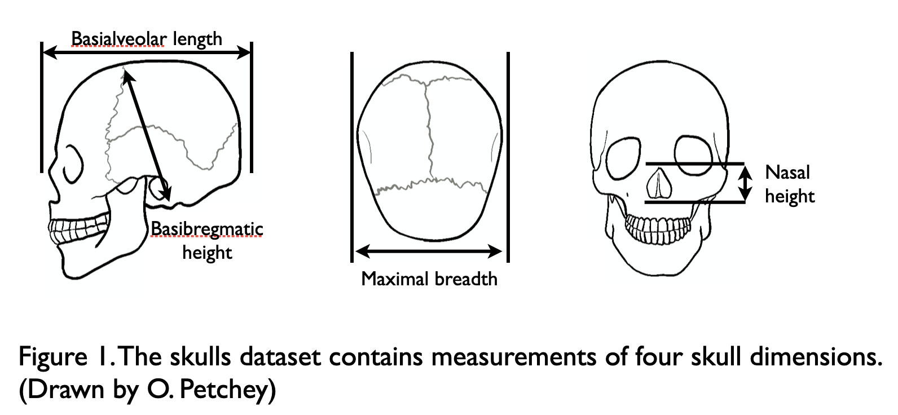

# Using multivariate data to answer biological questions

## Introduction

The questions addressed in Insights and on the companion website could all be answered by looking at one response variable at a time. Another way of saying this is that they were *univariate*: exploration of only one response variable at a time was enough. We did not look at relationships among response variables.

Many kinds of biological question involve simultaneous consideration of multiple response variables, however. These are *multivariate* problems. They require multivariate data, methods for visualizing multivariate data, and methods for analyzing it. This chapter covers the three issues.

Consider the question of how human skull shape has changed during the last few millennia. If we measured any single dimension of a skull, for example, maximum breadth, this question about shape would be beyond us. We might find that maximum breadth had increased, but this could be associated with increases in every skull dimension. Such a finding would indicate that skulls had increased in size, but not changed in shape.  With only one measurement, we could not know.

The same applies for the question of how environmental temperature relates to community composition, though we have to be careful about what we mean by community composition. If we define community composition as the abundances of each of the species in a community, then clearly this is a multivariate question. We cannot address such a question if we measure the abundance of only one species. We need to measure the abundances of all the species in the community that interest us, and then explore and analyse this multivariate dataset.

What other types of question are intrinsically multivariate?

* Questions about environmental effects on life history evolution are multivariate if we choose to interest ourselves simultaneously in multiple life history traits (e.g., behavioural, morphological, and phenological traits).
* Question about variation in genetic composition among individuals, and variation in variation in gene expression can be multivariate questions, since organisms have many genes.

Make a list of other biological questions that require measurement and analysis of multiple response variables.

Consider the example questions above, and note that all questions are about if variability in response variables is associated with variability in explanatory variables. Make sure the questions in your list are of the same nature. Then note that your explanatory and response variables could come from an observational or experimental study. Hence, there seems no need for us to think that univariate methods are better for analyzing experiments, and multivariate for analyzing observational studies. What is important, as always, is careful formulation of specific hypotheses and predictions, such that one does not become unintentionally involved in a fishing expedition (looking for patterns, with few or no expectations).

Safe in the knowledge that questions exist, which require multivariate data and associated methods, let us proceed practically, with the question of whether and how human skull shape has changed over the last few millennia. The dataset we will analyse contains measurements of 150 skulls. Four morphological measurements were made of each skull  (\@ref(fig:skull-dimensions) and the millenium in which the person/skull lived is also in the dataset.

```{r skull-dimensions, fig.cap='Skull dimensions measured', out.width='80%', fig.asp=.75, fig.align='center', echo=FALSE}

```

We will use this dataset to illustrate and discuss the following:

*	Importing multivariate data.
*	Manipulating multivariate data in R (e.g., switching between “wide” and “long” format).
*	Multivariate data exploration / visualization.
*	Visualisation.
*	Rotating data clouds (i.e., ordination).
*	Hypothesis testing multivariate data.

This material covers only a fraction of all the available and possible types of multivariate analysis. Furthermore, with one simple question and example datasets, we give only one illustration of the methods we do cover. This is because our intention is to give you enough information to feel confident that you have the basics in hand, and to then leap into the world of multivariate methods, learning what you need as you need it.

## Lets get started

Please prepare an RStudio Project and folder for this project, and create within this folder a folder named *data* into which you will put the datafile.

And now set up R:

```{r}
rm(list=ls())

library(tidyverse)
library(vegan)
```

Now get [the skulls dataset](https://raw.githubusercontent.com/R4All/datasets/master/skulls.csv). Put it in your data folder, and import the data, and have a look at it in R:

```{r}
skulls <- read_csv("data/skulls.csv")
skulls
glimpse(skulls)
```


```{r}
has_rownames(skulls)
skulls <- column_to_rownames(skulls, var = "skull.ID")
```


```{r}
## look at the rownames of the data
rownames(skulls)

## This is wide format data
skulls
head(skulls)

## we can change this into long format
## within R
skulls.long <- reshape(skulls,
	idvar="id",
	v.names="Measure",
	timevar="Dimension",
	times=colnames(skulls),
	varying=colnames(skulls),
	direction="long")

## Now we replace the horrid rownames with some nice,
## but meaningless ones (these are not the skull ids)
rownames(skulls.long) <- 1:length(skulls.long[,1])
skulls.long


## To demonstrate changing this to long format it is
## better to read in the data with the skull ids in a 
skulls <- read.csv("~/desktop/datasets/skull.dimensions.csv")
skulls
skulls.long <- reshape(skulls,
	idvar="id",
	v.names="Measure",
	timevar="Dimension",
	times=colnames(skulls[,2:5]),
	varying=colnames(skulls[,2:5]),
	direction="long")
str(skulls.long)

## the row names are a bit nasty… so reset them
rownames(skulls.long) <- 1:length(skulls.long[,1])
skulls.long

## I previously wrote the long data to a file
##write.csv(skulls.long, "$$$$$$skull.dimensions.long.csv")
## Hint, I disabled the write.csv with the $$$$$ 
## so I can't easily run it and thereby overwrite the file


### To demonstrate reading long format data and changing it
## to wide format...
skulls <- read.csv("~/desktop/datasets/skull.dimensions.long.csv")

## get an idea of the data.
skulls[order(skulls$id),]

## and use reshape to change it to wide format from long
skulls.wide <- reshape(skulls,
		idvar="id",
		v.names="Measure",
		timevar="Dimension",
		direction="wide")

## make the column names nice...
colnames(skulls.wide)[2:5] <- substr(colnames(skulls.wide)[2:5], 9, nchar(colnames(skulls.wide)[2:5]))
## check out the good work...
skulls.wide


## and back to wide format
skulls.wide <- reshape(skulls.long)
skulls.wide


## can also use the reshape library
library(reshape)
skulls <- read.csv("~/desktop/datasets/skull.dimensions.csv",
	row.names="id")


## add an identity variable
## add a new column with skull ID, remember that we
## previously put this information in the row names
skulls <- transform(skulls, ident=rownames(skulls))

## melt the data
skulls.m <- melt(skulls, measured=colnames(skulls[,2:5]), id.vars="ident")
skulls.m
str(skulls.m)

## cast the data
skulls.c <- cast(skulls.m, ... ~ variable)
str(skulls.c)
skulls.c


######## Do some plotting

## Here we will want to take into account the year
## that the skull came from
## for convenience, we can merge together the two datasets
## but to do this we need the skull id variable in the dataset
mm <- read.csv("~/Desktop/datasets/skull.dimensions.csv")
yy <- read.csv("~/Desktop/datasets/skull.date.csv")

## an easy check to see if all ids are in both datasets
sum(sort(yy$id)==sort(mm$id)) ## should equal 150, yay.

## an easy typo in the spreadsheet could cause mismatches
"s1"=="S1"

## How to use match to find the ones that don't match
## we simulate a missing id in mm$id by removing the
## first column
match(mm$id, yy$id[-1])
is.na(match(mm$id, yy$id[-1]))
yy$id[is.na(match(mm$id, yy$id[-1]))]
## the previous line shows us that id "S1"
## appears in the mm data.frame, but not yy

## a normal merge
skulls <- merge(mm, yy, by="id")
str(skulls)

## demonstrating merge with one row missing from mm
## Default behaviour is for merge to discard the lack of match
skulls <- merge(mm[-1,], yy, by="id")
str(skulls)

## demonstrating merge with one row missing from mm
## Telling merge() to keep the mismatches
skulls <- merge(mm[-1,], yy, by="id", all=T)
str(skulls)


## do again the normal merge
skulls <- merge(mm, yy, by="id")
str(skulls)


## make nice names for the dimensions
nice.names <- c("Skull ID",
				"Maximum breadth",
				"Basilar height",
				"Basilar length",
				"Nasal height")

layout(matrix(1:4, 2, 2, byrow=T))
plot(skulls[,2] ~ thousand.years, skulls, main=nice.names[2],
  	xlab="Thousand years ago", ylab=nice.names[2])
plot(skulls[,3] ~ thousand.years, skulls, main=nice.names[3],
  	xlab="Thousand years ago", ylab=nice.names[3])
plot(skulls[,4] ~ thousand.years, skulls, main=nice.names[4],
  	xlab="Thousand years ago", ylab=nice.names[4])
plot(skulls[,5] ~ thousand.years, skulls, main=nice.names[5],
  	xlab="Thousand years ago", ylab=nice.names[5])


## using a loop to
## make a scatterplot of each variable
layout(matrix(1:4, 2, 2))
years <- sort(unique(skulls[,"thousand.years"]))
for(i in 2:5)
  plot(skulls[,i]~skulls[,"thousand.years"], main=nice.names[i],
  	xlab="Year", ylab=nice.names[i])
  

## Lets say we want to be rather conservative
## and make the carbon dating of the skulls
## categorical…
## first we make the break points
## we make 10, because we want nine categories
breaks <- seq(min(skulls$thousand.years),
			  max(skulls$thousand.years),
			  length=10)
## get the midpoints of the bins
mids <- round((breaks[-1] + breaks[-10]) / 2, -2)
skulls <- transform(skulls, cut.year=mids[as.numeric(cut(skulls$thousand.years,
						breaks=breaks,
						include.lowest=T))])

## check the categorisation
plot(thousand.years ~ cut.year, skulls)
## looks good


## make a dot plot of each variable
layout(matrix(1:4, 2, 2))
for(i in 2:5)
  plot(skulls[,i]~skulls[,"cut.year"], main=nice.names[i],
  	xlab="Year", ylab=nice.names[i])


## make a jittered dot plot of each variable
layout(matrix(1:4, 2, 2))
for(i in 2:5)
  plot(skulls[,i]~jitter(skulls[,"cut.year"]), main=nice.names[i],
  	xlab="Year", ylab=nice.names[i])
  	  	
## or make a beeswarm plot of each variable
library(beeswarm)
layout(matrix(1:4, 2, 2))
for(i in 2:5)
  beeswarm(skulls[,i]~skulls[,"cut.year"], main=nice.names[i],
  	xlab="Year", ylab=nice.names[i])


## 3d plotting
library(rgl)
str(skulls)
plot3d(skulls[,2:4])


## Now we want to colour the points by the year category
## set up a colour map…
## we will use the RColorBrewer package
library(RColorBrewer) ## download the package first?
## get the unique year classes we previously made
year.classes <- sort(unique(skulls$cut.year))
## get some colours...
cc <- brewer.pal(length(year.classes), "Greens")
## make a data.frame that contains the mapping between the
## year categories and the colours
col.map <- data.frame(year.classes=year.classes,
       col=I(cc))
col.map


## Do the 3d plot, this time with coloured points
plot3d(skulls[,2:4], type="s", cex=0.5,
	col=col.map$col[match(skulls[,7], col.map$year)])


## make the colours transparent
## this doesn't work in 3d plotting
col.map$col <- paste(col.map$col, "aa", sep="")


## Make a nice colourful plot of one dimension against another (2d)
str(skulls)
par(mar=c(5, 4, 4, 6))
plot(skulls[,2], skulls[,3],
	xlab=nice.names[2],
	ylab=nice.names[3],
	pch=21, cex=1.7,
	bg=col.map$col[match(skulls$cut.year, col.map$year.classes)])
par(xpd=T)
#legend(157, 100, legend=col.map$year.classes, pch=21,
#	pt.bg=col.map$col, title="Year")
legend("topleft", legend=col.map$year.classes, pch=21,
	pt.bg=col.map$col, title="Year")

  

## do a pca of the data (remembering to only include the columns 2 thru' 5,
## since these contain the dimensions data)
pp <- prcomp(skulls[,2:5], center=T, scale=T)  
## make a plot… not so useful perhaps
plot(pp)
## a somewhat more useful plot
biplot(pp)
## but we can do better ourselves
plot(pp$x[,1], pp$x[,2], pch=21, cex=1.5,
   bg=as.character(col.map$col[match(skulls[,"cut.year"], col.map$year)]),
   xlab="Principle component axis 1",
   ylab="Principle component axis 2")
par(xpd=T)
legend(-3, 4, legend=col.map$year, pch=21, pt.bg=as.character(col.map$col),
	ncol=5, cex=0.7)
par(xpd=F)


## pca by "hand"
t(t(eigen(cor(skulls[,2:5]))$vectors) %*% t(scale(skulls[,2:5])))

  
## how much variance explained by each new axis?
## R will tell us:
summary(pp)
## or we can find out ourselves:
var.expl <- round((pp$sdev^2/sum(pp$sdev^2)),2)*100
var.expl
## and then put the answer on the figure
mtext(side=1, line=4, text=paste("(", var.expl[1], "%)", sep=""))
mtext(side=2, line=2, text=paste("(", var.expl[2], "%)", sep=""))
  
  
## finding out what the new axes mean?  
cor(skulls[,2:5], pp$x)


## plot the means points…
means <- aggregate(pp$x, list(skulls$cut.year), mean)
points(means[,2], means[,3], pch=23, cex=2,
	bg=as.character(col.map$col), type="b", lwd=3, col="red")

### End of PCA


## Now do an NMDS
library(vegan)

## Import then merge the date and dimensions datasets
mm <- read.csv("~/Dropbox/R4All_Share/modules/new MV/skull.dimensions.csv")
yy <- read.csv("~/Dropbox/R4All_Share/modules/new MV/skull.date.csv")
skulls <- merge(mm, yy, by="id")
str(skulls)


## put the cut year variable in again:
breaks <- seq(min(skulls$thousand.years),
			  max(skulls$thousand.years),
			  length=10)
## get the midpoints of the bins
mids <- round((breaks[-1] + breaks[-10]) / 2, -2)
skulls <- transform(skulls, cut.year=mids[as.numeric(cut(skulls$thousand.years,
						breaks=breaks,
						include.lowest=T))])
library(RColorBrewer) ## download the package first?
## get the unique year classes we previously made
year.classes <- sort(unique(skulls$cut.year))
## get some colours...
cc <- brewer.pal(length(year.classes), "Greens")
## make a data.frame that contains the mapping between the
## year categories and the colours
col.map <- data.frame(year.classes=year.classes,
       col=I(cc))
col.map


## 1. standardise the data, if required
yy1 <- scale(skulls[,2:5])

## 2. calculate dissimilarities
## 2a. find the best dissimilarity
rankindex(yy1, skulls$thousand.years)

## seems to be Euclidean here
yy2 <- dist(yy1, method="euclidean")
str(yy2)

## 3. Do the NMDS
yy3 <- monoMDS(yy2, k=2, model="local")

## 4. Look at the result
## 4a. The stressplot
stressplot(yy3)


## All of this can be done very nicely with 
## function metaMDS():
skulls.NMDS <- metaMDS(yy1, autotransform=F,
				distance="euclidean", model="local")
plot.skulls.nmds <- function() {
plot(skulls.NMDS, type="n")
points(skulls.NMDS, display="sites", pch=21, cex=2,
	bg=col.map$col[match(skulls$cut.year, col.map$year)])
par(xpd=T)
legend(-2.5, 4.3, legend=col.map$year, pch=21, pt.bg=as.character(col.map$col),
	ncol=5, cex=1)
par(xpd=F)
means <- aggregate(scores(skulls.NMDS), list(skulls$cut.year), mean)
points(means[,2], means[,3], pch=23, cex=2,
	bg=as.character(col.map$col), type="b", lwd=3, col="red")
}
plot.skulls.nmds()


cor(scores(skulls.NMDS), yy1)


## 5. Compare the results of NMDS across different
##		start conditions
yy4 <- monoMDS(yy2)
pro34 <- procrustes(yy3,yy4)
plot(pro34)
plot(pro34, kind=2)


### some fancy vegan functions...
##ordihull(skulls.NMDS, as.factor(skulls$cut.year), col="blue")
##ordiellipse(skulls.NMDS, skulls$cut.year,
##	col=col.map$col, label=T, draw="polygon")
##ordispider(skulls.NMDS, skulls$cut.year,
##    col=col.map$col[match(skulls$cut.year, col.map$year)])

year.classes <- sort(unique(skulls$cut.year))
for(i in 1:length(year.classes))
	ordiellipse(skulls.NMDS, skulls$cut.year,
		label=T, draw="polygon",
		col=col.map$col[i], 
		show.groups=year.classes[i])


###########################################
## Significance testing

## Do each of the regression models
mm.reg <- list()
for(i in 2:5) {
  mm.reg[[i]] <- lm(skulls[,i]~skulls[,"thousand.years"])
  print(paste("##############################", nice.names[i]))
  print(anova(mm.reg[[i]]))
}

### plot the regression models, or the means on the plots
## make a dot plot of each variable
layout(matrix(1:4, 2, 2))
for(i in 2:5) {
  plot(skulls[,i]~jitter(skulls[,"thousand.years"]), main=nice.names[i],
  	xlab="Year", ylab=nice.names[i])
  abline(coef(mm.reg[[i]]))
}


## find the meaning of the new variables…
str(skulls.NMDS)
cor(yy1, skulls.NMDS$points)

## and in this case, very similar results to the PCA
## (must have done the pca, of course)
cor(pp$x, skulls.NMDS$points)


### Checking the assumptions of MANOVA


################################
################################
################################
################################
################################
################################
################################
################################
To be askullsed
################################
################################
################################
################################
################################
################################
################################


## do a multivariate ANOVA on the data
## bind together the response variables
m.skulls <- cbind(skulls[,2], skulls[,3], skulls[,4], skulls[,5])
## do the model, with as.factor to make a categorical variable
## and therefore perform MANOVA, rather than multivariate regression
manova.model <- manova(m.skulls ~ as.factor(skulls$cut.year))
## next line doesn't work… no automatic model diagnostics!
plot(manova.model)
## Next line gives all the univariate models
summary.aov(manova.model)
## Next line does a multivariate test
summary(manova.model, test="Pillai")
## take a look at the structure...
str(manova.model)
## And here are the coefficients
round(manova.model$coefficients, 4)


## do a multivariate regression on the data
m.skulls <- cbind(skulls[,2], skulls[,3], skulls[,4], skulls[,5])
## use the continuous variable, thousand years,
## so that multivariate regression is performed
manova.model <- manova(m.skulls ~ skulls$thousand.years)
## again, this doesn't work!
plot(manova.model)
## Each of the univariate models...
summary.aov(manova.model)
## The multivariate regression test statistic
summary(manova.model, test="Pillai")
str(manova.model)
round(manova.model$coefficients,4)


## Using vegan to do hypothesis testing

## fit an environmental variable to the data
## here, environment is equivalent to skull date	
years <- skulls$thousand.years
model1 <- envfit(skulls.NMDS ~ years, perm=999)
model1
plot.skulls.nmds()
plot(model1, cex=1.3)


## and one can fit a smoothed surface,
## and put this on the plot
model2 <- ordisurf(skulls.NMDS ~ years, askulls=T)
summary(model2)


## And for categorical explanatory variables...
year <- as.factor(skulls$cut.year)
model2 <- envfit(skulls.NMDS ~ year, perm=999)
model2
plot.skulls.nmds()
plot(mod2)
## not pretty


## unused in the document but perhaps useful stuff below.


## do clustering
## first make the rownames the year
rownames(skulls) <- paste(skulls$cut.year, 1:length(skulls$cut.year), sep=".")
dists <- dist(skulls[,2:5])
clust <- hclust(dists)
plot(clust)
library(ade4)
phyl <- hclust2phylog(clust)
xx <- radial.phylog(phyl, clea = 1,
	clabel.l = 0.5, cnod = 0,
	circle=1.5)


## Checking for correlations among variables.
## put (absolute) correlations on the upper panels,
## with size proportional to the correlations.
panel.cor <- function(x, y, digits=2, prefix="", cex.cor, ...)
{
    usr <- par("usr"); on.exit(par(usr))
    par(usr = c(0, 1, 0, 1))
    r <- abs(cor(x, y))
    txt <- format(c(r, 0.123456789), digits=digits)[1]
    txt <- paste(prefix, txt, sep="")
    if(missing(cex.cor)) cex.cor <- 0.8/strwidth(txt)
    text(0.5, 0.5, txt, cex = cex.cor * r)
}
pairs(skulls[,c(-1)], lower.panel=panel.smooth, upper.panel=panel.cor)