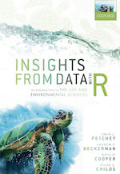

```{r setup, include=FALSE}
options(
  htmltools.dir.version = FALSE, formatR.indent = 2,
  width = 55, digits = 4,
  warnPartialMatchAttr = FALSE, warnPartialMatchDollar = FALSE
)

local({
  r = getOption('repos')
  if (!length(r) || identical(unname(r['CRAN']), '@CRAN@'))
    r['CRAN'] = 'https://cran.rstudio.com' 
  options(repos = r)
})

lapply(c('DT', 'citr', 'formatR', 'svglite'), function(pkg) {
  if (system.file(package = pkg) == '') install.packages(pkg)
})
```


# Introduction

```{r echo=FALSE}
knitr::opts_chunk$set(cache = FALSE)
```



*Welcome!* to the Companion Website for the book *Insights from Data with R -- An Introduction for the Life and Environmental Sciences*

The book is due to be released in late February 2021. Latest information here on the related [Oxford University Press web page](https://global.oup.com/academic/product/insights-from-data-with-r-9780198849827).

*Insights* was authored by the members of [R4ALL](http://r4all.org/), an organisation specialising in teaching R to those who’ve never used it. And to folk using R already but want to improve their foundation and workflow.

The Preface Chapter of *Insights* [here is a PDF of the Preface Chapter](assets/Insights_Preface.pdf) describes features of the book, such as its aims, content, structure, intended readership, and relationship to our other book *Getting Started with R*. Some of the text in the Preface may come across as a sales pitch (it probably is), but it also aims to make prospective readers clear about what they will find in *Insights* and why.

[The table of contents of *Insights* as a pdf.](assets/Insights_ToC.pdf).

On this Companion Website you will find information additional to that in the book:

(@) An overview of the [Insights Workflow](#insights-workflow).
(@) [Questions and exercises](#questions-exercises) to work through with each chapter of the book.
(@) [More topics in R](#more-r).
(@) [Additional data analysis concepts](#more-concepts).
(@) An additional Workflow Demonstration: [polity and food diversity](#WFD-food-pol)
(@) An additional Workflow Demonstration: [effects of dietary diversity on populations](#WFD-dietdiv-effect)
(@) A relatively unguided workflow demonstration [effects of dietary restriction on individuals](#WFD-diet-restrict).
(@) An example of how one might complete the previous Workflow Demonstration.
(@) [Model scripts](#modelwf-scripts) for each Workflow Demonstration.
(@) Details of a [live data analysis demonstration](#live-data-demo) that can be used in the very first class of an Introduction to Data Analysis undergraduate classes. It is designed to capture the students' interest.
(@) [More datasets](#more-datasets) that could be developed into new Workflow Demonstrations (perhaps for students to practice with and/or instructors to use).
(@) Some [Related reading](#related-reading).
(@) Answers to the questions that accompany each Chapter.
(@) Any corrections to the published edition of the book.


