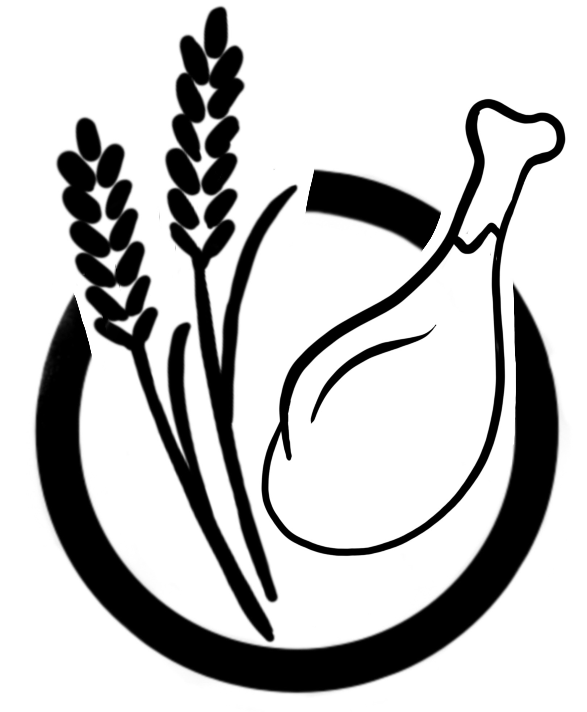

```{r setup, include=FALSE}
options(
  htmltools.dir.version = FALSE, formatR.indent = 2,
  width = 55, digits = 4, warnPartialMatchAttr = FALSE, warnPartialMatchDollar = FALSE
)

local({
  r = getOption('repos')
  if (!length(r) || identical(unname(r['CRAN']), '@CRAN@'))
    r['CRAN'] = 'https://cran.rstudio.com' 
  options(repos = r)
})

lapply(c('DT', 'citr', 'formatR', 'svglite'), function(pkg) {
  if (system.file(package = pkg) == '') install.packages(pkg)
})
```


**Standardise scripts**:

- Single hash for comments
- Minimise nesting, max. piping
- Nothing in ggplot()... all in the geoms (unless piping data in)

# Introduction

```{r}
knitr::opts_chunk$set(cache = FALSE)
```

*Welcome!*



The [preface](hyperlink to pdf of Preface?) of *Insights* informs about features of the book, such as its aims, content, structure, intended readership, and content that it does not include. Some of the text in the Preface may come across as a sales pitch (it probably is), but it also aims to make prospective readers clear about what they will find in *Insights* and why. Read the preface and answer [questions here (directs to a different website)](insightsfromdata.org), directly concerning the content of the Preface, might also help that understanding.

Here you will find information additional to that in the book:

1. An overview of the [Insights Workflow](#insights-workflow).
2. [More topics in R](#more-r).
3. [Additional data analysis concepts](#more-concepts).
4. (5,6) Three additional Workflow Demonstrations: [polity and food diversity](#WFD-food-pol), [effects of dietary diversity on populations](#WFD-dietdiv-effect), and [effects of dietary restriction on individuals](#WFD-diet-restrict).
7. Model scripts for each workflow demonstration.
8. Details of a [live data analysis demonstration](#live-data-demo) we often use in our introductory undergraduate classes.
9. [More questions and datasets](#more-questions-data) that could be developed into new Workflow Demonstrations (perhaps for students to practice with and/or instructors to use.).
10. Some [Related reading](#related-reading).


## For instructors

Perhaps add the "Notes/ideas for instructors section from the book Preface."

## Workflow demonstration





