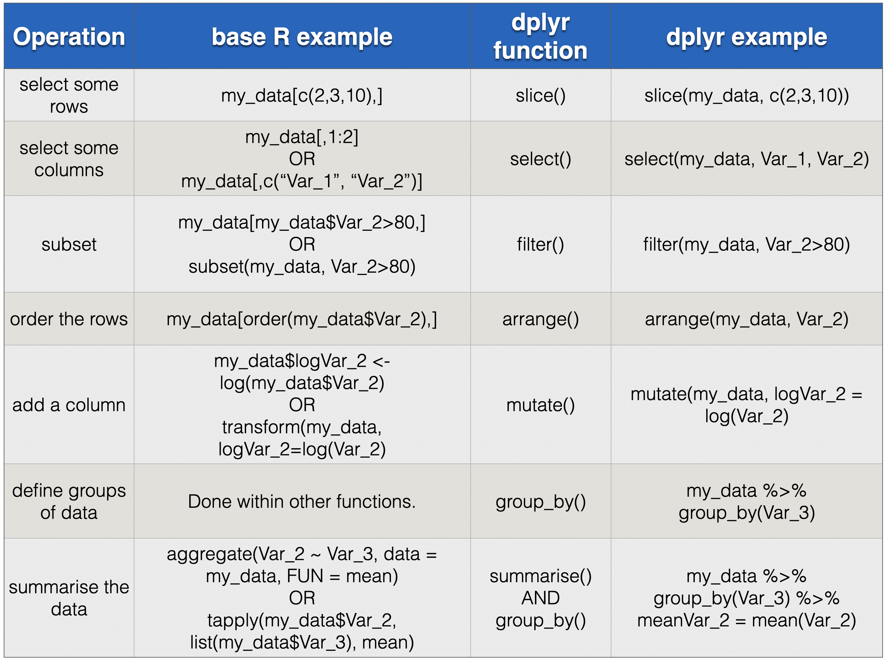

```{r include=FALSE, cache=FALSE}
library("dplyr")
library("readr")
library("ggplot2")
library("nasaweather")
library("magrittr")
library("knitr")
library("hexbin")

# knitr options

opts_chunk$set(fig.width=3.5, fig.height=3.5, fig.align="center", cache=TRUE)

# Set plotting to bw plot default, but with transparent background elements. Note
# transparency requires the panel.background, plot.background, and device background
# all be set!

theme_update(plot.background = element_rect(fill = "transparent", colour = NA))

options(tibble.print_max = 5, tibble.print_min = 5)
```


```{r setup, include=FALSE}
options(
  htmltools.dir.version = FALSE, formatR.indent = 2,
  width = 55, digits = 4,
  warnPartialMatchAttr = FALSE, warnPartialMatchDollar = FALSE
)

local({
  r = getOption('repos')
  if (!length(r) || identical(unname(r['CRAN']), '@CRAN@'))
    r['CRAN'] = 'https://cran.rstudio.com' 
  options(repos = r)
})

lapply(c('DT', 'citr', 'formatR', 'svglite'), function(pkg) {
  if (system.file(package = pkg) == '') install.packages(pkg)
})
```


# Introduction

```{r echo=FALSE}
knitr::opts_chunk$set(cache = FALSE)
```

*Welcome!* to the Companion Website for the book *Insights from Data with R -- An Introduction for the Life and Environmental Sciences*

The Preface Chapter [here is a PDF of the Preface Chapter](Preface?) of *Insights* describes features of the book, such as its aims, content, structure, intended readership, and relationship to our other book *Getting Started with R*. Some of the text in the Preface may come across as a sales pitch (it probably is), but it also aims to make prospective readers clear about what they will find in *Insights* and why. 

On this Companion Website you will find information additional to that in the book:

(@) An overview of the [Insights Workflow](#insights-workflow).
(@) [Questions and exercises](#questions-exercises) to work through with each chapter of the book.
(@) [More topics in R](#more-r).
(@) [Additional data analysis concepts](#more-concepts).
(@) An additional Workflow Demonstration: [polity and food diversity](#WFD-food-pol)
(@) An additional Workflow Demonstration: [effects of dietary diversity on populations](#WFD-dietdiv-effect)
(@) A relatively unguided workflow demonstration [effects of dietary restriction on individuals](#WFD-diet-restrict).
(@) An example of how one might complete the previous Workflow Demonstration.
(@) [Model scripts](#modelwf-scripts) for each Workflow Demonstration.
(@) Details of a [live data analysis demonstration](#live-data-demo) that can be used in the very first class of an Introduction to Data Analysis undergraduate classes. It is designed to capture the students' interest.
(@) [More datasets](#more-datasets) that could be developed into new Workflow Demonstrations (perhaps for students to practice with and/or instructors to use).
(@) Some [Related reading](#related-reading).
(@) Answers to the questions that accompany each Chapter.


<!--chapter:end:index.Rmd-->

```{r include=FALSE, cache=FALSE}
library("dplyr")
library("readr")
library("ggplot2")
library("nasaweather")
library("magrittr")
library("knitr")
library("hexbin")

# knitr options

opts_chunk$set(fig.width=3.5, fig.height=3.5, fig.align="center", cache=TRUE)

# Set plotting to bw plot default, but with transparent background elements. Note
# transparency requires the panel.background, plot.background, and device background
# all be set!

theme_update(plot.background = element_rect(fill = "transparent", colour = NA))

options(tibble.print_max = 5, tibble.print_min = 5)
```
# Insights Workflow {#insights-workflow}

Here are the steps of our general workflow. It is quite common and uncontroversial. In Chapter 1 of the *Insights* book we describe the workflow and then demonstrate in detail in Chapters 3 and 4. 

**Planning and preparation steps:**

* Decide upon a question.
* Sketch a graph of a likely or possible answer. This can and should be the graph that we will use to answer the question and to communicate the answer.
* Do some research about what one might expect the answer to be, and why.
* Get feedback from experts, peers, mentors, and revise the question appropriately.
* Specify hypotheses.
* Get feedback and revise.
* Specify response variables, though this may have already been done in early steps.
* Make predictions.
* Design your study, including planning analyses.
* Get feedback and revise.
* Write a formal proposal in which all of the above are described. It is good practice to [pre-register your proposal](https://www.cos.io/initiatives/prereg).

**Performing the study and getting insights steps:**

* Perform your study, including data collection.
* Backup raw data.
* Prepare the data (make it "research and re-use ready").
* Prepare computer, R, and RStudio.
* Read the data into R, and refine the import as required.
* Tidy the data.
* Clean the data.
* Create the initial insights.
* Create insights about your question (i.e. answer the question).

**Communicate your answer and its implications.**

* This step is of great importance and a whole field of its own. For example, how to give great oral presentations, and how to write great reports, are subjects about which many courses, videos, books, and blogs have been made.

Below we go into a little more detail about some of the second set of steps (*Performing the study and getting insights steps*). These are covered in even more detail the book.

## Preparing the data

If you don't know, e.g. because you did not conduct the study, then *before* importing the data files into R, be sure to inspect them in a spreadsheet program (so long as they're not too big) and note the following:

* if multiple data files are used, which contains what.
* what variable names are used in the data files, and what these mean (e.g. which are response variables, which are explanatory, and what are others).
* the number of rows and columns in the data files.
* the arrangement of the data in the data file, e.g. tidy or not tidy.
* any obvious things to deal with (e.g. how missing values are coded, date/time information, codes that need expanding, variable/column names that will need changing).

## Prepare your computer, R, and RStudio

We strongly advise you to use projects in RStudio. More details about this in Chapter 3 of the *Insights* book.

* Make a project folder, and data sub-folder.
* Make other sub-folders, as you like.
* Create the Project in RStudio.
* Create a new script file.
* Describe the project in the new script, include date, authors, project title.
* Add to the script any required add-on libraries.

## Read the data into R

Read in the data and then check the following at least:

* Check number of variables/columns.
* Check number of rows.
* Check variable types.
* Check appropriate representation of missing values.

Note that if you are attempting to import a *comma separate values* (CSV) formatted data file, and strangely find that it is imported into R with only one column, it may be that you instead have a semi-colon (;) as the separator. This can happen if we open a CSV file in Excel and then allow Excel to save it (even though we changed nothing). One solution is to use `read_csv2()` to read the data file, as this uses a semi-colon as the separator.

## Tidy the data 

* Ensure there is one observation per row.
* Ensure one type of information is not spread across multiple columns.
* If there is more than one observation of the same type of information spread across columns, then gather observations into a single column (i.e. tidy the data).

## Clean the data.

* Check for and resolve any inappropriate duplicates.
* Make any date and time type data be stored in R in date/time format.
* Replace any codes with informative words.
* Check for appropriate/plausible variable entries, e.g. levels of characters, ranges of numerics.

## Initial insights

* Check numbers of "things", number of experimental units, treatments, treatment combinations, temporal samples.
* Calculate response and/or explanatory variable(s) (if required).
* Examine the shapes of the distributions of variables (i.e. inspect the histograms of explanatory and response variables).
* Examine relationships among explanatory variables. Are they correlated, and if so what effect might this have on our ability to answer our question(s).


## Insights about question posed

* Reveal and examine relationships relevant to hypotheses/predictions.
* Assess confidence in revealed patterns.


<!--chapter:end:01-insights-workflow.Rmd-->

```{r include=FALSE, cache=FALSE}
library("dplyr")
library("readr")
library("ggplot2")
library("nasaweather")
library("magrittr")
library("knitr")
library("hexbin")

# knitr options

opts_chunk$set(fig.width=3.5, fig.height=3.5, fig.align="center", cache=TRUE)

# Set plotting to bw plot default, but with transparent background elements. Note
# transparency requires the panel.background, plot.background, and device background
# all be set!

theme_update(plot.background = element_rect(fill = "transparent", colour = NA))

options(tibble.print_max = 5, tibble.print_min = 5)
```

```{r message=FALSE, echo=FALSE, warning=FALSE}
# Load the libraries we use
library(dplyr)
library(ggplot2)
library(readr)
library(stringr)
library(lubridate)
library(tidyr)
# Import and clean the data
bats <- read_csv("data/bat_sex_diet_Mata_etal_2016.csv", na = "na")
names(bats) <- str_replace_all(names(bats), c(" " = "_"))
names(bats) <- str_replace_all(names(bats), c("\\(" = "", "\\)" = ""))
bats <- mutate(bats,
             Date_proper = dmy(Date),
             Sex = case_when(Sex == "M" ~ "Male",
                             Sex == "F" ~ "Female"),
             Age = case_when(Age == "Ad" ~ "Adult",
                             Age == "Juv" ~ "Juvenile")) %>%
#  select(-Date) %>% # commented out so we can demo a non-date variable
  rename("Bat_ID" = "Sample",
         "Row_order" = "Order",
         "Order" = "Order_1")
```


# Questions and exercises {#questions-exercises}

Below are questions and exercises related to each of the chapters of *Insights* book. In addition to the questions and exercises here, the *fish dietary restriction* Workflow Demonstration is presented here as a web page of question, and a web page of solutions.

## Preface

The following are multiple choice questions, in which each of the given options can be true or false.

**Q0.1** Who is the intended audience/users/readers of *Insights*?

* **A** People who have a need to efficiently, safely, and reliably derive robust insights from quantitative data.
* **B** People with a good knowledge of working with data and data analysis, but not in R.
* **C** Instructors/teachers of undergraduate's first courses in data analysis, in particular in Life and Environmental Sciences.
* **D** People who will benefit from a learning approach that gives confidence in their ability to succeed.

**Q0.2** *Insights* teaches a newer (i.e. tidyverse) approach to using R, and not what might be called the “classic” or “traditional” approach. What does this mean?

* **A** Learning based on the “tidyverse” packages that have revolutionised data exploration and analysis in R.
* **B** A consistent and therefore easily taught and learned approach.
* **C** A lot of use of square brackets and dollar signs in the R code.
* **D** It allows us to very easily construct powerful, efficient, easy to troubleshoot, and just plain lovely *pipelines* that work on our data.
* **E** Simple, powerful, flexible, and beautiful data visualisations.

**Q0.3** *Insights* is a book about the process of getting insights from data, and yet it contains no statistical models (e.g. no regression, ANOVA, linear models, or generalised linear models. Why are such things not included?

* **A** There is enough to be learned about data analysis and to be gained from data analysis without such tests. The skills covered in *Insights* are essential. Statistical tests should only be used to confirm what we see with our own eyes.
* **B** Statistical tests can be quite daunting and difficult, so we leave them until we have a solid hold on more foundational skills in data analysis.
* **C** Not including statistical tests eliminates the risk that early learning of statistical tests encourages a rather one dimensional view of data analysis focused on statistical significance and p-values.
* **D** Avoiding statistics encourages us to pay more attention to the practical significance (as opposed to statistical significance.

**Q0.4** What proportion of a data analysts' time and effort is spent on tasks such as preparation, import, cleaning, tidying, checking, double-checking, manipulating, summarising and visualizating data?

**Q0.5** From where do you get the datasets that you need to work along with the demonstrations in the book?

* **A** E-mail one of us.
* **B** From this website.
* **C** Direclty from the authors of the original studies.
* **D** From online data repositories where the authors of the original studies deposited their data for it to be shared and used.


**Q0.6** Which one of the book's authors works at the Natural History Museum in London?

**Q0.7** Which one used to brew beer (from grain)?

**Q0.8** Which one has has strangely hairy ears?

**Q0.9** Which one has cuddled sheep on a remote Scottish Island?


## Chapter 1 (Introduction)

**Q1.1** Can we get insights from data without using complex statistical models and analyses, without machine learning, without being a master data scientist?

**Q1.2** What is an advantage of focusing on the data without any statistical models/tests to think about?

**Q1.3** With what should we start our journey from data to insights?

* A dataset.
* A graph showing the result we would like to find.
* A clear and specific question.
* Expectation about what we might find and why we might find it.

**Q1.4** Why is it important to know if a study resulting in a dataset was a randomised manipulative experiment?

**Q1.5** Datasets, i.e. convenient arrangements of data, come in many forms. Which arrangement is used throughout this book?

**Q1.6** What is a "response variable" and what are other names for one?

**Q1.7** What is an "explanatory variable" and what are other names for one?

**Q1.8** Give five important features of datasets, and explain in your own words why they are important.

**Q1.9** What do each of the four demonstration datasets used in the Workflow Demonstrations share in common?

**Q1.10* Which step in getting insights from data was missing from the presented workflow? (This is a bit of a trick question.)


## Chapter 2 (Getting Acquainted)

**Q2.1** True or false: R and RStudio are the same software program?

**Q2.2** What will R tell us if we type into the Console `1 + 3 * 3`?

**Q2.3** What will R tell us if we type into the Console `log(100)`?

**Q2.4** How would we assign to the name "my_constant" the value of "log(100)"?

**Q2.5** What commands should we be typing directly into the Console?

**Q2.6** What is the error in this code (hint: you do not need to know what the `seq` function is doing):

```{r eval = FALSE}
my_x_variable <- seq(0, 4*pi, length = 100)
my_y_variable <- sin(my_x_varible)
```

**Q2.7** When we give a function some arguments, when should we name the arguments? E.g. when should we use  `round(x = 2.4326782647, digits = 2)` rather than  `round(2.4326782647, 2)`?

**Q2.8** True or false: it is good practice to have at the top of our script a command to *install* each of the packages we would like to use. E.g. `install.packages("dplyr")`.

**Q2.9** True or false: When asking help from others it is sufficient to email them a verbal description of the problem, and a copy of the error message R.

**Q2.10** If RStudio freezes, are we going to lose all our amazing work?


## Chapter 3 (Workflow Demonstration--Part 1)


**Q3.2** What are characteristic features of tidy data?

**Q3.3** Write down two reasons why its a good idea to use the Projects that are available in RStudio.

**Q3.4** What is the name given to this term `%>%` and what does it do?

**Q3.5** A little trickier perhaps... which variable in the bat diet dataset is numeric but should, arguably, not be?

**Q3.6** In what type of object do we often (and in this workflow) store data in R, and what are some features of this object.

**Q3.7** We cleaned up the variable names using a string replacement functions (`str_replace_all`). Find the name of the add-on package that contains the rather nice function `clean_names()`, which can quickly and easily result in us having nice clean variable names. 

**Q3.8** Take a look at [this version of the script of this part of the Bat Diet workflow demonstration](assets/witherrors_bat_diets_part1_insights_workflowdemo.R). We have added a variety of errors into the script, and your task is to find the errors and correct them.


## Chapter 4 (Workflow Demonstration--Part 2)

**Q4.1** Chapter 3 mostly concerned getting the data ready. Chapter 4 is mostly about getting information from the data, including answering our questions. What two add-on package are used to do this, and what is each of them useful for? 

**Q4.2** What do we mean by "sanity-checking insights"?

**Q4.3** How many times will you accidentally type in your code `=` when you meant to type `==`, and what is the difference?


**Q4.4** Imagine we calculate the mean of a variable and the answer, to our surprise, is `NA`. This is a surprise because we know the variable is numeric and we were therefore expecting a number. What is a likely reason for us getting NA, and what is one way of dealing with this?

**Q4.5** Imagine that we observe that the association between two variables seems to depend on a third variable. E.g. the effects of herbivory on plant biomass is negative in the absence of a predator, but is positive in the presence of a predator. Which of these terms might be appropriate to describe this kind of pattern?:

* An interaction.
* Context dependence.
* An association.
* Independence.

**Q4.6** We made a type of graph that allowed us to see the number of observations of a variable that had particular values (i.e. the number of values that fell in a particular *bin*)? What is a name of this type of graph, and why is it import to look at this?

**Q4.7** We counted (calculated) the number of different prey species detected in the poop of each bat. What is the smallest value this number could take, and why is this important to realise?

**Q4.8** In chapter 4 (and at many other places in *Insights*) we leave the axes labels of the displayed graphs with relatively ugly labels. E.g. in Figure 4.9 the y-axis label is `num_prey`. Why don't we make these and other labels nicer?

**4.9** Did you follow and understand the second part of this chapter "A prey-centric view" of the data and questions? (Quick answer: we (the authors) would be happy if you did decide to skip this section until you worked through the following chapters!)

**Q4.10** The workflow demonstration presented in chapter 3 and 4 were quite linear... we did one thing, then built on it, then another building on that. What did we do in reality, while developing the workflow demonstration?


## Chapter 5 (Dealing with data 1—Digging into dplyr)

### General questions and exercises

**Q5.1** What **dplyr** function (i.e. function from the **dplyr** add-on package) do we use to calculate summary information about data?

**Q5.2** What **dplyr** function do we use to keep a collection of rows/observations in a dataset, according to the values in one of the variables?

**Q5.3** What is `%in%` used for? (We ask because it is frequently very useful.)

**Q5.4** What What **dplyr** function do we use to add a new variable to a dataset that is a transformation/modification of an existing variable?

**Q5.5** List four other **dplyr** functions and write about what they're used for.

### Bat diet workflow questions and exercises

**Q5.6** Find the identity (`Bat_ID`) of the two bats that ate only the largest (52.5mm wingspan) type of prey.

**Q5.7** How many different prey *species* were detected in total?

**Q5.8** The following code is intended to calculate the number of prey items found in each poop. Find and correct the three intentional errors it contains:

```{r eval = FALSE}
 prey_stats < bats %>%
  group_by(Bat_Id) %>%
  summarise(num_prey = n()
```

**Q5.9** Calculate the number of times each prey item was observed.

**Q5.10** Calculate number of migratory and non-migratory prey species, and pest or non-pest, and each combination of migratory and pest.

**Q5.11** What was the maximum number of times a prey species could have been observed?

**Q5.12** What proportion of prey species were observed in only one poo?

**Q5.13** How many bats were caught on each of the dates?

**Q5.14** The Abstract of the paper states that Lepidoptera were mostly from the Noctuidae and Geometridae familes. How many species of Noctuidae and Geometridae are there in the dataset?

**Q5.15** The paper states that *56.9±36.7% were migratory moth species*. Calculate this yourself.

**Q5.16** Confirm the results from the paper: *Moths (Lepidoptera; mainly Noctuidae and Geometridae) were by far the most frequently recorded prey, occurring in nearly all samples and accounting for 96 out of 115 prey taxa.*

**Q5.17** Confirm the results from the paper: *Each pellet [poo] contained on average 4.1 ± 2.2 prey items*


## Chapter 6 (Dealing with data 2—Expanding your toolkit)

### General questions and exercises

**Q6.1** Describe in your own words a couple of reasons why piping (using `%>%`) is useful.


**Q6.2** Manipulating strings is a very important skill. In your own words, describe what the following functions do: `str_replace_all`, `case_when`, `separate`, and `grepl` (all of which are mentioned in the book).


**Q6.3** In your own words describe three other string manipulation functions.


**Q6.4** We can use the function `dmonths(1)` to get the duration of one month, according to R. In which case we see that the duration is `2629800s (~4.35 weeks)`. What does this mean about how **lubridate** calculates this duration of a month?


**Q6.5** Working with dates and times can be rather tricky and painful. What add-on package do we recommend for working with dates and times, because it contains many very useful and simple-to-use functions?


**Q6.6** What would the function `ymd` be useful for?


**Q6.7** Why is it useful to convert strings containing dates and times into date and time formatted variables?


**Q6.8** In your own words write down what the `pivot_longer` function is used for, and also the three arguments (and their meanings) that we usually give it.


**Q6.9** Look at the online Workflow Demonstration "Food-diversity Polity" and work through tidying (particularly the use of `pivot_longer`) the FAO Food Balance Sheet data.


### Bat diet workflow questions and exercises


**Q6.10** Make a pipeline of operations, just like the one in the Insights book, that will calculate the number of prey species in the poop of each bat, and the average number of prey per bat for each taxonomic Order.


**Q6.11** Make a variable containing both the age and sex of the bats. E.g. "Adult-Female", "Adult-Male", and so on.


**Q6.12** How long did the fieldwork take, from the first sample to the last?


**Q6.13** Change the arrangement of the bat diet data to be wide-format. That is, for each bat make there be only one row, and have a column for each of the possible prey species, with number of reads at the entry.


**Q6.14** If you have NA's in the wide dataset you made for the answer to the previous question, figure out how to replace these with zeros. Hint: you do not need to use another function or operation.


**Q6.15** How many rows will there be when we change this `bats_wide` dataset back to long format?


**Q6.16** And now switch the `bats_wide` dataset back to long format, and the make a new column that is a binary prey presence/absence variable.


**Q6.17** Confirm that the number of presences is the same as in the original dataset.


## Chapter 7 (Getting to grips with ggplot2)


### General questions and exercises

**Q7.1** What is the difference between **ggplot** and `ggplot`?


**Q7.2** In the context of a graph being made with `ggplot`, give two examples of aesthetic mappings, and give the function we use to specify them.


**Q7.3** In the context of **ggplot2**, what is a "scale"?


**Q7.4** In the context of **ggplot2**, what is a "layer"?


**Q7.5** In the context of **ggplot2**, what is a "facet"?


### Bat diet workflow questions and exercises

**Q7.6** Plot at the shape of the distribution of number of poops collected on each sampling date.


**Q7.7** Plot the distribution of number of reads. What shape is it? From looking at the distribution, predict whether the mean or median is larger. Then check your prediction by calculating the median and mean. For extra credit, add two vertical lines to the graph, one where the mean is, and one where the median is (hint, use the `geom_vline` function).


```{r echo = FALSE}
prey_stats <- bats %>%
  group_by(Bat_ID, Sex, Age) %>%
  summarise(num_prey = n(),
            num_prey1 = n_distinct(Sp._Nr.),
            mean_wingspan = mean(Wingspan_mm, na.rm = TRUE),
            prop_migratory = sum(Migratory == "yes") / n())
```


**Q7.8** The following code is intended to create a plot of the wingspan of prey found in male and female bat poops. Find and correct the three intentional errors it contains:

```{r eval = FALSE}
 prey_stats %>%
  ggplot() %>%
  geom_beewarm(mapping = aes(x = Sex y = mean_wingspan))
```


**Q7.9** Calculate and plot a histogram of the probability of observing each of the prey species across the whole study.


**Q7.10** Ensure that you have the odds ratio for appearing a male or female poo for each of the prey species (the `odds_ratio` object in the book). Plot a histogram of all the calculated odds ratios. Guess how many prey species with odds less than twice and less than half to appear in female compared to male poos. Calculate how many, and see how close is your guess. (Hint: it may be worthwhile to plot log2 of the odds ratio.)


```{r echo = FALSE, message = FALSE}
num_poops <- bats %>%
  group_by(Sex, Species) %>%
  summarise(num_poops = n())
# Get list of all prey
all_prey <- num_poops %>%
  pull(Species) # 165 values ( = prey species)
# Get the prey species found in male poops:
prey_in_male_poops <- num_poops %>%
  filter(Sex == "Male") %>%
  pull(Species) # 93 values ( = prey species)
# and in female poops
prey_in_female_poops <- num_poops %>%
  filter(Sex == "Female") %>%
  pull(Species) # 72 values ( = prey species)
# Get the numer of prey species found
# in either or both males and females...
# should be same as number of unique (i.e. 115 values)
prey_in_either_or_both <- union(prey_in_male_poops,
                                prey_in_female_poops) # 115 values
# Get the prey found in both males and females
prey_in_both <- intersect(prey_in_male_poops,
                          prey_in_female_poops) # 50 values
# Get the prey not found in male poops
prey_not_in_male <- setdiff(all_prey, prey_in_male_poops) # 22 values
# and not found in female poops.
prey_not_in_female <- setdiff(all_prey, prey_in_female_poops) # 43 values
num_poops <- bind_rows(num_poops,
                       tibble(Sex = "Female",
                              Species = prey_not_in_female,
                              num_poops = 0),
                       tibble(Sex = "Male",
                              Species = prey_not_in_male,
                              num_poops = 0)
)
total_num_poops <- bats %>%
  select(Sex, Bat_ID) %>%
  distinct() %>%
  group_by(Sex) %>%
  summarise(num_bats = n())
bat_props <- full_join(num_poops, total_num_poops)
bat_props <- mutate(bat_props, props = num_poops / num_bats)
odds_ratios <- bat_props %>%
  mutate(not = num_bats - num_poops,
         odds = num_poops / not) %>%
  select(Sex, Species, odds) %>%
  spread(Sex, odds) %>%
  mutate(Odds_ratio = Female / Male,
         log2_Odds_ratio = log2(Odds_ratio)) 
```


**Q7.11** And now for a little bit of fun: Combine the script that displays a photo of a cute dog with the script that gives some praise to create a motivational poster of a dog giving praise.


## Chapter 8 (Making Deeper Insights: Part 1 - working with single variables)


### General questions and exercises

**Q8.1** Give an example of a *continuous numeric variable* and explain why it is so.


**Q8.2** Give an example of a *discrete numeric variable* and explain why it is so.


**Q8.3** Give an example of a *categorical variable*, and state if it is *ordinal* or *nominal*.


**Q8.4** Numeric variables can also be said to be measure on an *interval* or a *ratio* scale. Explain the difference and give examples of each.


**Q8.5** Explain in your own words what is meant by a "sample distribution".


**Q8.6** What type of graph is a very good one for getting a summarising a numeric variable?


**Q8.7** When we make a histogram we much choose the number of bins. What is good practice when doing so?


**Q8.8** If we have rather few data points (e.g. less than 30 or so), what type of graph might we make instead of a traditional histogram?


**Q8.9** If we have very many of data points (e.g. many thousands) what type of graph might we make instead of a traditional histogram?


**Q8.10** Compare and contrast two measures of central tendency.


**Q8.11** Why do we advise use of the interquartile range to summarise the dispersion of a sample distribution?


**Q8.12** Moving on now to summarising categorical variables, we are more interested in how common in a sample are occurrences of each of the categories. Why does it not make much sense to calculate a median, even though R may let us do so?


### Workflow demonstration questions and exercises

(Only one exercise in this section, since this chapter is mostly conceptual. If you feel you need more practical experience, and have worked through the bat diet workflow demonstration in the *Insights* book, then consider working through one or more of the online workflow demonstrations. Stop when you have explored the distribution, central tendency, and dispersion/spread of some of the numeric and categorical variables.)

**Q8.13** Try to yourself, without using a to do so directly, calculate the median and interquartile range of the wingspan variable. Hint: it might be useful to sort/arrange the dataset by ascending values of the wingspan variable; and you will need to know the number of observations. Then use the `quantile` function to check your answer.


## Chapter 9 (Making Deeper Insights Part 2: Relationships among (many) variables)

**Q9.1** When examining data for an association between two numeric variables, what type of graph will likely be quite informative? And what summary statistic might we use?

**Q9.2** What is a limitation of the Pearson's correlation coefficient?


**Q9.3** What two correlation coefficients can be used when the association is relatively non-linear?


**Q9.4** What about those two correlation coefficients makes them appropriate for non-linear associations?


**Q9.5** What does a correlation coefficient of 1 mean?

**Q9.6** When making a scatterplot with many data points, what do we need to be careful of, in order to not mislead about the amount of data points? And how could this be achieved?

**Q9.7** What type of graph might we make in order to examine if there is evidence of an association between two categorical variables?

**Q9.8** What kind of table (i.e. what name does the table have that) shows the number of cases for each combination, and therefore tells us if the number of counts is dependent on the value of both categorical variables?

**Q9.9** What types of graphs could we use to assess the evidence for an association between a categorical and numeric variable?

**Q9.10** What can we do if we would like to check for associations among three or more variables?


### Workflow questions and exercises

(Only one exercise in this section, since this chapter is mostly conceptual. If you feel you need more practical experience, and have worked through the bat diet workflow demonstration in the *Insights* book, then consider working through one or more of the online workflow demonstrations. Stop when you have explored the relationships among some of the variables (which, in any case, will likely be the end of the workflow demonstration).)

**Q9.11** Explore if there is any evidence of an associate between the total number of reads in a poop and the number of prey observed in a poop. Hint: you will first need to calculate the number of prey, if you have not already. Make sure to take care that all data points are very likely visible.


## Chapter 10 (Looking back and looking forward)

You made it to the last chapter -- congratulations. In the last chapter, as well a congratulating you, we mention four next steps: code style, visual communication, statistical analysis, and reproducibility. We go into some detail about the what, why, and how of reproducibility. Even as we finish this web page and the book is in production, there are new requirements to publish our code and data alongside the insights. And, perhaps even more importantly, that the code (analysis script) is reproducible. So training about how to make reproducible analyses will become more and more important, and be part of the Open Science movement. And so, only one question for this chapter, and it is about reproducibility...

**Q10.1** Which of these are good practices and bad practices for reproducible methods for getting insights from data?

* Using absolute paths to data files.
* Never editing our raw data files "by-hand".
* Putting all our files in one folder.
* Making our code easy for others to understand, including making many useful comments.
* Use RMarkdown to make reports.
* Future-proofing your code.


<!--chapter:end:02-questions.Rmd-->

```{r include=FALSE, cache=FALSE}
library("dplyr")
library("readr")
library("ggplot2")
library("nasaweather")
library("magrittr")
library("knitr")
library("hexbin")

# knitr options

opts_chunk$set(fig.width=3.5, fig.height=3.5, fig.align="center", cache=TRUE)

# Set plotting to bw plot default, but with transparent background elements. Note
# transparency requires the panel.background, plot.background, and device background
# all be set!

theme_update(plot.background = element_rect(fill = "transparent", colour = NA))

options(tibble.print_max = 5, tibble.print_min = 5)
```
# More R {#more-R}


## RStudio Project setup

In the *Insights* book we strongly recommend using the Projects that are built into RStudio, and organising the folders and files on your computer into projects. Here are the ready made empty folders and Project files  mentioned in *Insights* (the book) section *Projects in RStudio*.

* [Zip file of project folders.](assets/insights_projects.zip)

## Base/classic and tidyverse comparison

*Insights* teaches you to use R with the tidyverse functions. Not everyone uses R with these functions, however, so it can be useful to know a little about the classic (older but still often used) ways to use R. One instance in which you might benefit from this is if you have access to scripts written in your lab long ago, or are working with seasoned R veterans who do not use the tidyverse.

A summary comparison of some ‘classic’ methods and **dplyr** methods is given in the table below. A brief description of this comparison follows.

The table below compares common data manipulation methods using the classic way (base R) and the modern way, with functions in the dplyr package. The placement of the comma, when using `[ ]`, is quite important and subtle. The help files for `subset()`, `order()`, `aggregate()`, and `tapply()` are worth consulting should you run into these functions.




Using **dplyr**, we use the functions `select()`, `slice()`, and `filter()` to get subsets of data frames. The classic method for doing this often involves something called indexing, and this is accomplished with square brackets and a comma, with the rows we want before the comma and the columns/variables we want after the comma: something like `my_data[rows,columns]`. There are lots of ways of specifying the rows and columns, including by number, name, or logical operator. It’s very flexible, quick, and convenient in many cases. Selecting rows can also be done with the `subset()` base R function, which actually possesses the combined functionality of `filter()` and `select()` from **dplyr**. Ordering rows or columns can be achieved by a combination of indexing and the base R `order()` function.
Adding a new variable, which might be some transformation of existing ones, is also very similar between base R, using the `transform()` function, and **dplyr**, using the `mutate()` function. People often add columns by using a dollar sign followed by the new variable, for example `my_data$new_variable <- my_data$old_variable`.

The classic and still useful methods for getting information about groups of data use functions like `aggregate()` and `tapply()` -- both of these were covered in detail in the previous edition of this book. These functions have separate arguments that specify the groups and the summary statistics. In **dplyr** the groups are specified by the `group_by()` function and the summary statistics by `summarise()`.


A section on translation between base and modern R (Use table 3.2 from GSwR
Add pull)

## Multiple graphs in one figure

We showed how to make multiple facets in one graph, but what about if we'd like to arrange multiple different `ggplot` graphs in one figure. There are a number of approaches to doing this. Our favourite at the moment is with the **patchwork** add-on package. Here is what the authors write: "*The goal of patchwork is to make it ridiculously simple to combine separate ggplots into the same graphic.*" Read and learn here more:

https://patchwork.data-imaginist.com/index.html

## Other pipes

https://thewoodpeckr.wordpress.com/2020/02/10/upping-your-pipe-game/

## Simulating data

https://www.r-bloggers.com/the-birthday-paradox-puzzle-tidy-simulation-in-r/

## Avoiding "loops"

do()
Used I think in the fish diet restriction workflow demo.


## Syntax highlighting

From the book:

```{block, type="info"}
Throughout this book you will see that different parts of our R commands have different colours. We could here explain all the different parts and different colours. But then we would have to explain the grammar and syntax in more detail than we feel is currently useful for you. In case you wonder, however, please look on the Insights companion website (http://insightsfromdata.io).
```


## summarise

a bit about other summarise functions, such as summarise all. And the other option of doing a gather and group_by and summarise.

<!--chapter:end:03-extra-r.Rmd-->

```{r include=FALSE, cache=FALSE}
library("dplyr")
library("readr")
library("ggplot2")
library("nasaweather")
library("magrittr")
library("knitr")
library("hexbin")

# knitr options

opts_chunk$set(fig.width=3.5, fig.height=3.5, fig.align="center", cache=TRUE)

# Set plotting to bw plot default, but with transparent background elements. Note
# transparency requires the panel.background, plot.background, and device background
# all be set!

theme_update(plot.background = element_rect(fill = "transparent", colour = NA))

options(tibble.print_max = 5, tibble.print_min = 5)
```
# Additional concepts

## Next steps...

* **Distributions** We mentioned what is a sample distribution, we emphasised how important it is to visualise sample distributions, and we make many such visualisations as histograms. What we talked about much less, though is very important, are some of the types of theoretical distributions that one can use in analyses, particularly in statistical analyses. We mentioned the normal, Poisson, and binomial distribution during the Bat Workflow Demonstration. Going further we could have checked with a QQ-plot if these distributions were appropriate for characterising the data. Learning more about these distributions, and about what QQ-plots are would be a good next step.

* **Interactions and complexity** We mentioned interactions at multiple times. They are important because we live in a world where many things are contigent on others. Such that the effect of a intervention depends on some other variable. Hence, the effects of a dietary intervention may depend on the disease status of an individual. Achieving an intuitive understanding of a system with many more than three or four interactions can be elusive, so researchers often do not attempt to explore or explain such complex situations. One solution/alterate approach, is to use analysis methods that characterise a system of causal relationships... i.e. a network of causes and effects. The methods and tools are not often taught in introductory statistics courses, but it is worth being aware of them at least (they are sometimes callled path analysis and structural equation models).

* **Lurking variables** We can easily think of situations that are not so amenable to the approaches you learned in this book. This does not mean that the approaches are not useful or important. They are foundational. And therefore to be built on. One example of such a situation is if we have two continuous explanatory variables that are relatively strongly correlated with each other. And we are looking at how they are related to a response variable.  It is quite possible that we see a positive relationship between one explanatory variable and the response variable, when the relationship is in fact negative. We can see the negative relationship only once we have accounted for the other explanatory variable. If this sounds a bit concerning then good... it is. It illustrates how very important is checking for, and understanding implications of, correlations among explanatory variables. And how important it is to take time to think during the planning phase of the workflow about what are the likely important explanatory variables. How can one "account for" the other explanatory variable? The answer is to hold the second explanatory variable constant, or at least relatively constant. This can be done by plotting only data for a small range of the second explanatory variable (`cut` and `facet_wrap` can be used).

* **Power of data to give insights** When planning a study it is worthwhile to calculate the *statistical power* that can be expected. One methods for doing so is to create fake data by simulation, and then analysing it. One can then assess how likely the statistical method is to detect any real effect that was included in the fake data, and how likely it is to detect an effect when no real effect was included in the fake data. Making useful fake data requires an estimate of effect sizes (i.e. the strength of an effect or of a relationship), about variability, and amount of data. It is well worth spending time looking into power analyses, and how to simulate fake data. 

* **Effect sizes** We found that a difference in mean prey size of about 5 mm between female and male bats. Therefore we would say that the effect sizes of gender is 5 mm. It is  important to maintain a clear focus on effect sizes (and once you move onto statistics, a measure of certainty in the effect size, e.g. a confidence interval). You will almost certainly be exposed to p-values, but please retain attention and focus on effect sizes. That said, also be always aware that use of the term "effect size" is in no way used to indicate a *causal* effect has been demonstrated (and is therefore in some senses an innapropriate term to use).

* **Ordination** Our analyses have had relatively few explanatory variables, and one response variable. Relatively common, however, is to have several, even several tens of explanatory and/or response variables. Questions about gene expression and community composition, for example, can lead to data with many response variables. Such data is sometimes termed *multivariate* data, and working with such data is a whole other world of data and statistical analyses methods. Ordination is a common foundation and good starting point for such analyses, and so would be a good place for you to start looking. Principle component analysis is a good starting place therein. By the way, the functions for working with multivariate data usually require wide-format datasets and are more informative if datasets have named rows. If you need to get into this world, please look at the further information on the Insights companion website (http://insightsfromdata.io).

* **Influence and outliers** We sometimes observe one or a few data point that are quite different from all others. How can we tell if they are so different that we should treat them differently? How can we know if they are different and likely to have high influence on our conclusions? What influence on our insights does an individual data point have? This will depend on various things, including: 1) number of other data points, with more other data points resulting in any individual one having less influence; 2) the value of the data point (y-value)... large ones (either in the positive or negative direction) tend to have larger influence; 2) the x value of the data point... where larger ones (in positive or negative direction) have more influence. Knowing how to identify and deal with unusual data points is very important, as is using only transparent methods for doing so.

* **Transformations** Transforming variables, e.g. by taking the logarithm of the values and working with that, is quite common place. It can, for example, changing the shapes of the distribution of the data to make it more ameneable to analyses, or do the same for the relationship between two numeric variables. Why one might want to do this, when one should, and when one perhaps should not is very important to learn. We feel it could be the case that transformations are often applied without sufficient appreciation of their consequences.


* **Factors** Now for some R specific things to learn more about. Variables that contain categories can, if one likes, be made factor type variables in R. This is useful when visualizing data and making statistical models. Factors are, however, a bit tricky. We explained them a little during the Workflow Demonstration (Section \@ref(wf-refine-import)), and go into further detail in the Workflow Demonstrations in the *Insights* companion website (http://insightsfromdata.io). One specific task we there cover is how to change to order of levels in a factor variable so that the order of categories in a graph is exactly as we'd like it.


* **Multiple graphs** We showed how to make multiple facets in one graph, but what about if we'd like to arrange multiple different `ggplot` graphs in one figure. There are a number of approaches to doing this. A recent one, which aims to make it "ridiculously simple to combine separate ggplots into the same graphic" is the [`patchwork` add-on package](https://patchwork.data-imaginist.com/index.html). Using it involves something we did not cover in this book: assigning a ggplot to an object. It is worth you soon learning about this.


## Non-independence {#non-independence}

```{r results='hide', message=FALSE, warning=FALSE, echo=FALSE}
# Load the libraries we use
library(dplyr)
library(ggplot2)
library(readr)
library(stringr)
library(lubridate)
library(tidyr)
library(ggbeeswarm)

# Import and clean the data
bats <- read_csv("data/bat_sex_diet_Mata_etal_2016.csv", na = "na")

# variable names fixing
names(bats) <- str_replace_all(names(bats), c(" " = "_"))
names(bats) <- str_replace_all(names(bats), c("\\(" = "", "\\)" = ""))

# variable value fixing and variable re-naming
bats <- mutate(bats,
             Date_proper = dmy(Date),
             Sex = case_when(Sex == "M" ~ "Male",
                             Sex == "F" ~ "Female"),
             Age = case_when(Age == "Ad" ~ "Adult",
                             Age == "Juv" ~ "Juvenile")) %>%
#  select(-Date) %>% # commented out so we can demo a non-date variable
  rename("Bat_ID" = "Sample",
         "Row_order" = "Order",
         "Order" = "Order_1")

# calcuate a data frame of summary statistics
prey_stats <- bats %>%
  group_by(Bat_ID, Sex, Age) %>%
  summarise(num_prey = n_distinct(Sp._Nr.),
            mean_wingspan = mean(Wingspan_mm, na.rm = TRUE),
            prop_migratory = sum(Migratory == "yes")/n()) %>%
  #gather(key = "Response_variable", value = "Value", 4:6) %>%
  na.omit()

# calcuate the mean values of these statistics
mean_prey_stats <- prey_stats %>%
  na.omit() %>%
  group_by(Sex, Age) %>%
  summarise(sex_mean_wingspan = mean(mean_wingspan, na.rm = TRUE))

```

Think about the bat diet dataset. Each of the bats can have multiple observations (rows) in the dataset, one for each prey item detected in its poop. Hence the dataset has 633 rows/observations describing the 143 bats.

Here's a puzzle for you. There are two ways to calculate the mean, minimum, and maximum wingspan of prey consumed by bats. Here is the first: we just calculate these things without doing anything else (i.e. we calculate directly on the raw data):

```{r}
bats %>% 
  summarise(mean_wingspan = mean(Wingspan_mm, na.rm = TRUE),
            min_wingspan = min(Wingspan_mm, na.rm = TRUE),
            max_wingspan = max(Wingspan_mm, na.rm = TRUE),
            n_wingspan = n())
```

We also asked for the number of data points, which here is 633. Seems fine.

Here is the other way. We first calculate the mean wingspan of prey consumed by each bat, thus reducing the dataset to one number for each bat. Then we calculate the mean of these means, the minimum of these means, and the maximum of these means. Take a moment to think about if you think the answers will be the same or different to the answer above, and why you think this. Also, try to answer this for each of the mean, minimum, and maximum.

Here comes the answer done the second way:

```{r}
bats %>% 
  group_by(Bat_ID) %>%
  summarise(mean_wingspan = mean(Wingspan_mm, na.rm = TRUE)) %>%
  summarise(mean_mean_wingspan = mean(mean_wingspan, na.rm = TRUE),
            min_mean_wingspan = min(mean_wingspan, na.rm = TRUE),            
            max_mean_wingspan = max(mean_wingspan, na.rm = TRUE),
            n_mean_wingspan = sum(!is.na(mean_wingspan)))
```

Some results are different in the two methods. The mean wingspan across all bats is 33.6 in the first case and 33.7 in the second. The minimum is 6.5 in the first case, but is 14 in the second case. The maximum is 52.5 for both, however. So the answers can be different, but don't have to be.

Thinking about the minimum and maximums may help you understand this. Let's look at the bat individuals that included in their poop the smallest prey item. The code is below; don't worry about understanding it now if you don't (perhaps make a note to come back to it):

```{r}
bats %>% 
  filter(Wingspan_mm == min(Wingspan_mm, na.rm = TRUE)) %>%
  select(Bat_ID) %>%
  distinct() %>%
  inner_join(bats) %>%
  arrange(Bat_ID) %>%
  select(Bat_ID, Species, Wingspan_mm) %>%
  glimpse()
```

We can see that Bat_ID 606 had six prey detected in its poop and their sizes were 29.5, NA, NA, 20, 6.5, and NA. The mean of these is obviously bigger than 6.5mm. In fact, we can know that if all the bats that ate a prey item of wingspan 6.5mm also ate something else (which can only be bigger than 6.5mm) then the mean prey size eaten must be greater than 6.5mm. And in this particular dataset all of the bats that ate something of wingspan 6.5mm also ate something else. I.e. there are no bats that only ate something of wingspan 6.5mm.

In contrast, two bats ate only the largest (52.5mm wingspan) type of prey. So the mean prey size eaten is also 52.5mm.

Why is the mean different (33.65 in one case and 33.67 in the other)? (This is not a rounding issues, the numbers really are different.) To understand how this can arise, consider this simplified example in which bat 1 was observed to eat two prey items, both of size 1, and bat 2 ate only one prey item of size 10

```{r}
bat1 <- c(1, 1)
bat2 <- c(10)
```

Let's get the mean of all prey items:

```{r}
mean(c(bat1, bat2))
```

This seems correct: we add up the values to get 12 and divide by how many there are (3) to get 4. Excellent!

Now the second way:

```{r}
mean(c(mean(bat1), mean(bat2)))
```

Here we calculate mean for each bat (1, and 10), then add these to get 11 and divide by 2 to get 5.5. It's key to realise that the two methods give different results because there were different numbers of observations (prey items) among the bats. If both bats had eaten the same number of prey items then the two methods would have given the same results.

Now, imagine that bigger bats have more prey in their poop, perhaps because they do bigger poops. If we calculate the mean (or minimum or maximum) by the first method (i.e. without first calculating the mean for each bat) then these big bats would have more influence on the overall mean than the small bats, just because they did bigger poops. On the other hand, when we first calculate the mean of each bat we remove this effect---we give each bat equal influence/weight in the calculation of the overall mean.

We hope you see why the two approaches give different result. But what has this got to do with independence/nonindependence? First, recognise that prey detected in the poop of the same bat are related in the sense that they came from the same bat poop... they share something in common compared to two prey that were detected in two different bat poops. So one can say that two observations from the same bat poop are less independent than two observations from different poops. Second, realise that if we do calculations without first taking the mean for each bat, we are not taking this non-independence into account: we give each of the 633 poops equal influence, even though some come from the same bat. If in contrast, we first take the mean for each bat, we are reducing the influence of related observations by the number of observations for each bat. I.e. each bat contributes only one observation to the overall mean, i.e. the number of observations used to calculate the overall mean is 142.

You're probably now wondering which is the correct way to calculate the overall mean (and other overall statistics). Unfortunately there is not one answer to this. The answer certainly depends on your question (and maybe on other things too). If we're interested in questions about variation among bats, we're probably best off removing the influence of number of prey eaten by particular bats, i.e. we are better off working with 142 data points, one for each bat. This is what we did in the Workflow Demonstration to answer such questions. If, on the other hand, we are just using the bats to sample prey in their environment, and we want the mean size of the prey in the environment then it seems fair to calculate the mean of all 633 data points, and thank the bats that happened to give us lots of samples from the environment.


## Missing values (NAs) {#extra-NAs}

It is very important to be intimately aware of the number of data points we're working with, and where there are NAs in our data. If we didn't notice that we have only 142 (and not 143) mean wingspan measures, we might report that we had 143, have someone else find out that we missed this detail, and then lose a bit of credibility.

We saw that the bat diet dataset contains 78 missing values of the `Wingspan_mm` variable, and no missing values in any other variables. We then calculated three response variables for each bat:

```{r}
prey_stats <- bats %>%
  group_by(Bat_ID, Sex, Age) %>%
  summarise(num_prey = n(),
            num_prey1 = n_distinct(Sp._Nr.),
            mean_wingspan = mean(Wingspan_mm, na.rm = TRUE),
            prop_migratory = sum(Migratory == "yes") / n())
```

A few things here are worth noting:

* We might have decided to remove all the rows containing NAs in the `Wingspan_mm` variable before doing anything else. But then we would have lost some information from the dataset---potentially useful and important information. Also, we might have created some bias if there was something special about the NAs.

* The NAs are all for non-Lepidoptera prey, so any analysis of wingspan will only be for Lepidoptera. We needed to know this. (Check this by viewing the data.)

* One bat (Bat_ID 1320) ate only one prey item and this was non-Lepidopera (check this again by viewing the data, or using the `filter` function). Hence this bat has a NA entry when we calculate the mean wingspan of prey it ate. The other 142 bats all have a non-NA mean wingspan entry. This means that when we answer questions about mean wingspan we will be working with only 142 data points, and for other response variables we'll have 143.


```{block, type="beaware"}
__R functions will usually take care of NAs__ . They will then often give a warning like "5 rows with missing values removed". If you see such a warning, absolutely, without a doubt, 100% make sure you know why these are being removed, and put a note in your code. To be clear, if you let functions take care of NAs then make sure you know what they're doing. And its probably better to take care of them yourself, explicitly.
```


### Skewness

A well-defined hierarchy has been defined to describe and quantify the shape of distributions. It's essential to know about the first two: central tendency and dispersion, because these are the basis of many standard analyses. The next most important aspect of a distribution is its __skewness__ (or just 'skew'). Skewness describes the asymmetry of a distribution. Just as with central tendency and dispersion, there are many different ways to quantify the skewness of a sample distribution. These are quite difficult to interpret because their interpretation depends on other features of a distribution. We'll just explore skewness in the simplest case: the skewness of a __unimodal__ distribution.

A unimodal distribution is one that has a single peak. We can never say for certain that a sample distribution is unimodal or not---unimodality is really a property of theoretical distributions---but with enough data and a sensible histogram we can at least say that a distribution is 'probably' unimodal. The histograms we produced to describe the sample distributions of `Wingspan_mm` and `No._Reads` appear to be unimodal. Each has a single, distinct peak. 

These two unimodal distributions are also asymmetric---they exhibit skewness. The `Wingspan_mm` distribution is said to be skewed to the left because it has a long 'tail' that spreads out in this direction. In contrast, we say that the `No._Reads` distribution is skewed to the right, because it has a (very) long 'tail' that spreads out to right. Left skewness and right skewness are also called negative and positive skew, respectively. A sample distribution that looks symmetric is said to have (approximately) zero skew^[Strictly speaking the terms "negative" and "positive" are reserved for situations where we have calculated a quantitative measure of skew. However, they are often used informally in verbal descriptions of skewness.].

The reason we care about skewness is that many common statistical models assume that the distributions we're sampling from, after controlling for other variables, are **not** skewed. This is an issue for a statistics course. For now we just need to understand what skewness means and be able to describe distributions in terms of left (negative) and right (positive) skew.

```{block, type="info"}
How are mean, median, and skew related? Left (negative) skew means that the mean will be smaller than the median, right skew that the mean is greater than the median. Check this for the `Wingspan_mm` variable and also the `No._Reads` one. Consider using the `skewness` function in the **e1071** package.
```

```{r eval=FALSE, echo=FALSE}
bats %>%
  summarise(mean_wingspan = mean(Wingspan_mm, na.rm = TRUE),
            median_wingspan = median(Wingspan_mm, na.rm = TRUE),
            skewness_wingspan = e1071::skewness(Wingspan_mm, na.rm = TRUE))
```

## Modes of data analysis

Talk about these three:
* Exploration of patterns
* Prediction of patterns
* Confirmation of causes
Look here for inspiration, of some kind.
https://dynamicecology.wordpress.com/2013/10/16/in-praise-of-exploratory-statistics/


## Interoperability

Countries in the fao polity study

https://www.r-bloggers.com/taxadb-a-high-performance-local-taxonomic-database-interface/

### Standardising terms

It's certainly nice to know that we accurately entered the prey species names, in the sense that they match the names of known prey species. Doing so will also ensure that our results could be compared with and combined with other studies of moth species (put another way, we would have assured our data are *interoperable* with other studies involving these moth species). To do this, we can use a very nice set of packages that make the whole process a total breeze. Let's try this for the first ten species in the dataset. Note that the first line below installs the __taxize__ add-on package, and is commented out as we only need to run it once).

```{r eval = FALSE}
# install.packages("taxize")
# the previous line was commented out. Uncomment it by removing
# the # if you want to run it.
library(taxize) # load the package
some_species_names <- slice(dd, 1:10) %>%
  pull(Species) # get first ten species
# query the online database of species names
species_names_reports <- gnr_resolve(some_species_names,
                                     best_match_only = TRUE)
species_names_reports
```

In this report, the final column gives a quick indication of how well the moth species name in the dataset matched a known species name. A score of 1 is the highest match, 0 is the lowest. This tells us that *Ethmia bipunctella* and *Bradycellus verbasci* in the dataset correspond to known species---their matching score in the final column is 0.988. The third species in the dataset, however is *Hoplodrina ambigua/ superstes* and cannot be well matched to an individual known species---it has a score of 0.75. Likely this entry in the dataset corresponds with the text in the paper "When the same haplotype matched more than one species, we ... classified them into a species group". I.e. *H. ambigua* and *H. superstes* could not be distinguished and so were treated as a species group. (It takes a while to make these queries, so we don't run one for every moth species name in the dataset.) There is lots more one can do with species names, but it's a bit beyond the scope of this book, so we now move on.


## Lurking variables


State that we simulated this data. Make the code available on r4all.

```{r echo=FALSE}
# Code from here: https://bookdown.org/ajkurz/Statistical_Rethinking_recoded/multivariate-linear-models.html#masked-relationship
N   <- 400   # number of cases
rho <- .8      # correlation between x_pos and x_neg
set.seed(141)  # setting the seed makes the results reproducible
dd <- 
  tibble(x1 = rnorm(N),                            
         x2 = rnorm(N, rho*x1, sqrt(1 - rho^2)),  
         y     = rnorm(N, x1 - x2))               
```

```{r}
dd
```

```{r masked-rels-1, fig.cap='(a and b) Little evidence of a relationship between the response variable *y* and either of the two explanatory variables *x1*, or *x2*. (c) Strong correlation between the two explanatory variables *x1* and *x2*', out.width='50%', fig.asp=.75, fig.align='center', echo=FALSE, warning=FALSE}
library(patchwork)
p1 <- ggplot() +
  geom_point(data = dd, aes(x = x1, y = y))
p2 <- ggplot() +
  geom_point(data = dd, aes(x = x2, y = y))
p3 <- ggplot() +
  geom_point(data = dd, aes(x = x1, y = x2))
p1 + p2 + p3
```


```{r}
dd <- mutate(dd,
            x1_cut = cut(x1, 10),
            x2_cut = cut(x2, 10))
```

```{r masked-rels-2, fig.cap='The positive relationship between the response variable (*y*) and one of the explanatory variables (*x1*) is visible because each facet shows a relatively small range of variation in the other explanatory variable (*x2*).', out.width='50%', fig.asp=.75, fig.align='center', echo=FALSE, warning=FALSE}
ggplot() +
  geom_point(data = dd, aes(x = x1, y = y)) +
  facet_wrap(~x2_cut, scales = "free", nrow = 2)

```

```{r masked-rels-3, fig.cap='The same as the previous figure, but with the explanatory variables switched, so that we see the negative relationship between *y* and *x2*.', out.width='50%', fig.asp=.75, fig.align='center', echo=FALSE, warning=FALSE}
ggplot() +
  geom_point(data = dd, aes(x = x2, y = y)) +
  facet_wrap(~x1_cut, scales = "free", nrow = 2)
```

Conditional plots. How can one "account for" the other explanatory variable? Hold the second explanatory variable constant, or at least relatively constant.

Correlated explanatory variables.


We can easily think of situations that are not so amenable to the approaches you learned in this book. This does not mean that the approaches are not useful or important. They are foundational. And therefore to be built on.

One example of such a situation is if we have two continuous explanatory variables that are relatively strongly correlated with each other. And we are looking at how they are related to a response variable.  It is quite possible that we see a positive relationship between one explanatory variable and the response variable, when the relationship is in fact negative. We can see the negative relationship only once we have accounted for the other explanatory variable. If this sounds a bit concerning then good... it is. It illustrates how very important is checking for, and understanding implications of, correlations among explanatory variables.


Link to post on the R4All web site: http://r4all.org/posts/lurking-variables-and-hidden-relationships/

## Influence and outliers

We sometimes observe one or a few data point that are quite different from all others. How can we tell if they are so different that we should treat them differently? How can we know if they are different and likely to have high influence on our conclusions? What influence on our conclusions (analysis) does an individual data point have? This will depend on various things, including: 1) number of other data points, with more other data points resulting in any individual one having less influence; 2)
the value of the data point (y-value)... large ones (either in the positive or negative direction) tend to have larger influence; 2) the x value of the data point... where larger ones (in positive or negative direction) have more influence.
We can think of this by anology with a children's playground toy... the seesaw. Can you put together what I write above, and this toy? How would the analogy work?

## Transformations


## Interactions

https://github.com/opetchey/insights1_edition1/issues/4

## Distributions

https://blog.cloudera.com/blog/2015/12/common-probability-distributions-the-data-scientists-crib-sheet/


### Comparing descriptive statistics {#summaries}

Until now we have been focusing on plots that display either the raw data (e.g. scatter plots), or a summary of the raw data that captures as much detail as possible (e.g. histograms and box plots). We've tended to treat descriptive statistics like the sample mean as 'a number' to be examined in isolation. These are often placed in the text of a report or in a table.

There is, however, nothing to stop us visualising a set of means (or any other descriptive statistics) and a figure is much more informative than than a table. Moreover, many common statistical tools focus on a few aspects of sample distributions (e.g. means and variances) so it's a good idea to plot these.

We need to know how to construct graphs that display such summaries. Let's start with a simple question: how does the (arithmetic) mean wingspan vary between males and females? One strategy is to produce a bar plot in which the lengths of the bars represent the mean wingspan in each sex. There are two different ways to produce this with **ggplot2**.

The first is simplest, but requires a new **ggplot2** trick. When we add a layer using `geom_bar` we have to set two new arguments. The first is `stat = "summary"`. This tells **ggplot2** not to plot the raw values of the y aesthetic mapping, but instead, to construct a summary of the 'y' variable. The second argument is `fun.y = mean`. This tells **ggplot2** how to summarise this variable. The part on the right hand side can be any R function that takes a vector of values and returns a single number. Obviously we want the `mean` function. See how this works in practice (with the resulting graph in Figure \@ref(fig:key-concepts-17))

```{r key-concepts-17, fig.cap='A barplot showing the mean prey wingspan consumed by male and female bats.', out.width='50%', fig.asp=.75, fig.align='center', fig.height=2.5, warning=FALSE}
ggplot() +
  geom_bar(data = prey_stats,
           mapping = aes(x = Sex, y = mean_wingspan),
           stat = "summary",
           fun.y = mean) +
  coord_flip() + 
  xlab("Sex") +
  ylab("Mean wingspan (mm)")
```

We also flipped the coordinates here with `coord_flip` to make this a horizontal bar plot (for no particular reason!). The only new idea is our use of the `stat` and `fun.y` arguments.

The second way to build a bar plot showing some kind of summary statistic breaks the problem into two steps. In the first step we have to calculate whatever it is we want to display, i.e. the category-specific mean in this case. This information needs to be stored in a dataframe or tibble so **dplyr** is the best tool to use for this:

```{r}
wingspan_by_sex <- prey_stats %>% 
  group_by(Sex) %>% 
  summarise(mean_mean_wingspan = mean(mean_wingspan, na.rm = TRUE))
wingspan_by_sex
```

We used `group_by` and `summarise` to calculate the set of means, which we called `mean_mean_wingspan`. The second step uses the new dataframe (called `wingspan_by_sex`) as the default data in a new graphical object, sets x and y aesthetic mappings from `Sex` and `mean_mean_wingspan`, and adds a layer with `geom_bar` (with the resulting graph in Figure \@ref(fig:key-concepts-18))

```{r key-concepts-18, fig.cap='The same as the previous figure, but with the means calculated first.', out.width='50%', fig.asp=.75, fig.align='center', fig.height=2.5, warning=FALSE}
ggplot() +
  geom_bar(data = wingspan_by_sex,
           mapping = aes(x = Sex, y = mean_mean_wingspan),
           stat = "identity") + 
  coord_flip() +
  xlab("Sex") +
  ylab("Mean of mean wingspan (mm)")
```

The result is the same as the last plot. Notice that we had to set `stat` to `"identity"`. This is important. The default behaviour of `geom_bar` is to count the observations in each category. The `stat = "identity"` argument tells it that the information in `mean_wind` must be plotted 'as is'.

Which approach is better? Although the first approach is more compact, we recommend the second long-winded approach for new users because it separates the summary calculations from the plotting. This way, as long as we're comfortable with **dplyr**, we can get away with remembering less about how **ggplot2** works. It also makes it a bit easier to fix mistakes, as we can first check whether the right information is in the summary dataframe, before we worry about plotting it. The two-step method is easy to extend to different kinds of plots as well.

## Ordination and clustering

including how to implement in the tidyverse

Check the MV chapter.

<!--chapter:end:04-extra-concepts.Rmd-->

```{r include=FALSE, cache=FALSE}
library("dplyr")
library("readr")
library("ggplot2")
library("nasaweather")
library("magrittr")
library("knitr")
library("hexbin")

# knitr options

opts_chunk$set(fig.width=3.5, fig.height=3.5, fig.align="center", cache=TRUE)

# Set plotting to bw plot default, but with transparent background elements. Note
# transparency requires the panel.background, plot.background, and device background
# all be set!

theme_update(plot.background = element_rect(fill = "transparent", colour = NA))

options(tibble.print_max = 5, tibble.print_min = 5)
```


**At least say how we could improve country name matching. And that this is an interoperability issue...**


#  Are diets more diverse in more democratic countries? {#WFD-food-pol}


## About this Workflow Demonstration

This Workflow Demonstation (WD) is primarily a supplement to the material in the book *Insights from Data with R* by Petchey, Beckerman, Childs, and Cooper. If you don't understand something here, have a look at that book (perhaps again), or search for help, or get in touch with us.

At the time of publication (early 2021) there are likely some improvements that could be made to this demonstration, in terms of the description of what we do in it, why we do it, and how we do it. If anything seems odd, unclear, or sub-optimal, please don't hesitate to get in touch, and we will quickly make improvements.


##  Introduction to the study and data

In this WD we will look at the diversity of food available to people living in different countries. And we will explore one potential influence of this diversity---the political system (e.g. democratic) of the country. Why this? Why not?

There are likely lots of factors governing the diversity of food available to the population of a country, and political system is just one. We could also look at gross domestic product, location, population size, and so on. But let's keep things relatively simple and straightforward for the moment. You can make things more complex if you choose to look further into the question. Just wait until after you've mastered the simpler though perhaps still challenging enough material in this WD.

To be clear, we are asking the question of whether the diversity of food available to the population of a country is associated with the political system of that country. We hypothesise that more freedom will result in more diversity of food availability (figure \@ref(fig:insight-sketch-2)). We will restrict ourselves to two variables: diversity of food available and political system. Let's explore two measures of diversity: the richness of food items, which is just the number of different food types, and a measure of diversity known as the Shannon index, which is greater if there are more food types and if the amount of each is more evenly distributed among them. As far as we know, the analyses are novel. Any insights will be new! Though, since the findings are not published / peer reviewed, they should be treated as preliminary and (as usual) be critically assessed.

```{r insight-sketch-2, fig.cap='A hypothetical outcome of the demonstration study of relationship between the political system of a country and the diversity of food available.', out.width='70%', fig.asp=.75, fig.align='center', echo=FALSE}
knitr::include_graphics("images/insights_sketches_002.jpeg")
```


The data about what food is available to the people of a country is from the *FAO Food balance data* and that about the political system is from the *Polity&trade; IV Project dataset*. Hence there will be something fundamentally new in this WD: importing two different datasets and then merging them together. This turns out to be quite a lot of work!

As you work through this chapter, try following along with the [workflow/checklist on this web page](UPDATE). 


## Understanding the data

As mentioned in the book, a number of features of data determine the types of insights we can get from it, and how much we might trust those insights. Though we start with two datasets, we will have only one after we merge them. Here are the features of that one dataset, and how these affect the insights we might reveal.

* **Number of variables:** We will have only three variables, the food diversity, the political system, and the year. This is to keep the question and how to answer it simple. It is likely, however, that factors as well as, or other than, the political system of a country affect the food diversity available. Further analyses should explore these other factors (though we do not attempt them here). 


* **Number of observations:** You will see that we have nearly 200 observations (the number of countries in the final dataset) for each year in the study. So in total we have multiple hundreds of observations (later we see exactly how many), which is quite a lot when one has only two variables. This means we have quite good potential to see patterns that could (if there were fewer observation) otherwise be unclear.


* **Variables describing interventions/manipulations**: This is not a randomised experiment; none of the variables describes a manipulation/intervention that is accompanied by a control. Hence we are exploring relationships and will not be able to make inferences about causation.


* **Amount of correlation among explanatory variables:** We will only have two explanatory variables (political system and year). Because we will remove the year variable (explore data independent of year), in a sense, we will have no correlation between explanatory variables. Recall that inference is harder if we have multiple explanatory variables and there was some correlation among them. So we are keeping things simple and easy, at least in terms of inference.


* **How independent are observations:** Each observation is of a country in a year. I.e. we have multiple observations for each country, and these make up a time series. Put another way, we have "repeated measures" of each country. Hence two observations close together in time are less independent than two far apart in time, and two from the same country are less independent than two from different countries. There are other sources of non-independence that we will pay less attention to, such as geographic closeness, political history, and climate. It would be interesting to investigate their importance, however.


##  A little preparation

Make a new folder for this Workflow Demonstration (WD), and in it a folder called in `data` (this will contain any datasets for this WD/project). In *RStudio* create an *RStudio* project and save it in the project folder (not the `data` folder). Close *RStudio* and double click on the project file to re-open *RStudio*. Create a new R script file. In this new script file make a comment about what it will contains, and then load some libraries.


```{r message=FALSE, warning=FALSE}
# Load the libraries we use
library(dplyr)
library(ggplot2)
library(readr)
library(stringr)
library(lubridate)
library(tidyr)
library(vegan)
library(ggbeeswarm)
```


```{block, type="action"}
Install the `vegan` and `ggbeeswarm` library if you have not already done so, otherwise `library(vegan)` and `library(ggbeeswarm)` will not work. Look at the **Packages** section of the Getting Acquainted chapter of the book if you need help with installation.
```

Then save the file and give it a filename that is intuitive, unique, and memorable, so it is easy to search for and find.


##   Polity data: origins, acquire, import, clean, tidy, NAs, duplicates

### Data origins and acquisition

 A *Polity* is a political entity. The Polity&trade; IV Project aimed to code the characteristics of states in the world for the purposes of comparative quantitative analysis (i.e. what we're about to do!). The project and resulting datasets are used for monitoring regime change and for studying effects of regime authority. Nevertheless, the data "should be treated and interpreted with due caution. Its primary utility is in investigative research which should be augmented by more detailed analysis."; quoted from page 16 of the [Dataset User's Manual](https://www.systemicpeace.org/inscr/p4manualv2016.pdf) by Monty G. Marshall, Ted Robert Gurr, and Keith Jaggers. Find out more about the project at the [Center for Systemic Peace](http://www.systemicpeace.org/polityproject.html) website.

You can acquire the complete dataset from [this web page of the Center for Systemic Peace](http://www.systemicpeace.org/inscrdata.html). Scroll down to the section *Polity IV: Regime Authority Characteristics and Transitions Datasets* and click on the *Excel Series* link to the right of the *Polity IV Annual Time-Series, 1800-2017* box. The downloaded file is an Excel spreadsheet. We recommend you open this in Excel and save it as a `csv` file, but we'll also show below how to read the Excel file into R.

Looking at the dataset in Excel or something similar, you will see that the dataset has 17'061 observations and 36 variables. We will work with only three of the variables:

* **country** - a character variable containing the country name.
* **year** - a numeric variable containing the year.
* **polity2** - a numeric variable giving the *revised combined polity score* from +10 (strongly democratic) to -10 (strongly autocratic).

The *revised combined polity score*, according to the *Dataset User's Manual* is a score varying from -10 for the most autocratic of polities, up to +10 for the most democratic, that "provides a convenient avenue for examining general regime effects in analyses". (The manual also states a number of reasons for treating the variable with caution.)

### Data import

If you did the preparation mentioned above, made a project, made a `csv` file from the Excel file, and put the data file in the data folder of that project, and you started R by double clicking on the RProject file (or switching to this project), the following code should import the data:

```{r}
rm(list = ls())
pol <- read_csv("data/p4v2015.csv")
```

If you want to read direct from the Excel file, use this (you will need to install the __readxl__ package if you have not already done so):

```{r eval=FALSE}
library(readxl)
pol <- read_excel("data/p4v2015.xls")
```

Is RStudio showing the correct number of rows and columns (you would have had to look at the file in Excel (or another spreadsheet program to know this)? Is it showing the appropriate variable types for each of the three variables? The `Country` variable should be a character variable, the other two should be numeric.

### Tidy and clean

We only want to work with three of the 36 variables, so we use the `select` function to keep only these, and at the same time rename them to standardise the variable names by making them all begin with an upper case letter and then have lower case:

```{r}
pol <- pol %>%
  select(Country = country,
         Year = year,
         Polity2 = polity2)
```


```{block, type="info"}
Please note that here and below we do not describe at all or in much detail the R code used. This is because it is described in detail in the book.
```

Because we assign the result of this `select` operation to `pol` we are getting rid of the previous version of `pol` with this new one.

The data set has only one observation (of Polity) per row, so it is already tidy... we do not need to gather observations from multiple columns into one.

### Deal with NAs

As usual, we should see if there are any NAs in the data, understand what they might result from, and decide what how to treat them. The next code makes a new dataset `pol_nas` that contains the rows that contain a missing value in any of the three variables.

```{r}
pol_nas <- pol %>%
  filter_all(any_vars(is.na(.))) 
pol_nas
```

This dataset contains 235 rows, and viewing it we see that it is only the `polity2` variables that contains NAs. I.e. there are 235 missing `Polity2` values.

A brief perusal of the *Dataset User's Manual* reveals a clue about why some of all of these NAs exist: "Cases of foreign “interruption” are treated as “system missing."

Let us decide to treat these missing values as unimportant for further analyses, and to not include them in any further analyses, by removing them from the dataset. We know this should leave us with 17,061 - 235 = 16,826 rows of data:

```{r}
pol <- pol %>%
  na.omit()
```

You should see that we do, indeed, now have 16,826 rows of data.

We might now like to clean up a little, by removing the `pol_nas` dataset from R (you will see it dissapear from the *Environment* pane):

```{r}
rm(pol_nas)
```


### Check for innapropriate duplicate observations

We expect there to not exist any more than one Polity score per country per year. We check this by first selecting only the `Country` and `Year` variables, then getting any duplicate rows with the `duplicated` function. The `duplicated` function returns a vector of TRUE and FALSE, where TRUE means a row is a duplicate. We can then get the `sum` of this vector to count the number of TRUEs (i.e. number of duplicated rows).

```{r}
pol %>%
  select(Country, Year) %>%
  duplicated() %>%
  sum()
```

Interesting. There are two cases that contain duplicates. Let's see which Country-Year combinations these are:

```{r}
pol %>%
  select(Country, Year) %>%
  filter(duplicated(.))
```

And look at the duplicated cases:

```{r}
pol %>%
  filter(Country == "Yugoslavia",
         Year == 1991)
```

```{r}
pol %>%
  filter(Country == "Ethiopia",
         Year == 1993)
```

Looking through the *Dataset User's Manual* does not readily shed light on these duplicates. Let's remove both cases of duplication by taking the average `Polity2` score. This should result in a dataset with 16,824 rows.

```{r}
pol <- pol %>%
  group_by(Country, Year) %>%
  summarise(Polity2 = mean(Polity2))
```


```{block, type="warning"}
We just made a decision about how to deal with the duplicated scores. We took the mean. There are other things we could have done (e.g. use a different measure of central tendency, such as the median). So we have made an arbitrary choice in our analysis pathway. We went down one path when we could have chosen another. We need to 1) recognise and record when we make decisions like this, and 2) check to see if our conclusions are robust to variation in what we choose to do. (Here, conclusions would not be affected by using the median, as there are only two values being averaged.)
```

Let us again check for duplicate Country-Year combinations:

```{r}
pol %>%
  select(Country, Year) %>%
  duplicated() %>%
  sum()
```

Good, there are now no duplicated cases.

### Check ranges of numeric variables

Its a good idea to check if numeric variables contain any unexpected values. From the *Dataset User's Manual* we expect the `Year` variable to be values including the 19th, 20th, and 21st centuries, and the `Polity2` variable to have a minimum of -10 and maximum of 10. Write code to check these are true in the imported data. Make the summary dataset and have a look at it for yourself. You should see that the expected ranges of the year and polity variables are respected.

```{r}
pol_summ <- pol %>%
  summarise(min_year = min(Year),
            max_year = max(Year),
            min_pol = min(Polity2),
            max_pol = max(Polity2))
```

We will now save this dataset so we don't have to run all that code every time:

```{r}
write_rds(pol, "data/pol.RDS")
```


## First insights from the polity data

Before we move on to the FAO dataset, lets have quick look at some features of the Polity data. 

Let's look at the frequency distributions of the two numeric variables. We will do this efficiently by first gathering the information in the two variables into one, then plotting. This is the method used and described in detail in the *Insights* book. Here is the code that produces figure \@ref{fig:pol1}:

```{r pol1, fig.cap='Frequency distributions of the polity score and of the year in which observations were made.', out.width='100%', fig.asp=.75, fig.align='center'}
pol %>%
  pivot_longer(names_to = "Variable", values_to = "Value", cols = 2:3) %>%
  ggplot() +
  geom_histogram(aes(x = Value), bins = 21) +
  facet_wrap( ~ Variable, scales = "free", nrow = 2)
```

The `Polity2` variable is numeric with a minimum values of -10 and a maximum of 10 (as we already knew). The most common polity score is very democratic (+10), there are relatively few moderately democratic polity score, and there are a number of several levels of autocratic polity scores. That is, the distribution appears somewhat bimodial. We must be aware, that these are distributions of each score, with many scores for each country. 

The `Year` variable is distributed with more values in the later years than earlier years---it makes some sense that we have more information about the recent than about the distant past. None of the three variables have any missing values, so we expect to see no warnings about excluded data points, and to not have to deal with any other issues caused by missing values. Great!

Try to write code to find out each of these:

* Number of countries in the dataset.
* Number of years in the dataset, and first year, and last year.
* How many records (years of data) for each country.
* First and last year of data for each country.
* Whether there are gaps (years without data) in each country.
* Number of countries with gaps (i.e. no data in some years).
* Number of countries with records in each year.
* Temporal change in polity in some countries that interest you.
* Graphs to visualise these where appropriate.

Answers for some of these are below.

Number of countries, years, first year and last year:

```{r}
pol %>%
  summarise(num_countries = length(unique(Country)),
            num_years = length(unique(Year)),
            first_year = min(Year),
            last_year = max(Year))
```

For each country, number of years of records, first year, last year, number of years between first and last, and if there are gaps of no data:

```{r}
per_country_pol <- pol %>%
  group_by(Country) %>%
  summarise(num_years = length(unique(Year)),
            first_year = min(Year),
            last_year = max(Year),
            years_interval = last_year - first_year +1,
            gaps = num_years != years_interval)
```

Number of countries with gappy information:

```{r}
per_country_pol %>%
  summarise(sum(gaps))
```


Code for a graph of the number of countries with records in each year:

```{r eval=FALSE}
pol %>%
  group_by(Year) %>%
  summarise(num_countries = length(unique(Country))) %>%
  ggplot() +
  geom_point(aes(x=Year, y=num_countries))
```


Change in polity in some countries of interest (to the authors at least) (the code below produces figure \ref{fig:pol2}:

```{r pol2, fig.cap='Change in polity in some countries of interest (to the authors at least)', out.width='100%', fig.asp=.75, fig.align='center'}
countries_of_interest <- c("Bhutan", "Brasil", "Cuba", "Cambodia",
                           "Estonia", "Yugoslavia", "Australia")
pol %>%
  filter(Country %in% countries_of_interest) %>%
  ggplot() +
  facet_wrap(~ Country) +
  geom_point(aes(x=Year, y=Polity2, col=Country)) +
  geom_line(aes(x=Year, y=Polity2, col=Country))
```

*Insight* That the polity score of a country can change so greatly has implications for our subsequent analyses. For example, calculating and using a mean polity score for each country (average across years) may be unwise as it would ignore such temporal change.


## Acquire, import, check the FAO Food balance sheet data

Let us now move on to the dataset we use to get the food diversity measure for each country. The dataset gives, for various *Areas* in the world, such as countries and continents, the annual supply and use of various food *Items* such as "Wheat and products", "Honey", and "Crustaceans". Supply and use includes what are called *Elements* of the food supply equation; elements such as "Production", Import Quantity", and "Food supply quantity (kg/capita/yr)". The words *Area*, *Item*, and *Element* are emphasised because they are variables in the dataset, as described further below. There is a lot of important information about this data available on the [FAO Food Balance Sheet Metadata]( http://www.fao.org/faostat/en/#data/FBS/metadata) web page web page. And even more in the [Food Balance Sheet Methodology Handbook](http://www.fao.org/economic/ess/fbs/ess-fbs02/en/).

The full dataset is 206 MB and can be downloaded from the FAO web page. Importing this takes about 4 seconds on a reasonably fast laptop. As you will see below, we will make a smaller dataset (about 15 MB) and save it, so we don't have to work with the full dataset.

The full dataset has 238,560 rows and 113 variables. The first nine variables are:

* **Area.code** - A numeric variable containing number codes for the *Area* variable.
* **Area** - A character variable containing the geographic area that a row is about, for example, a country name or a continent name.
* **Item.code** - A numeric variable containing number codes for the food items in the *Item* variable.
* **Item** - A character variable containing the food item a row is about.
* **Element.code** - A numeric variable contains number codes for the *Element* variable.
* **Element** - A character variable showing the particular supply or utlilisation element a row is about. These are the elements of the food balance equation.
* **Unit** - The units of measure of the quantity in the row.
* **Y1961** - A numeric variable giving the quantity in year 1961
* **Y1961F** - A character variable giving information about the data (F is for Flag), such as "Official data", "FAO data", etc.

The *Definitions and standard button* on this web page http://www.fao.org/faostat/en/#data/FBS/metadata leads to much much more information about the variables and entries.

** Seems that the data have been updated online!!! and don't include many years.**

You could get the FAO food balance data from the [FAO website](http://www.fao.org/faostat/en/#data/FBS/metadata). The datafile you would get is called `FoodBalanceSheets_E_All_Data.csv` and is 206 MB, i.e. it is quite big. We need, however, only a small amount of the information in this dataset. So to make things easier for ourselves and for you, we created a smaller dataset containing only the data we need, and saved it as an *RDS* type of file. This file type fits more data into a smaller space---the resulting file `FoodBalanceSheets_E_All_Data_reduced.Rdata` is 1.9MB. You can download that data here: [direct download small FAO balance sheet data](data/FoodBalanceSheets_E_All_Data_reduced.Rdata).

If you do want to go through the process of getting the 206MB file, and reducing it down to something more manageable, feel free to use the next code below, otherwise skip over this. It's pretty straightforward, apart from two things.

First, we give the `read_csv` an argument you didn't previously see: `encoding`. This helps `read_csv` properly recognise otherwise problematic symbols. In this case, it ensure that country names such as *Côte d'Ivoire* don't cause problems (the "ô" can otherwise do so).

Second, the penultimate line saves the produced tibble `ff` to a `Rdata` type of data file; though even that new type of instruction should be quite transparent to you by now.

```{r eval=FALSE}
# Get the full food balance sheet dataset *All data* from the FAO website:
# http://www.fao.org/faostat/en/#data/FBS/metadata.
# Reduce the size of the FAO data, so easier to deal with
# import FAO data
fbs <- read_csv("data/FoodBalanceSheets_E_All_Data.csv",
               locale = locale(encoding = 'ISO-8859-1'))
# First fix some variable names:
names(fbs) <- str_replace_all(names(fbs), c(" " = "_"))
# Remove all non-countries
fbs <- filter(fbs, Country_Code < 5000)
# keep only some of the elements
fbs <- filter(fbs, Element %in% c("Food supply quantity (kg/capita/yr)"))
# remove some other variables that won't be used
fbs <- select(fbs, -Country_Code, -Item_Code,
             -Element_Code, -Element, -Unit,
             -ends_with("F"))
# save the reduced file
saveRDS(fbs, "data/FoodBalanceSheets_E_All_Data_reduced.Rdata")
rm(fbs)
```

The next line reads in that smaller dataset:

```{r eval=TRUE}
#rm(list = ls())
fbs <- readRDS("data/FoodBalanceSheets_E_All_Data_reduced.Rdata")
```

Feel free to have a look at the dataset with the `glimpse` function. We `select` a few columns first, as otherwise the output is rather long due to there being 112 variables in the dataset.

```{r}
fbs %>%
  select(Country, Item, Y1961, Y1971, Y1981, Y1991, Y2001, Y2011) %>%
  glimpse()
```

There are 17'953 observations/rows in the dataset. The country and food item variables are character variables, the year variables (which contain amounts of food for each year) contain numeric (double) variables.

Now find the number of countries and the number of food items:

```{r}
fbs %>%
  summarise(num_countries = length(unique(Country)),
            num_food_items = length(unique(Item)))
```


There are 182 countries, so 11 fewer than in the Polity data. We will later check which ones are not in the Polity data, and if any in the Polity data are not in the FAO data. There are 114 food `Items`... wow, that's a lot of different types of food! Take a look at some of the values... it's quite interesting to see what's recorded.

If the data contained every possible combination of country and item we would expect 182 * 114 = 20'748 observations. That there are only 17'953 tells us that some combinations are missing. We will find out which these are and deal with them appropriately!

The six variables we `glimpse` above, with names like `Y1961` each contain  amounts of food available (food supply quantities in kg per capita per year) in the year referred to in the variable name (i.e. 1961) and are, as expected, numeric.

We will examine for missing values and duplicates after tidying the data, as it is then more efficient to do so.

### Tidy the FAO data {#tidying-FAO}

The FAO data is not tidy. You should be able to figure out in what respect it is "dirty". Have a think about this before reading on.

Yes! ... The same information is spread across multiple columns/variables, such that there are multiple observations in each row. More specifically, the data for each year is in a separate column---data for different years are spread across columns---each row contains lots of observations each from a different year.

It is not that this is a bad or unexpected arrangement for the data. It is, in fact, a quite compact arrangement. But it is not so easy for us to work with in R, so we will change it to be "tidy".

Before we make the data tidy, let's try to figure out how many rows it should have when tidy. We will gather food item quantity information that is currently spread across columns and put it in one column. A visualisation of a simplified version of the dataset is in Figure \@ref(fig:long-wide).

Again, how many rows should there be: the answer is the amount of information that's in the columns that we want to gather into a single column. In the untidy/wide data there are 55 variables containing the data we wish to gather (because we are not gathering the information from `Country` or `Item`). Each of those variables has 17,953 rows, so we expect the long/tidy data to have 55 * 17,953 = 987,415 rows.


```{r long-wide, fig.cap='The same data (a) in long/tidy format and (b) in wide format, with colours and arrows linking the same data in the two different formats.', out.width='100%', fig.asp=.75, fig.align='center', echo=FALSE}
knitr::include_graphics("images/long_wide.jpg")
```

Let's now make the data tidy, and clean up the year variable. We first gather all the same data from columns three through 57 (`3:57`) into a new variable called `Food_Supply_Quantity` and put the information about which year each observation belongs to in a new variable called `Year`. Because the column names begin with Y (e.g. `Y1961`) we then need to keep only the 2nd through to 5th character in the `Year` variable (using the `substr` function), and convert the result to a numeric type variable (with the `as.numeric` function), doing all this within a `mutate` in order to replace the old year variable with the converted one. Let's then `glimpse` the data. Here's the code for all that:

```{r eval=TRUE}
fbs_long <- fbs %>%
  pivot_longer(names_to = "Year",
               values_to = "Food_Supply_Quantity",
               cols = 3:57) %>%
  mutate(Year = as.numeric(substr(Year, 2, 5)))
glimpse(fbs_long)
```

We see that as expected the new tibble contains 987,415 observations. Excellent! This near-magical gather function has done a lot of very tedious work for us, very quickly. 

Do a few things now for yourself:

* Check we still have 182 countries and 114 food items (114).
* Confirm that the data covers the years 1961 through 2015.
* Confirm the distribution of the food supply quantity variable has lots of small values, and a few large. Is this what you would expect? Perhaps supply is large for a few basic foods (e.g. grains) and then there are lots of relatively rare food items.
* Confirm that only the food supply quantity variable contains missing values, and that there are 158,307 of them.

Beware that at present we are looking at the distribution including data from across years and countries. We will soon look more closely at this distribution.


### Clean the FAO data

Are all the years represented in the dataset? Let's look at the unique values of the year variable:

```{r}
fbs_long %>%
  pull(Year) %>%
  unique()
```

Yes, every year from 1961 to 2015 is represented (by at least one observation). There are 55 years in the dataset.


### Check for innapropriate duplicate observations

As before, we should check for innapropriate duplicate observations. Do we think there can be/should be any duplicated rows in this dataset? That would be the exactly the same value of Country, Item, Year, and Food Supply Quantity. Lets check:

```{r dupe-1, cache = FALSE}
duplicated_records <- fbs_long %>%
  filter(duplicated(.))
```

Note that the resulting tibble contains only one example of each duplicate (look at the data with `View(duplicated_rows)`.

And have a look at one of these duplicates:

```{r}
fbs_long %>%
  filter(Country == "Afghanistan",
         Item == "Eggs",
         Year == 1961)
```

There are 9,287 rows that are duplicated (not unique). Let's assume (somewhat dangerously perhaps) that these are mistaken duplicate entries, and so reduce to a dataset with only unique rows:

```{r dupe-2, cache = FALSE}
fbs_long <- unique(fbs_long)
```

Now, if we're being really paranoid, we might wonder if there were ever two different values of food supply recorded for the same country in the same year. Put another way, if we look at only the Country, Year, and Item variables, do we see duplicated rows? 

```{r dupe-3, cache = FALSE}
part_duplicated_records <- fbs_long %>%
  select(Country, Item, Year) %>%
  duplicated() %>%
  filter(fbs_long, .)
```

Looking at the result we see there are `r nrow(part_duplicated_records)` rows with duplicated `Country`, `Year`, and `Item`. This is weird. And these these duplicates are only for food items "Eggs" and "Milk - Excluding Butter". We have no idea why there are multiple entries for these two items! Here's an example of one of the duplicates:

```{r}
filter(fbs_long,
       Country == "Albania",
       Item == "Eggs",
       Year == 1961)
```

In the same year, for the same country, for the same item, there are two values of Food_Supply_Quantity: 1.5 and 1.8. But it's quite reasonable to think there should be only one. Let's solve this problem by rather arbitrarily calculating one value, the average, of these duplicated records:

```{r failing, cache = FALSE}
fbs_long <- fbs_long %>%
  group_by(Country, Year, Item) %>%
  summarise(Food_Supply_Quantity = mean(Food_Supply_Quantity))
```

```{block, type="info"}
Time to tell the truth. It took us a some considerable time to realise there were duplicated records in the FAO dataset. We only realised there must be duplicates when we tried to get the numbers to add up below. They did not before we removed the duplicates, and this led us to find the duplicates. Once we found them, we removed them above. In the text above, it may look like we were really smart to think they might occur, check for them, find them, and remove them. In reality we were not so smart. We were, however, absolutely determined to understand why the numbers did not add up. You must also be as strict in your work. After we found the duplicates in this dataset, we also looked in the Polity data, found some, and then decided to add a check for duplicates to all our Workflow Demostrations, and to advise you to make this a standard sanity check when you start looking at a dataset.
```

That was a major step forward. Now we know our dataset has only unique observations.

### Checking something else...

Now let's do another sanity check. Because there are 182 countries and 114 food items we know there could be 20,748 observations for each year. Let's see how many there really are:

```{r}
obs_per_year <- fbs_long %>%
  group_by(Year) %>%
  summarise(num = n())
```

There are only 17,589 observation per year. Either not all countries reported in all years, not all items were reported by each country in each year, or both!

First let's see how many countries there are per year:

```{r}
countries_per_year <- fbs_long %>%
  group_by(Year) %>%
  summarise(num = length(unique(Country)))
```

There are indeed 182 countries per year. All countries are included in all years.

Let's see how many Items each country reported (across all years):

```{r here_xxx}
items_per_country <- fbs_long %>%
  group_by(Country) %>%
  summarise(num = length(unique(Item)))
```

Aha. Not all items were reported by all countries. Turkmenistan reported on the fewest (62), while China reported on the most (110). Let's see if the sum of the number of items reported by each country is the number of observations per year.

```{r}
items_per_country %>%
  summarise(total = sum(num))
```

Yes! This is the same as the number of observations per year. All this pretty much guarantees that each country consistently (across all years) reported on a constant set of the items, or there is an observation for this set of items in each year.

```{block, type="safety"}
We didn't just now find out anything new about the data, but we did confirm that we understand it properly. Checks and balances increase confidence.
```


### Missing values

Now let's look at the missing values:

```{r}
fbs_long %>%
  summarise_all(list( ~ sum(is.na(.)))) %>%
  glimpse()
```

We still have 158,307 missing values. Why? Where are they coming from?

Let's dig a bit deeper by getting the number of observations per year, and the number and proportion of these that are missing values:

```{r}
obs_per_year <- fbs_long %>%
  group_by(Year) %>%
  summarise(num = n(),
            num_na = sum(is.na(Food_Supply_Quantity)),
            prop_na = num_na / num)
```

And take a look at the data using `View(obs_per_year)`. We can also see quite a bit if we plot the summary data (\@ref(fig:long-wide)) with the following code:

```{r fao-pol1, fig.cap='The number of observations, the number of missing values and the proportion of missing values in each year of the data.', out.width='100%', fig.asp=.75, fig.align='center', echo=FALSE}
obs_per_year %>%
  pivot_longer(names_to = "Variable", values_to = "Value",
               cols = c(num, num_na, prop_na)) %>%
  ggplot() +
  geom_point(aes(x = Year, y = Value)) +
  facet_wrap(~ Variable, scales = "free", ncol = 1)
```

We see that from 1961 to 1991 there are around 2,500 (15%) missing values per year.  From 1992 to 2011 there are less than 5% of the values are missing, and from 2012 to 2015 (the last year in the dataset) most or all the values are missing. Can you think of why there might be fewer missing values after 1991?

Let's look at one country (its identity might give you a clue)... Belarus. Let's get the number of values, missing values, and proportion of missing values for Belarus in each year.

```{r}
Belarus_obs_per_year <- fbs_long %>%
  filter(Country == "Belarus") %>%
  group_by(Year) %>%
  summarise(num = n(),
            num_na = sum(is.na(Food_Supply_Quantity)),
            prop_na = num_na / num)
```

Looking at this dataset we see that all values are missing until 1992, and then there are no missing values until 2012, when all are again missing. It's probably clear by now that all values are missing until 1992 because Belarus only became an independent state in 1991. Likely there are lots of other countries in the dataset that have missing values for this reason. 

There's some stuff going on:

* Belgium and Luxembourg did not separately report data during the period 1992-1999, and instead reported jointly. Then from 2000 until 2011 reported separately, so there we have lots of missing values.
* Some countries ceased to exist in their former state, e.g. Czechoslovakia after 1993 contains only missing values due to its dissolution into the Czech Republic and Slovakia.
* Similarly, the USSR reports only missing values after 1991 when the USSR ceased to exist.

And why more missing values from 2012 to 2015? Actually, the description of the data on the FAO web site says the data is from 1961 to only 2013, so it's not surprising that 2014 and 2015 are empty. We will remove these years. We don't know why there are more missing values in 2012 and 2013, so let's also remove those:

```{r}
fbs_long <- filter(fbs_long, Year < 2012)
```

### More cleaning

This seems still rather messy! Let's aim for a dataset that contains only country/year combinations where a country actually existed (i.e. there were not all NAs reported). And also a dataset in which there is an entry for all 114 food items for each country-year combination (by putting zeros in for no reported item). (Note that this could be quite dangerous, as its possible that an item not being reported is not because it was not present in that country and year. It may have been not reported for other reasons.)

First we get a list of the years in which each country does not contain all missing values. This we will use as a master list of years and countries to include in our analysis. We will not include year/country combinations where there were only missing values (the reason we need to be this specific is that we will soon turn the missing values into zeros). Let's get that list of country/year combinations to include:

```{r}
country_year_not_all_missing <- fbs_long %>%
  group_by(Country, Year) %>%
  summarise(keep = n() != sum(is.na(Food_Supply_Quantity))) %>%
  filter(keep) %>%
  select(-keep) %>%
  ungroup()
```

Does that look rather complicated? The difficult(ish) line is the summarise, in which we create a new variable `keep` that is TRUE or FALSE depending if all values of `Food_Supply_Quantity` are NA or not. The `n()` give the number of values, the `sum(is.na(Food_Supply_Quantity))` gives the number of NAs, and the `!=` asks if the two are not the same, and returns TRUE if so. The other lines should be possible for you to work out (though not necessarily easy).

Note that there are 8,272 combinations of years and countries in the dataset. This is an important number. It is the number of data points we should have data for after we calculate the diversity of food available in each country in each year.

Recall that we already decided to assume that when a country did not report a value for an item that this means there was always zero supply of that food item, so the country did not bother including it in the reported, i.e. it's really a zero. Hence we're going to pad out the data so that all countries report on all 114 items, with zero `Food Supply Quantity` for the items they did not report.

First we make a dataset with all combinations of `Country`, `Year`, and `Item`. It should have 182 * 51 * 182 = 1,058,148 rows. We use the quite lovely `expand.grid` function, which creates all possible combinations of the variables it's given. We give it all the unique values of `Country`, `Year`, and `Item`, and it expands them to give all possible combinations. Each argument to `expand.grid` should be a name-value pair, and the name should be the same in the original data, to aid further operations:

```{r}
all_cases <- expand.grid(Country = unique(pull(fbs_long, Country)),
                         Year = unique(pull(fbs_long, Year)),
                         Item = unique(pull(fbs_long, Item))) 
```

Super. This has 1,058,148 rows as expected. Now we want to only keep from this the country/year combinations for which we already found there were countries that existed. There are 8,272 of these and each should have 114 items, so we should get 943,008 observations. We do this with a `left_join` to keep only the cases of the join that have values in the first (left) dataset in the join:

```{r}
temp2 <- left_join(country_year_not_all_missing, all_cases)
```

We get a warning, and know that we should never ignore warnings. The warning is *Column `Country` joining character vector and factor, coercing into character vector*. This is caused because `expand.grid` automatically converts character variables to factors. We can stop this happening (by adding the argument `stringsAsFactors = FALSE` in our call to `expand.grid` and hopefully the remove the warning:

```{r}
all_cases <- expand.grid(Country = unique(pull(fbs_long, Country)),
                         Year = unique(pull(fbs_long, Year)),
                         Item = unique(pull(fbs_long, Item)),
                         stringsAsFactors = FALSE)
temp2 <- left_join(country_year_not_all_missing, all_cases)
```

Perfect... and we still have the expected number of 943,008 observations.

Next we do another left join to add the food supply quantity data (in `fbs_long`) to the cases/observations we want to keep (in `temp2`)

```{r}
temp3 <- left_join(temp2, fbs_long)
```

Good, we still have 943'008 observations.

The number of missing values is now 139,252 (please confirm this for yourself). Each of these is a case when a country reported values for some items in a year, but did not report values for others, and these others are given a value of NA. As we said above, we're going to assume these are real zeros, and so we need to turn them all into zeros:

```{r}
fbs_final <- temp3 %>%
  mutate(Food_Supply_Quantity = ifelse(!is.na(Food_Supply_Quantity),
                                       Food_Supply_Quantity,
                                       0))
```

No missing values now (again, please confirm this for yourself). And we have a dataset that we very well understand. Let's check again though.

We should have 114 items reported per country per year:

```{r}
items_per_country_per_year <- fbs_final %>%
  group_by(Country, Year) %>%
  summarise(num = length(unique(Item)))
```

And we should have varying numbers of countries per year:

```{r}
countries_per_year <- fbs_final %>%
  group_by(Year) %>%
  summarise(num = length(unique(Country)))
```

And the sum of the number of countries per year multiplied by 114 should equal 943,008:

```{r}
countries_per_year %>%
  summarise(total = sum(num) * 114)
```

Yes! Wow! Can you believe so much effort was needed to make a solid foundation of data! And we're not even there yet... we still have a particularly "involved" bit of wrangling work to do: we need to merge/join the FAO and the Polity datasets. But first...

### Calculating our response variables

The final step of preparation of the FAO data is to calculate our response variables. Our question is about food diversity so we need response variables that quantify this. We will use number of items available per year, and diversity of items available per year, where diversity accounts for the amount of each item as well as number of items using the Shannon index. 

```{r}
fbs_div <- fbs_final %>%
  group_by(Country, Year) %>%
  summarise(richness = sum(Food_Supply_Quantity>0),
            diversity = diversity(Food_Supply_Quantity,
                                        index = "shannon"))
```

Excellent. We have 8,272 data points, exactly as we should. (We previously saw this was the number of combinations of country and year for which not all data was NA. I.e. the number of rows in `country_year_not_all_missing`).

We will now save this dataset so we don't have to run all that code every time:

```{r}
write_rds(fbs_div, "data/fbs_div.RDS")
```


## Merge the two datasets

First let's clear R and reload the two datasets:

```{r message=FALSE, echo=FALSE, warning=FALSE}
library(dplyr)
library(ggplot2)
library(readr)
library(stringr)
library(lubridate)
#library(skimr)
library(tidyr)
library(vegan)
library(ggbeeswarm)
#library(ggridges)
```

```{r}
rm(list=ls()) # clear R
pol <- read_rds("data/pol.rds")
fbs_div <- read_rds("data/fbs_div.RDS")
```

The final step of data preparation is to merge the Polity and FAO data. The main issue we must deal with before we do the merge is to make the country names in the two dataset **interoperable**. That is, we must ensure that we can match country names. If both datasets had been made with **interoperability** in mind, they would have used a standard naming of countries, such as ISO (International Organisation for Standardization) 3166-1 (this code denotes the standard for country naming).

At present we have a `Country` variable in both datasets. This contains an English language name for each country. Take a look at some of the names in the FAO derived food diversity dataset; here we find names containing the string `United`:

```{r}
fbs_div %>% filter(str_detect(Country, "United")) %>%
  pull(Country) %>%
  unique()
```

And also in the Polity dataset the counrty names containing `United`:

```{r}
pol %>% filter(str_detect(Country, "United")) %>%
  pull(Country) %>%
  unique()
```

The FAO data uses "United States of America" while the polity data uses "United States".

Here's another example:

```{r}
pol %>% filter(str_detect(Country, "Tanz")) %>%
  pull(Country) %>%
  unique()
```
```{r}
fbs_div %>% filter(str_detect(Country, "Tanz")) %>%
  pull(Country) %>%
  unique()
```

What a mess!!! These are not the only mismatches. We need a standard.

Both *original* datasets contain country *codes* as well as names. First look at the FAO food balance raw data. It contains the variable "Country Code" (beware that the code reads in the original 200 MB data file):

```{r message = FALSE}
fbs_temp <- read_csv("data/FoodBalanceSheets_E_All_Data.csv",
               locale = locale(encoding = 'ISO-8859-1'))
fbs_country <- fbs_temp %>%
  select(Country, Country_Code='Country Code') %>%
  unique() %>%
  filter(Country_Code < 5000)
```

Let us put the code into the `fbs_div` dataset. There both contain the common `Country` variable we want to merge by:

```{r}
fbs_div <- left_join(fbs_div, fbs_country)
```

It is not immediately clear what this code is, however, i.e. what standard. Digging into their metadata a bit we can find a page of *Definitions and Standards*: http://www.fao.org/faostat/en/#definitions. In the tab *Country/Region* we find a dataset with country names and various country codes, including ISO2 and ISO3 codes (of ISO 3166-1). Excellent. We downloaded this dataset and now read it into R and merge with the food balance sheet dataset `fbs_div`:

```{r}
FAO_country_standards <- read_csv("data/FAOSTAT_data_country_name_standards.csv", na = "")
names(FAO_country_standards) <- str_replace_all(names(FAO_country_standards), c(" " = "_"))
FAO_country_standards <- FAO_country_standards %>%
  rename(Country_name_FAO = Country) %>%
  filter(Country_Code < 5000)
```

Before we do the merge, take a look at this:

```{r}
FAO_country_standards %>% filter(str_detect(Country_name_FAO, "Swaz"))
```
In the standard (ISO) there is no country named "Swaziland". There is in the FAO food balance sheet dataset, however:

```{r}
fbs_div %>% filter(str_detect(Country, "Swaz")) %>%
  pull(Country) %>%
  unique()
```

A quick search tells us that Swaziland changed name to Eswatini. And here we find it in the ISO standard list:

```{r}
FAO_country_standards %>% filter(str_detect(Country_name_FAO, "Esw"))
```

The implication is that even two datasets from the same source (UN stats) used different English language names for the same country. Standards are critical!!

So, we are going to do the merge by the `Country_code` variable. The variable renaming we previously did has resulted in no other variables common between the two dataset, so we are good to go!

If we merge the FAO country standards dataset into the food balance data, we should get the same number of rows as in the food balance data. Anything less would indicate the standards data does not include some country codes that are the food balance data.

```{r}
fbs_div_stand <- left_join(fbs_div, FAO_country_standards) %>%
  select(-Start_Year, -End_Year)
```

Excellent, the `fbs_div` dataset now contains the ISO standard codes. Now we need to get the standards into the Polity data.

### Polity standardisation

Good. Now let us look at the polity data. The original data file contains various country codes. Looking in the Polity user manual and a bit of further sleuthing reveals that the country codes are from the "Correlates of War" project: https://correlatesofwar.org/data-sets/cow-country-codes. The dataset there `COW country codes.csv" was developed before the ISO country codes, and so has does not use an international standard (a personal communication with a developer confirmed this). 

We decided, therefore, to make our own dataset that mapped the Polity country names to ISO standards. The steps to do this were to export the Polity country names as a csv file and import then into a spreadsheet programme (e.g. Excel). We then copy-pasted in the ISO standards. And then over about four hours of manual matching work made as many correspondences as possible. Yes, we did manipulate data in Excel... but the "data" is just the country names and codes. It was horrid, tedious, and risky (i.e. errors could easily be made and not seen) work. The resulting mapping carries no guarantees. It should be double, triple and quadruple checked. We will use it with great caution here...

```{r eval = FALSE, echo = FALSE}
pol_countries <- pol %>%
  select(Country) %>%
  unique() 
write_csv(pol_countries ,"data/pol_countries.csv")
```

```{r message = FALSE}
pol_iso_mapping <- read_csv("data/pol_iso_mapping.csv",
                            na = ".") %>%
  rename(Country = Country_pol)
```

```{block, type="beaware"}
**Be aware** You may have noticed that in the `read_csv` just above we wrote `na = "."`. This is because when we created the spreadsheet of mapping between Polity and ISO country names we used "." and not "NA" as the missing value indicator. Can you guess why we did not use "NA"? The reason is that "NA" is the ISO2 code for Namibia. If we had used NA for missing value then Namibia would have been given a missing value for the ISO2 code. The general message here is to be careful when a variable contains entries that might include "NA" as a real value.
```


```{r eval = FALSE, echo = FALSE}
setdiff(pull(pol_iso_mapping, Country),
        pull(pol, Country))
setdiff(pull(pol, Country),
        pull(pol_iso_mapping, Country))
# all match
```

Merge the ISO codes into the polity data:

```{r}
pol_stand <- left_join(pol, pol_iso_mapping)

```

### The final merge

We are about as ready as we ever will be to merge the two datasets. Lets just go for it and see what happens (though better would be to see before doing so what we should expect). We will use `inner_join` to get keep only the rows with entries for both food diversity and polity. There can be a maximum number of rows of the smaller dataset, here 8'272 for the food diversity dataset. (We also select and rename variables--a bit of cleaning.)

```{r}
fbs_pol <- inner_join(fbs_div_stand,
                     pol_stand,
                     by = c("ISO2_Code" = "ISO2_Code",
                            "Year" = "Year")) %>%
  select(Country = Country.x,
         Year,
         Richness = richness,
         Diversity = diversity,
         Polity2,
         Official_name_en = official_name_en,
         M49_Code = M49_Code.x,
         ISO2_Code,
         ISO3_Code = ISO3_Code.x) %>%
  ungroup()
```

This merged dataset has 7472 rows, because some of the country-year combinations in the food diversity dataset are not in the polity dataset. Note that many more of the country-year combinations in the polity data are not in the food diversity dataset. This is largely due to the polity data covering many more years, but also because it contains some countries that are not in the food diversity dataset.


## Tidying up

Again, we have a lot of objects in R's brain. We only need one: `fbs_pol`. We can remove all the other variables. We don't need to run all the code above every time we do an analysis. Save the `fbs_pol` dataset, and in the next section we will start anew.

```{r eval=FALSE}
saveRDS(fbs_pol, "data/fbs_pol.Rdata")
```


##  Shapes

We will not look at the shapes of the distributions of the variables. As usual, start by loading libraries and our dataset:

```{r echo = FALSE}
rm(list=ls())
```

```{r message=FALSE, echo=TRUE, warning=FALSE}
# Load libraries
library(dplyr)
library(ggplot2)
library(readr)
library(stringr)
library(lubridate)
library(tidyr)
library(vegan)
library(ggbeeswarm)

# load dataset
fbs_pol <- readRDS("data/fbs_pol.Rdata")
```

First the distribution of number of food items available in each country, across all countries and all years. The code for this you are quite familiar with by now, using `ggplot` and `geom_histogram` (Figure \@ref(fig:fbs-pol2):

```{r fbs-pol2, fig.cap='Frequency distribution of richness of food items across all countries and years.', out.width='75%', fig.asp=.75, fig.align='center'}
fbs_pol %>%
  ggplot() +
  geom_histogram(aes(x = Richness), bins = 10)
```

Some countries in some years have only between 30 and 40 food items available, others have over 90. This is a large difference. The most common number is around 80. The distribution is somewhat left skewed, with a longer tail of smaller values. The distribution is not, however, horribly asymmetric. 

And looking at the distribution of diversity of food item quantities with the following code (Figure \@ref(fig:fbs-pol3):

```{r fbs-pol3, fig.cap='Frequency distribution of diversity of food items across all countries and years.', out.width='75%', fig.asp=.75, fig.align='center'}
fbs_pol %>%
  ggplot() +
  geom_histogram(aes(x = Diversity), bins = 10)
```

The diversity distribution is quite similar to the richness distribution, with a bit of left skew, but not too much. The values of diversity are rather arbitrary---not as intuitive as richness. Higher values indicate some combination of high richness and high evenness in the quantities of the items.

And looking at the distribution of the Polity variable with the following code (Figure \@ref(fig:fbs-pol3x):

```{r fbs-pol3x, fig.cap='Frequency distribution of Polity2 all countries and years.', out.width='75%', fig.asp=.75, fig.align='center'}
fbs_pol %>%
  ggplot() +
  geom_histogram(aes(x = Polity2), bins = 10)
```

Is this what you were expecting? A rather bimodal distribution with most countries either very autocratic (low scores) or very democratic (high scores). Perhaps this in itself is an interesting pattern, though political scientists may find it obvious. Probably the creators of the Polity2 data have commented on it.

We can also make the three histograms more efficiently by first gathering all the variables into one column and then creating a graph with a facet for each of the original variables (Figure \@ref(fig:fbs-pol3x1):

```{r fbs-pol3x1, fig.cap='Frequency distribution of Polity2 all countries and years.', out.width='75%', fig.asp=.75, fig.align='center'}
fbs_pol %>%
  select(Richness, Diversity, Polity2) %>%
  pivot_longer(names_to = "Variable", values_to = "Value",
               col = 1:3) %>%
  ggplot() +
  geom_histogram(mapping = aes(x = Value), bins = 10) +
  facet_wrap( ~ Variable, nrow = 3, scales = "free", )

```


## Relationships

This is what we've been waiting for. We are about to answer our question. Can you believe it has been so long to get here. All the work was worthwhile, however. We understand our data; it is neat and tidy.

First we'll look at the relationship between richness and diversity. We might imagine that they're quite closely associated since 1) diversity includes richness, and 2) their distributions look quite similar. By now the following code to make a scatter plot of richness against diversity should be familiar, though we add some transparency to the points since lots lie on top of each other (Figure \@ref(fig:fbs-pol4):

```{r fbs-pol4, fig.cap='Relationship between the two response variables, richness of items and diversity of items, across all countries and years.', out.width='75%', fig.asp=.75, fig.align='center'}
fbs_pol %>%
ggplot() +
  geom_point(aes(x = Richness, y = Diversity),
             alpha = 0.1)
```

We can also visualise the relationship with a two-dimensional histogram, such as that show in figure \@ref(fig:fbs-pol4) that was created with the following code:

```{r fbs-pol4-1, fig.cap='Relationship between the two response variables, richness of items and diversity of items, across all countries and years.', out.width='75%', fig.asp=.75, fig.align='center'}
fbs_pol %>%
ggplot() +
  geom_hex(aes(x = Richness, y = Diversity))
```

Not quite as close a relationship between richness and diversity as we expected. There is certainly enough spread that we could get different insights from looking at each of the variables separately... they don't have to tell the same story.

And now, drum-roll, for the answer to our question. Is there a relationship between the political system of a country and the richness of food available for human consumption? Again, by now the R-code is hopefully no challenge for you (and gives Figure \@ref(fig:fbs-pol5)):

```{r fbs-pol5, fig.cap='Richness of food items available versus Polity score, across all countries and all available years.', out.width='75%', fig.asp=.75, fig.align='center'}
fbs_pol %>%
ggplot() +
  geom_point(aes(x = Polity2, y = Richness),
             alpha = 0.05)
```

What do you think? Is there a relationship? And how confident are you that the relationship is not just the result of chance? Before we conclude, let's look at the relationship for diversity of food items (Figure \@ref(fig:fbs-pol6)).

```{r fbs-pol6, fig.cap='Diversit of food items available versus Polity score, across all countries and all available years.', out.width='75%', fig.asp=.75, fig.align='center'}
fbs_pol %>%
ggplot() +
  geom_point(aes(x = Polity2, y = Diversity),
             alpha = 0.05)
```

Well, to our eyes, it certainly looks like the countries with high Polity scores have higher richness and diversity of food available than the countries with low Polity scores. There is also *a lot* of variation, such that any country (regardless of Polity) can have nearly the highest or lowest observed diversity of richness.

We are being a little bit naughty, however. Each country can be contributing multiple data points to these graphs, one for each year it is present in the dataset. Countries with more years will tend to influence our conclusions more than those with fewer years. And the different years of data from one country are not independent... they are repeated measures. Let's remove this non-independence and differential contributions of different countries in one of the crudest (though very simple and effective) ways---by getting the average value for each country. The `group_by`, `summarise` we use should be familiar:

```{r}
fbs_pol_year <- fbs_pol %>%
  group_by(Country) %>%
  summarise(Ave_Polity2 = mean(Polity2),
            Ave_Richness = mean(Richness),
            Ave_Diversity = mean(Diversity))
```

We have gone from a dataset with 7,472 observations to one with 159, one data point for each country in the data. Here's the code for the graphs of Polity score and richness/diversity for this country level data:

```{r fbs-pol7, fig.cap='Richness of food items available versus Polity score; average value for each country.', out.width='75%', fig.asp=.75, fig.align='center'}
fbs_pol_year %>%
  ggplot() +
  geom_point(aes(x = Ave_Polity2, y = Ave_Richness))
```

```{r fbs-pol8, fig.cap='Diversity of food items available versus Polity score; average value for each country.', out.width='75%', fig.asp=.75, fig.align='center'}
fbs_pol_year %>%
  ggplot() +
  geom_point(aes(x = Ave_Polity2, y = Ave_Diversity))
```

The country level data (Figures \@ref(fig:fbs-pol7) and \@ref(fig:fbs-pol8)) appear to show stronger evidence of a positive relationship between polity score and richness/diversity of food available, with more democratic countries (higher polity scores) having more diversity of food available than less democratic ones.

Let's look at the data another way, by categorising the Polity score. To do this we make a new variable using `mutate` and use the `cut` function to cut the Polity scores into five categories, and we name the categories:


```{r}
fbs_pol_year <- fbs_pol_year %>%
  mutate(Ave_Polity2_cat = cut(Ave_Polity2,
                           breaks = seq(-11, 11, length = 6),
                           labels = c("Very autocratic",
                                      "Quite autocratic",
                                      "Neutral",
                                      "Quite democratic",
                                      "Very democratic")))
```

Here, we will only show the figure for the richness of food items (Figures \@ref(fig:fbs-pol7)) and not diversity (you can make that graph yourself):

```{r fbs-pol9, fig.cap='Frequency distribution of diversity of food items across all countries and years.', out.width='75%', fig.asp=.75, fig.align='center'}
fbs_pol_year %>%
  ggplot() +
  geom_boxplot(aes(x = Ave_Polity2_cat, y = Ave_Richness)) +
  geom_beeswarm(aes(x = Ave_Polity2_cat, y = Ave_Richness)) +
  ylab("Dietary richness\n[number of food items]") +
  xlab("Type of political system") +
  coord_flip()
```

```{r fbs-pol10, fig.cap='Frequency distribution of diversity of food items across all countries and years.', out.width='75%', fig.asp=.75, fig.align='center'}
fbs_pol_year %>%
  ggplot() +
  geom_boxplot(aes(x = Ave_Polity2_cat, y = Ave_Diversity)) +
  geom_beeswarm(aes(x = Ave_Polity2_cat, y = Ave_Diversity)) +
  ylab("Dietary diversity\n[Shannon diversity of food items]") +
  xlab("Type of political system") +
  coord_flip()
```

This tells more or less the same story, though the figure might be considered a bit nicer as it shows the meaning of the Polity score. Note that there is considerable imbalance in the number of countries per Polity group. In particular there are quite few countries with very autocratic governance.

```{r eval=FALSE, echo=FALSE}
fbs_pol_year %>% group_by(Ave_Polity2_cat) %>%
  summarise(num_countries = n())
```


## Wrapping up

So it does appear that more democratic countries have more diversity food available to its citizens. We cannot, however, say that the political system *causes* this pattern... the relationship is "only" a correlation. There is probably some causal pathway linking the two, but it could be via a third variable.

We're certain that you notice the huge effort preparing the data, and then only a little (mostly graphs) looking at shapes and relationships? We spent much more time and effort making sure we knew the data inside out, that we had prepared it appropriately, and it was a solid foundation for the question we wanted to answer.

That said, we were rather shallow in the part about gaining the insights from the data (the Relationships section). There is much much more we could have looked at. For example, we could look at relationships within countries across time, especially if there is a big shift in polity. Does the shift in polity precede a shift in diversity of food availability?

There are also lots of other explanatory variables we could have included in our analysis, for example national GDP, geographical location, and so on. Lots of this data is freely available on the internet. A simply fantastic place to get lost in such data and visualisation is the [Our World in Data](https://ourworldindata.org/) website.

Other things you could think about analysing, for which data are available (though we couldn't say exactly where):

* Biodiversity.
* Latitudinal gradients.
* Species (country) area relationship.
* GDP diversity relationship.
* Causality by time lag relationships.
* FAO Macroeconomic statistics (e.g. GDP by country by year) (http://www.fao.org/faostat/en/#data)
* FAO Population data (e.g. population size by country by year) (http://www.fao.org/faostat/en/#data)
* World Bank, e.g. country land area https://data.worldbank.org/indicator/AG.LND.TOTL.K2
* Maybe: SDG indicators: http://data.un.org/Explorer.aspx?d=SDGs


### A challenge for you...

Check to see if GDP or GDP per capita can explain variation in dietary diversity? What, if anything, would you imagine is the causation among political system, GDP, and dietary diversity (you might use the data to try to infer this, or just think about it)?

Get the GDP data from here: http://www.fao.org/faostat/en/#data/MK 

```{r eval = FALSE}
gdp <- read_csv("data/Macro-Statistics_Key_Indicators_E_All_Data.csv",
               locale = locale(encoding = 'ISO-8859-1'))
# First fix some variable names:
names(gdp) <- str_replace_all(names(gdp), c(" " = "_"))
# Remove all non-countries
# keep only some of the elements
#gdp <-   filter(gdp, Item_Code==22008 & Element_Code==6110)
gdp <-   filter(gdp, Item_Code==22014 & Element_Code==6119)
gdp <- select(gdp, -Item_Code, -Area_Code,
             -Element_Code, -Element, -Unit, -Item,
             -ends_with("F"), -ends_with("N")) %>%
  pivot_longer(names_to = "Year", values_to = "GDP", cols = 2:49) %>%
  mutate(Year=as.numeric(substr(Year, 2, 5))) %>%
  rename(Country=Area)
fbs_pol_all <- full_join(fbs_pol, gdp)

fbs_pol_sum <- group_by(fbs_pol_all, Country) %>%
  summarise(mean_div=mean(Diversity, na.rm=TRUE),
            mean_pol=mean(Polity2, na.rm=TRUE),
            mean_GDP=mean(GDP, na.rm=TRUE))

ggplot() +
  geom_point(data = fbs_pol_sum,
             aes(x=log10(mean_GDP), y=mean_div, col=mean_pol), size=3)

ggplot() +
  geom_point(data = fbs_pol_sum,
       aes(x=mean_pol, y=mean_div, col=log10(mean_GDP)), size=3)

ggplot() +
  geom_point(data = fbs_pol_sum,
             aes(x=mean_pol, y=log10(mean_GDP), col=mean_div), size=3)


```


<!--chapter:end:05-wfdemo-polity-fooddiv.Rmd-->

```{r include=FALSE, cache=FALSE}
library("dplyr")
library("readr")
library("ggplot2")
library("nasaweather")
library("magrittr")
library("knitr")
library("hexbin")

# knitr options

opts_chunk$set(fig.width=3.5, fig.height=3.5, fig.align="center", cache=TRUE)

# Set plotting to bw plot default, but with transparent background elements. Note
# transparency requires the panel.background, plot.background, and device background
# all be set!

theme_update(plot.background = element_rect(fill = "transparent", colour = NA))

options(tibble.print_max = 5, tibble.print_min = 5)
```
# How does dietary diversity affect populations?  {#WFD-dietdiv-effect}


## About this Workflow Demonstration

This Workflow Demonstation (WD) is primarily a supplement to the material in the book *Insights from Data with R* by Petchey, Beckerman, Childs, and Cooper. If you don't understand something here, have a look at that book (perhaps again), or search for help, or get in touch with us.

At the time of publication (early 2021) there are likely some improvements that could be made to this demonstration, in terms of the description of what we do in it, why we do it, and how we do it. If anything seems odd, unclear, or sub-optimal, please don't hesitate to get in touch, and we will quickly make improvements.

## Going to the next level

This case study includes a bit more complexity than the first one and covers a few new topics in R and in general. The complexity mainly occurs in the calculations we do to obtain the response variables (i.e. the variables we examine to answer our biological question). The calculations involve some conceptually challenging manipulations, and the corresponding pipelines of **dplyr** functions will at first seem complex and daunting.

It's fine to be concerned, even a bit stressed, by this complexity. If you feel so, just take a break, have a chat with friends, and while doing that think about how we only travel great distances and climb high peaks by taking one small step at a time. The same applies to what seem like complex and daunting tasks in getting insights from data. It's amazing how far we get taking one step at a time. When we show you what seems like a complex task, like a complex pipeline of functions, break it down into its component steps. Let's take a first step by introducing the case study and data that was collected.

Again: as you work through this chapter, try following along with the [workflow/checklist on this web page](http://r4all.org/posts/workflow-checklist-for-data-analysis/). 


A discussion of these features of the case study data (put info in a box? A new type of box?):

The number of variables (columns) they contain.
The number of observations (rows).
If and how many of the variables describe experimental manipulations.
The amount of correlation among the variables.
How independent are the observations.

## Introduction to the study and data

The data comes from [a study of how the number of available prey species for a predator consume affects the stability of the predator population dynamics](https://besjournals.onlinelibrary.wiley.com/doi/abs/10.1046/j.1365-2656.2000.00446.x). The study was designed to address the hypotheses that more pathways of energy flow to a predator (i.e. more prey species) would stabilise the predator population dynamics, 1) by increasing the abundance of the predator, 2) by reducing how much it varies, and 3) by delaying extinction.

The experiment involved three prey species and one predator. One, two or three prey species were present, with every combination of each. The experimental units were small jars of nutrient containing liquid and the predator and prey species were aquatic microbes feeding on bacteria also present in the liquid. The small size of the prey and predators (about 20 to 400 microns) means that in just a few weeks individuals can reproduce many times, and also die. There were five replicates of each of the seven prey species compositions (so 35 experimental units).

During the experiment the data was written onto paper, then at a later date the data was entered into a spreadsheet. The data in the spreadsheet was checked for errors, by comparing it with the original paper copy of the data. The data recording and entry was done with tidiness and cleanliness in mind, so tidying and cleaning will be minimal. The data file contains the data exactly as it was recorded on the paper data sheet, and after data entry was double checked to correct any errors.

Looking at the dataset in Excel or something similar, you will see the following variables:

* **day** - the day of the experiment the observation in the row belongs to.
* **count** - the number of individuals counted in the sample; used to calculate density per ml. Counts were made by eye, looking down a microscope.
* **w1** - the volume of liquid in ml removed from the community for sampling abundance. Used to calculate density per ml.
* **w2** - the volume of diluent added to the volume sampled, plus the volume sampled. Used to calculate density per ml.
* **w3** - the volume of the sub-sample taken of the mixture of diluent and sample removed. Used to calculate density per ml.
* **species** - a numeric code for the species that the observation in the row belongs to.
* **prey.richness** - the number of prey species added to the jar.
* **prey.composition** - a number that identifies the combination of prey species added to the jar.
* **replicate** - a replicate identifier, unique within prey composition.
* **jar** - a number that uniquely identifies each experimental unit.

How does the data measure up to the features of data we mentioned in the first chapter?

* Number of variables. Not too many. Really there are only two or three explanatory variables, and one response variable (population size, though we will derive three separate response variables). Certainly we are not up in the range of tens of explanatory variables. And because this was an experiment, we only have variables already thought to be important.
* Number of observations. Not too many. Just 35. Our ability to detect patterns is going to be low.
* If and how many of the variables describe experimental manipulations. Yes the data are from an experiment. Prey composition was manipulated, and so therefore was prey richness. So we know that any apparent relationships between the predator population and the prey composition is a result of a causative relationships. I.e. if we alter prey composition and only prey composition (as is the case here) and see changes in the predator population then we know that prey composition *caused* those changes.
* The amount of correlation among the variables. There is no correlation to speak of; this is not so uncommon in an experiment.
* How independent are the observations. Here we need to be a bit careful. There were 35 experimental units, so there should be 35 data points in our analyses. Multiple samples through time were taken from each experimental unit, however---we have repeated measures. We will take care of this, and not fall into a trap of trying to interpret patterns in graphs with lots of non-independent data points.

##   What type of response variable?

This question is worth asking at the beginning of a study. There were, in fact, three main response variables used in this study and these correspond to the three hypotheses mentioned above. I.e. there is one response variable for each of the three hypotheses/questions. These response variables were: 1) the population size of the predator population, 2) the temporal variability of the predator population size, and 3) the amount of time for which the predator population persisted. Each of these is an component/influence on the stability of the predator population. Each will have to be calculated from the time series of predator population density (number of individuals predators per ml) in each replicate. First though we will have to calculate population density from `count`, `w1`, `w2`, and `w3`, because during the experiment the volume of liquid in which the number of individuals of each species was counted varied (i.e. `w1`, `w2`, and `w3` are not constant). The reason for this variation is that dilution is required when populations are very dense, otherwise the dense swarm of individuals would be near impossible to count.

## A little preparation

Make a new folder for this case study, and in it a folder called `data` (this will contain any datasets for this case study/project). In RStudio create an RStudio project and save it in the project folder (not the `data` folder). Close RStudio and double click on the project file to re-open RStudio. Create a new R script file and load the libraries we will use:

```{r message=FALSE, echo=TRUE, warning=FALSE}
# Load the libraries we use
library(dplyr)
library(ggplot2)
library(readr)
library(stringr)
library(lubridate)
library(tidyr)
library(forcats)
```

```{block, type="action"}
Install the `forcats` library if you have not already done so, otherwise `library(forcats)` will not work. Look at the Packages section of the Getting Acquainted chapter if you need help with installation.
```

##  Acquire the dataset

Get the data file `dileptus expt data.csv` from the [dryad repository](https://datadryad.org/resource/doi:10.5061/dryad.7h62c8t.2) associated with the publication about the data (make sure you get version 2 of the dataset). The dataset is stored on dryad in comma separated value (csv) format. Put the file in your `data` folder for this project.

##  Import the dataset

Import the dataset using the `read_csv()` function from the `readr` package.

```{block, type="warning"}
Make sure you opened RStudio by clicking on your project file for this case study (or switch to the RProject in the top right of the RStudio window. This will ensure RStudio is looking at the correct folder, and that the `relative path` used before the file name will be correct:
```

```{r}
stab <- read_csv("data/dileptus_predator_prey_data.csv")
```

Great, we didn't get an error. The `read_csv()` function has done two things. It read in the data and the `stab <-` assigns the data to a new object called `stab` (you could give it a name other than `stab` if you wish).

The `read_csv()` function also gives a summary of what it found. 


##  Checking the import worked correctly

Now we should check some basic things about the imported data. Let's start by checking if it has the correct number of rows and variables, and if variables are the expected (i.e. correct type). We can look at these features of the imported data in many ways. One useful method is to type the name of the data object in the Console and press enter:

```{r}
stab
```

We are told the object is `A tibble: 806 x 10`. This is what we expect if we look at the datafile. All looks good so far then.

Not all is well, however, as some of the variables that should be numeric are character, and vice versa. We expect `count` to be numeric. Looking that the `count` variable we see some entries are a full stop. This is because the dataset was originally made to be used by software (SAS) which by default uses the full stop to indicate a missing value. So we need to repeat the import the a full stop as the missing value indicator:

```{r}
stab <- read_csv("data/dileptus_predator_prey_data.csv", na = ".")
```

Good, now `count` is an integer type variable.


##  Cleaning and tidying

### Recode some names

We expect the `species` and the `prey.composition` variables should probably be character variables. Indeed, they really should be characters, but they appear to be integers. Always use the proper word when you have one ---don't ever use codes like this (the person who entered this data was probably not thinking about this carefully enough! Or was constrained by time. Or both.). Let's fix this by replacing the species code numbers with their names (we found the correct names for each code in the lab book for this experiment, it is not in the dataset):

```{r}
stab <- stab %>%
  mutate(species = recode(species,
                          "1" = "Colpidium",
                          "2" = "Collodictyon",
                          "3" = "Paramecium",
                          "4" = "Dileptus"))
```

Here we do a `mutate` to make a new version of the `species` variable, and the `recode` function to change the numbers to the species names. We first give `recode` the variable to work on (`species`) and then tell it to change each 1 to "Colpidium" and so on for the other numbers.

Next we work on the `prey.composition` variable. In fact, we're just going to throw it away as it is redundant, because we can construct it from the species variable. Let's do that. While we're at it, let's also get the prey richness from the other columns, rather than use the existing imported `prey.richness` column.

The first thing we'll do is make a new dataset containing these two new variables, `community_composition` and `prey_richness`, and we'll get these variables for each prey composition and replicate combination:

```{r}
comm_comp <- stab %>%
  group_by(prey.composition, replicate) %>%
  summarise(community_composition = paste(unique(species), collapse = ", "),
            prey_richness = length(unique(species)) - 1)
```

Let's break this down. We're doing a `group_by`---`summarise`. The `group_by` is by `prey.composition` (seven compositions) and `replicate` (five replicates), so we're expecting 7 * 5 = 35 rows in this new dataset. Then in the `summarise` we create in the first line the new `community_composition` variable, and in the second the new `prey_richness` variable. To make the new `community_composition` variable we paste together the species present in the group (composition by replicate combination); we use `unique` to remove repeats of the species names, and `collapse` to make the species names in a group be pasted together into one string. Take a look at the new `community_composition` variable, and then look again at the code above and the description of how we just made this new `prey_composition` variable.

```{r}
comm_comp %>%
  select(community_composition)
```

We also make the new `prey_richness` variable. The code was `prey_richness = length(unique(species)) - 1`. The `length` function tells us the number of unique (because we used the `unique` function) species, and we subtract the 1 to remove the 1 added by the predator species being present.

Next we do more or less the same thing to get a new variable `prey_composition`. This will be the same as the community composition variable we just made, but without the predator species name included. The code is more or less the same, but with the predator (*Dileptus*) rows filtered out before the `summarise`.

```{r}
prey_comp <- stab %>%
  group_by(prey.composition, replicate) %>%
  filter(species != "Dileptus") %>%
  summarise(prey_composition = paste(unique(species), collapse = ", "))
```

The final thing to do is to add the new variables to the original dataset. We do this by merging (joining) the datasets with the new variables into the original dataset, one then the other, then we clean a bit by removing the old `prey.composition` and `prey.richness` variables, and by removing the `comm_comp` and `prey_comp` datasets which were only of temporary use.

```{r}
stab <- full_join(stab, comm_comp) %>%
  full_join(prey_comp) %>%
  select(-prey.composition, -prey.richness) %>%
  ungroup()
rm(comm_comp, prey_comp)
```

```{block, type="safety"}
It's not necessary to remove variables and datasets that we're not interested in using anymore, but is often a good idea to do so. It can prevent us accidentally using them, or just from getting confused about what they are and if they are in fact important when we come back to our work after a gap of a few months, as often happens. If we have a rather large dataset, keeping only the essential variables can usefully reduce the size of the dataset.
```

### Make the `prey_composition` variable a factor with specific order

What on earth did that mean? So far we have not mentioned *factors*. These are a type of variable that contains words (a bit like character variables) but in which the different words/categories are referred to as *levels* and have an explicit order. This order affects how some things are done in R, and this is why we want to determine the specific order of the levels of the `prey_composition` variable. For example, when we make a graph with `prey_composition` on the x axis we would like the three single-species prey compositions first on the left, then the three two-species prey compositions, then the three-species prey composition on the right.

Before we do this, look at the `prey_composition` variable in its current state:

```{r}
stab %>%
  select(prey_composition)
```

It is a character variable (`<chr>`). If we try to see what the levels of this variable are, we get `NULL`; there are no levels:

```{r}
stab %>%
  pull(prey_composition) %>%
  levels()
```

To change this to an ordered factor type variable, we use the `fct_relevel` function from the **forcats** package inside a `mutate` change the `prey_composition` variable:

```{r}
stab <- stab %>%
  mutate(prey_composition =
           fct_relevel(prey_composition,
                       "Collodictyon",
                       "Colpidium",
                       "Paramecium",
                       "Colpidium, Collodictyon",
                       "Colpidium, Paramecium",
                       "Collodictyon, Paramecium",
                       "Colpidium, Collodictyon, Paramecium")
  )
```

Now let's see how the `prey_composition` variable looks:

```{r}
stab %>%
  pull(prey_composition) %>%
  levels()
```

Excellent. The variable is now a factor (`<fct>`) and we can see its levels.

```{block, type="info"}
Do not worry if it's not immediately apparent why we made this variable an ordered factor---we emphasise the point a couple of times below where the benefits of this are very clear and obviously desirable.
```


### Fix those variable names

We don't have any spaces, brackets, or other special characters in variable names, and there is no date variable we need to correctly format. Great -- the person who entered the data did something right!

### Calculate an important variable

When we first introduced the data, we identified four variables that would be used to calculate the number of individual organisms *per ml*. We must do this because different volumes and dilutions of liquid were counted at different times in the experiment. Standardising the abundance measures to number of individuals per ml will also allow interoperability with data from other studies that have also been standardised.

Look at the definitions of the four variables `count`, `w1`, `w2`, and `w3` and see if you can figure out how to convert the count to per ml. It's not easy, but not too difficult perhaps. Really, give it a go. The challenge of getting insights from data is in large part about being able to solve problems like these. After solving them on paper we can then move to R to implement the solution.

Start by simplifying the problem. Imagine we made no dilution of `w1` such that `w2 = w1` and counted all of `w1` such that `w3 = w1`. In effect we just took the volume `w1` from the experimental culture and counted the number of individuals in it. If `w1` is 1 ml, then then the number of individuals counted (in variable `count`) is per ml. If `w1` is 0.5ml, we need to multiple the count by 2 (i.e. divide by 0.5) to get to per ml. If `w1` is 2 ml we need to divide by 2 to get to per ml. In this case we could use the formula `count / w1` to convert to number of individuals per ml.

Now think about if we sampled 1 ml (`w1` = 1 ml), added 1 ml of diluent (`w2` = 2 ml), and then counted 1 ml of that diluted sample (`w3` = 1). We have diluted by a factor of 2 (`w2 / w1` = 2) and counted 1 ml of that dilution, so we need to multiply the count by 2 to get to per ml. That is, we multiply the count by the dilution factor to get the count per ml (so long as `w3` = 1 ml).

Finally, think about if we count only 0.1 ml of the diluted sample (`w3` = 0.1 ml). That is a tenth of a ml, so we need to multiply by ten (or divide by 0.1). That is, we divide by `w3` to correct to count per ml when `w3` is not 1 ml.

Putting these parts together we see that we multiply by the dilution factor `w2/w1` and then divide by the volume counted (`w3`). We, of course, add the new `dens_per_ml` variable and calculation using the `mutate` function:

```{r}
stab <- stab %>%
  mutate(dens_per_ml=count*w2/w1/w3)
```

Super-simple! Now we have a standardised, comparable, and interoperable measurement of population size of each species.

```{block, type="efficiency"}
Actually, the dataset as it was entered was done so to make this calculation work very easily. In particular, `w2` is very purposefully the sum of the sampled volume and the diluent, and is *not* just the volume of the diluent. Furthermore, if there was no dilution, and the count was made of `w1` we might have entered `NA` for `w2` and `w3` since they did not exist. Instead, the both `w2` and `w3` are set to 1 in this case, which means they have no effect in the calculation (multiplication and division by 1 has no effect). This is an example of designing and planning before and during data entry with downstream calculations in mind.
```


### Remove NAs

When we imported the data we noticed some values of `count` were missing (`NA`). The reason these particular counts are NA while there are still values of `w1`, `w2`, and `w3` is a bit of a puzzle. One might imagine that the `NA` should really be a zero. In fact, what the researcher did was to sometimes enter `NA` after a species had become apparently extinct, because after not seeing individuals of a species for several days there was no attempt to observe that species, even though a sample was taken to observe any other still extant species in that community. So these `NA` values are when a species has gone extinct, and so could be zero, but since no count was attempted, it was appropriate to enter missing value `NA`. A consequence of all that is that we can remove all observations/rows containing an `NA`.

We can do this with a `filter` so that we remove only rows with an `NA` in the `count` variable:

```{r}
temp1 <- stab %>%
  filter(!is.na(count))
nrow(temp1)
```

Or remove we can remove rows with and `NA` in any of the variables:

```{r}
temp2 <- stab %>%
  na.omit()
nrow(temp2)
```

Since the number of remaining rows is the same for both approaches we know there we no observations in which a variable other than `count` contained an `NA` when the `count` variable did not. So we're safe doing it either way. Let's overwrite `stab` with a new version with no `NA` values.

```{r}
stab <- stab %>%
  na.omit()
```


### Checking some specifics

We should check some feature of the dataset specific to the study.

Which days were samples taken on? To find this we `pull` the `day` variable from the tibble `stab` and get its `unique` values:

```{r}
stab %>%
  pull(day) %>%
  unique()
```

Samples were taken every two days from day to until a maximum of day 20. So we expect a maximum number of counts of species abundances in a particular replicate to be 10 multiplied by the number of species in a replicate community. I.e. the maximum number of counts in a community with two prey species and the predator (recall that all communities contained the predator) will be 30. Maximum number of counts will be 20 for communities with only one prey species. Note that this is the maximum because we know some values of count were `NA`.

Let's now get the number of counts for each replicate community, and while we're at it, the last day sampled for each replicate. We do this with a `group_by %>% summarise` pipeline, grouping by the `jar` and `prey_composition` variables. We include the `prey_composition` variable in the grouping so that we have it to refer to in the resulting summary dataset, and place it first in the `group_by` function so that the summary dataset is arranged by this variable.

```{r}
temp1 <-stab %>%
  group_by(prey_composition, jar) %>%
  summarise(num_samples = n(),
            max_day = max(day))
temp1
```

```{block, type="info"}
Notice how the dataset is arranged in the same order as the levels of the `prey_composition` variable that we specified when we made this variable an ordered factor type variable. The order is as we planned. If we had not made the `prey_composition` variable into an ordered factor, R would have chosen its preferred arrangement/ordering, and often this is not our preference. You can see R's preferred arrangement if you replace `prey_composition` with `as.character(prey_composition)` in the `group_by`.
```

Looking at the summary tibble `temp1` (remember you can use `View(temp1)` or click on `temp1` in the *Environment* tab) we see that each of the prey compositions has five replicates, exactly as expected. And, also as expected, the maximum number of samples is 10 times the number of species, though often this maximum was not realised. We also see that some communities were sampled for longer than others (we assume this is due to sampling ceasing when all species went extinct).

We can have R confirm the number of replicates per prey composition with a quick `group_by %>% summarise` pipeline working on `temp1`:

```{r}
temp1 %>%
  group_by(prey_composition) %>%
  summarise(number_of_replicate = n())
```

We can also get the number of counts made of each species by using the same code with `species` added as a grouping variable:

```{r}
temp2 <- stab %>%
  group_by(prey_composition, jar, species) %>%
  summarise(num_samples = n(),
            max_day = max(day))
temp2
```

Here we see that two of the microcosms had only two samples taken. These are the ones in which the last day sampled was day four (confirm this for yourself if you wish; `View(temp2)` is useful for this).

```{block, type="safety"}
All this might seem like overkill, particularly if we imagine that we had collected and entered the data into the spreadsheet. Surely then we would know all this, and therefore not have to check it? It's not overkill, however. It's about making efforts to ensure that we and R are in perfect agreement about the nature and contents of the data. Reaching such agreement is absolutely essential, and often involves resolving differences of opinion by highlighting hidden (and potentially dangerous) assumptions made by us and/or by R about the nature and contents of the data. By taking such efforts we are investing in the foundations of our insights. We need solid foundations for reliable, robust, and accurate insights.
```

### A closer look at the data

We so far have not looked at the species abundances and have not yet calculated the three required response variables. Let's begin by looking at the species abundances, and do this by plotting the dynamics of the species in each microcosm. Now you will begin to see the power, elegance, and amazingness of `ggplot`. We will map the log 10 transformed abundance data onto the y-axis. We will map the `day` variable onto the x-axis. We will plot the data as points and lines (so use `geom_line` and `geom_point`) and we will map the `species` variable onto the colour of the points and lines. And we will make a grid of facets using `facet_grid` with rows of the grid corresponding to prey composition and columns for the replicates. Translating that into `ggplot` terms we get the following code (producing Figure \@ref(fig:microbe1)):

```{r microbe1, fig.cap='Population dynamics observed during the experiment.', out.width='100%', fig.align='center', fig.width=8, fig.height=12}
stab %>%
  ggplot(aes(x = day, y = log10(dens_per_ml), col = species)) +
  geom_point() + 
  geom_line() +
  facet_grid(prey_composition ~ replicate)
```

```{block, type="beaware"}
Notice that we gave the aesthetic mappings as an argument to the `ggplot` function (we have mostly been giving the aesthetic mappings to the geoms). We give the mappings to ggplot here because we have two geoms... and we would like both to use the same mappings. And because we don't give them any mappings, they are inherited from the mappings giving to ggplot. This "inheritance is explained and illustrated in more detail in the book.
```

```{block, type="info"}
Notice the order of the rows of facets in the graph (Figure \@ref(fig:microbe1))---it is from top to bottom the order we specified when we made the `prey_composition` variable an ordered factor. So `ggplot` is using this order. If you like to see what the order would have been if we hadn't specified it, replace `prey_composition` with `as.character(prey_composition)`.
```

The dynamics in Figure \@ref(fig:microbe1) are those shown in figure 1 of the original publication. Everything seems reasonable, though I (Owen) wish I'd recorded more information about why I stopped sampling the microcosms when I did. I think I still have my lab books from this experiment somewhere inaccessible like my parents loft but haven't had the chance to get them.

The predator (*Dileptus*) does not seem to grow well when *Collodictyon* is the only available prey species, but grows very well on and decimates *Colpidium*, after which the predator appears to go extinct and then the *Colpidium* population recovers. We can also notice that the predator population persists to the end of the experiment on day 20 only when all three prey species are present. It is probably worth emphasising that 20 days corresponds to around 20 generations of these organisms; this is a lot of time for birth and death to affect population abundances (if each individual divided into two daughters each day, the population would increase in size by a factor of 2^20, i.e. grow to be 1 million times larger).


### Calculate the three response variables

There are three response variables corresponding to the three hypotheses about why increased prey diversity might increase predator population stability:

* Predator population abundance.
* Predator population variability.
* Predator population persistence time.

#### Calculating predator (*Dileptus*) abundance

You might be thinking "we already have predator abundance", and you'd be correct. We have estimates of the number per ml on each of the sample days. The issue that we now have to deal with, and solve somehow, is that of independence of observations. When we take repeated measures of the same thing, here the same predator population in the same experimental community, the repeated measures are not independent, and measures closer together in time are less independent than are those further apart in time. There are some rather complex and perhaps sophisticated ways of accounting for the non-independence in repeated measures, but they are beyond the scope of what we want to cover. Instead we are going to use a rather crude, but also quite valid solution. That is to use the maximum predator abundance in each of the experimental unit (communities). There are 35 experimental communities, so we expect to have 35 estimates of average predator abundance.

To make the calculation in R we will use a `filter %>% group_by %>% summarise` pipeline. We filter to keep only the observations of the predator (*Dileptus*), then group the data by `prey_richness`, `prey_composition`, and `replicate`, then calculate two summary values. The first summary value, named by us `pred_max_dens` is the maximum density of the predator population observed in each experimental community. The second variable calculated, named by us `all_zero` is TRUE if all the predator densities were zero, or is otherwise FALSE. Here is the R code:

```{r}
pred_max_dens <- stab %>%
  filter(species == "Dileptus") %>%
  group_by(prey_richness, prey_composition, replicate) %>%
  summarise(max_dens = max(dens_per_ml),
            all_zero = sum(dens_per_ml > 0) == 0) 
```

As expected, the resulting tibble contains 35 observations and four variables. Lovely. We will look at the values after we calculate the other two response variables.

```{block, type="info"}
In the `group_by` we included a redundant grouping variable `prey_richness`. It is redundant in the sense that we would have got the same resulting tibble if we had not included it, the only difference being that the resulting tibble would not have contained the `prey_richness` variable. We will often find ourselves including redundant variables in a `group_by` because we would like to them to appear in the resulting tibble so we can use them later.
```

```{block, type="warning"}
We calculated the maximum of the predator abundance, but could have chosen the mean, median, or the geometric mean, or harmonic mean. It is really important to recognise that the choice of mean here is quite arbitrary, and so introduces an element of subjectivity into our journey from data to insights. Such subjectivity is a rather common feature of this journey.
```

```{block, type="reliability"}
We must make sure our insights are robust to subjective decisions about how to reach them. We can do this by looking at whether the insights are sensitive to changes in these decisions. This is quite different, however, from selecting the decision that gives a result we might desire, which would clearly be a totally inappropriate practice.
```


#### Calculating predator (*Dileptus*) population variability

We will use the coefficient of variation as the measure of predator population variable. The coefficient of variation, or CV for short, is the standard deviation of the abundances divided by the mean of the abundances. What values might we expect? Well, one thing to expect is some undefined values, since we know that in six of the communities there were no predators observed. The mean will therefore be zero, and the result of division by zero is undefined. So we expect the CV to be `NaN` for the six communities in which the predator was never observed.

The R code is very similar to that used in the previous section to calculate maximum predator abundance:

```{r}
pred_CV <- stab %>%
  filter(species == "Dileptus") %>%
  group_by(prey_richness, prey_composition, replicate) %>%
  summarise(CV = sd(dens_per_ml) / mean(dens_per_ml),
            all_zero = sum(dens_per_ml > 0) == 0)
```

Looking at the data (e.g. with `View(pred_CV`) shows us that indeed there are six `NaN` values of CV. We will look at the other CV values after we calculate the third response variable.

```{block, type="efficiency"}
**Congratulations** if you noticed that we could have calculated maximum abundance and CV of abundance in the same summarise. This would have been more efficient, in the sense that we would have had less code. It would also have been safer since then we could not have accidentally done something different (e.g. a different grouping) for the two.
```


#### Calculating predator (*Dileptus*) persistence time

Before we do, what type of variable is this? One characteristic is that it is "time to event" data... we are observing the amount of time taken for a particular event (here extinction) to occur. The values can't be negative. They could be continuous, but in this case are not, because we sampled only every other day. Hence the variable is discrete numbers. We will go into a bit more detail about this nature of values of persistence time after we calculate them.

We get the last day on which *Dileptus* was observed with a `filter %>% group_by %>% summarise` pipeline. We filter to retain only observations of *Dileptus* being present (i.e. we exclude observations when *Dileptus* had zero count/density per ml). Then we group the data by prey richness, prey composition, and replicate (prey richness is redundant but we want to keep it to work with later). Then we use `summarise` to get the maximum value of the `day` variable in the filtered data. Translated into R this looks like:

```{r}
temp_persistence_time <- stab %>%
  filter(species == "Dileptus", dens_per_ml != 0) %>%
  group_by(prey_richness, prey_composition, replicate) %>%
  summarise(last_day_observed = max(day))
```

Note that the created tibble has only 29 observations, whereas there were 35 experimental communities. This difference occurs because *Dileptus* was never observed in six of the experimental communities and so these are filtered out of this analysis. We will add them in below as a side effect of another manipulation, so don't need to take care of this further here.

Next we need to recognise that the last day on which *Dileptus* was observed might have been the last day observed because it was after that observed to be extinct, or that it was never sampled again (e.g. if the last day observed was day 20). If we stop an experiment before we observe the event being watched for (e.g. before we observe extinction) then we say that the observation is *censored*.

We really should include this information in the persistence time dataset. To do so we need to get and add the day of last sample of *Dileptus*. We do this with the same pipeline as we used to get the last day observed, except we don't exclude the observations when *Dileptus* was sampled and found to have zero abundance:

```{r}
pred_last_day <- stab %>%
  filter(species=="Dileptus") %>%
  group_by(prey_richness, prey_composition, replicate) %>%
  summarise(last_sample=max(day))
```

The created tibble has the expected number of observations: 35.

We then join the two created tibbles and create a new variable that contains `TRUE` if the observation of persistence time was censored (indicated if the persistence time is the same as the last day sampled) or `FALSE` if a sample was taken after the observed persistence time (i.e. the observation is not censored).

```{r}
pred_persistence_time <- temp_persistence_time %>%
  full_join(pred_last_day) %>%
  mutate(censored=ifelse(last_day_observed==last_sample, T, F))
```

Because we used `full_join` we have 35 observations in the resulting tibble, with six `NA` values of persistence time (and also therefore `censored`) corresponding to the six communities that are missing from the `persistence_time` tibble because *Dileptus* was never observed in those communities.

```{block, type="info"}
**Censored observations in time to event data** Often we do not have the exact time at which the event of interest occurred. In this experiment we sampled only one every two days. If we observed some individuals on day 14, for example, and then none on or after day 16, we know that extinction occurred somewhere in the time interval between day 14 and day 16. Thus we have what is called "interval censored" time to event data. That is, unless extinction was not observed by the last sample, in which case the data are right censored, and we can only say that extinction (since it is at some point inevitable) will happen sometime after the day of the last sample. Censoring of time to event data is very common and is formally accounted for in statistical analyses of time to event type data. It certainly complicates and adds potential for misinterpreting visualisation of the data, so we must then at least differentiate data points by the type of censoring they have.
```

#### Put them all together

Let's put all three response variables into the same tibble, since it will make some of the subsequent things easier and more efficient. We want them all in the same column. "But wait", you say! If all three response variables are in the same column/variable, how will we know which is which. Easy---we make another variable that tells us the response variable in each row. The new tibble will have 35 * 3 = 105 rows. There are lots of ways to do this. The approach we show is to merge/join the three tibbles containing each of the response variables (`pred_max_dens`, `pred_CV`, and `pred_persistence_time`) which creates a wide-formatted arrangement of the data (a different variable for each of the response variables). And then we'll transform it into tidy (long) format by gather the information from each of the three separate response variables into one variable.

The first step is to merge all three tibbles:

```{r}
wider_rv <- pred_max_dens %>%
  full_join(pred_CV) %>%
  full_join(pred_persistence_time)
```

We get told both joins are being done by `prey_richness`, `prey_composition`, and `replicate` and also `all_zero` for the first of the two joins. Lovely---thanks very much. (The join is done by these because R looks for variables shared by the two tibbles being joined, and by default joins by these.)

Next step is to gather the three response variables into one variable:

```{r}
rv <- wider_rv %>%
  pivot_longer(names_to = "Response_type",
               values_to = "Value",
               cols = c(max_dens, CV, last_day_observed))
```

We tell `pivot_longer` that we'd like the values in the variables `max_dens`, `CV`, and `last_day_observed` gathered together an put into one variable called `Values` and that we'd like the `key` variable, i.e. the one that says which response variable each observation is about, to be named `Response_type`. If how `pivot_longer` works is unclear then please refer to the section of the book that covers this.

Excellent. We now have a tibble `rv` with 105 observations (as expected), a variable named `Response_type` with entries `max_dens`, `CV`, and `last_day_observed`, and the values of each of these in the `Value` variable. We have the other variables `all_zero`, `last_sample`, and `censored` also (which is just fine).

## Shapes

Let's get the mean, standard deviation, and number of observations of each of the response variables for each prey composition. You have seen how to do this before. Take a look back through the book/your notes/your brain to remind yourself.

Yes... it's a pretty straightforward `group_by %>% summarise` pipeline:

```{r}
summry_rv <- rv %>%
  group_by(prey_richness, prey_composition, Response_type) %>%
  summarise(mean = mean(Value, na.rm = TRUE),
            sd = sd(Value, na.rm = TRUE),
            n = sum(!is.na(Value)))
```

The resulting tibble `summry_rv` has 21 observations (7 prey compositions by 3 response variables) and six variables, three of which are the calculated mean, standard deviation, and number of non-NA values.

```{block, type="info"}
We counted the number of non-NA values by asking which of the entries in `Value` were not NA using `!is.na`, which gives a series of TRUE and FALSE values. Then we use `sum` to count the number of TRUEs.
```

Take a look at the resulting tibble (`View(summry_rv)`). Can you see any patterns? Do you get clear insights? Probably not. The lesson here is tables are quite difficult to interpret. We need some visualisations of relationships between the response variables differ and the treatments. Before we do this, let's have a look at the distributions of the response variables. Try to think about how you would produce graphs of the frequency distributions of each of the response variables.

Here is how we did it (producing Figure \@ref(fig:microbe2)):

```{r microbe2, fig.cap='Histograms of the three response variables.', out.width='100%', fig.align='center', fig.height=3}
rv %>%
  ggplot() +
  geom_histogram(aes(x = Value), bins = 5) +
  facet_wrap(~ Response_type, scales = "free")
```

First note that we are told that 12 non-finite values have been removed and therefore are not in the visualisation. These are the `CV` and `last_day_observed` for the six communities were no predators were ever observed.

What do you think about the shapes of these distributions? Maximum density looks quite skewed, with lots of small values and few large. This might be expected for an abundance type variable, since growth is a multiplicative process. We would expect a more symmetric distribution of logged abundance (though see Figure \@ref(fig:microbe3)).

```{r microbe3, echo=FALSE, fig.cap='Histogram of log10 maximum abundance. We thought that log transformation would make the distribution more symmetric, but it has not... it just made it asymmetric in the opposite direction!', out.width='70%', fig.align='center'}
rv %>%
  filter(Response_type == "max_dens") %>%
  ggplot() +
  geom_histogram(aes(x = log10(Value)), bins = 5)
```

There are two reasons why we need to be cautious, however, about interpreting much about these distributions. First, they each contain data from seven different treatments (`prey_composition`)---only five of the values in each distribution might be expected to come from the same population. In effect, we might be looking at seven distributions superimposed on top of each other. Second, sure, we could plot a separate distribution for each of the prey compositions, but we would only have five values per distribution, and that is not enough to say much about their shapes. I.e. we could not say with any confidence if they are symmetric of not. All is not lost, however, as you will see in the next section in which we look at relationships.

## Relationships

Recall the question we're interested in. Do predators have more stable populations when they have more prey to feed on. We expected this to be so if maximum predator population was greater, if predator population variability was lower, and if predator population persistence was longer when there were more prey available. For each of these we must look at the relationship between the response variable and prey richness (the explanatory variable). We can also look at prey composition as an explanatory variable, to see if there is much difference between effects of prey communities with same number of prey species, but different compositions of prey species.

### Maximum predator density

Recall that we have one tibble `rv` with all three response variables. Clearly then, if we want to plot data about only maximum prey density we will need to filter the data according to `Response_type == "max_dens`. We then do a pretty straightforward `ggplot` with `prey_richness` mapped onto the x-axis, the `Value` of maximum density mapped onto the y-axis, and then a `geom_jitter` with jitter only along the x-axis (`width`). Here's the code, and the result is in Figure \@ref(fig:microbe4-0):

```{r microbe4-0, echo=FALSE, fig.cap='A not so useful graph due to the y-axis label being totally uninformative. Value of what?', out.width='100%', fig.align='center', fig.width=8}
rv %>% filter(Response_type == "max_dens") %>%
  ggplot() +
  geom_jitter(aes(x = prey_richness,
                  y = Value,
                  col = prey_composition),
              width = 0.1, height = 0)
```

There is a big problem with this. Our figure does not tell us what is on the y-axis ("Value" is not particularly informative!) We could fix this by changing the y-axis like this (no figure is presented for this code):

```{r eval=FALSE}
rv %>% filter(Response_type == "max_dens") %>%
  ggplot() +
  geom_jitter(aes(x = prey_richness, y = Value, col = prey_composition),
              width = 0.1, height = 0) +
  ylab("max_dens")
```

This is a bit dangerous, in fact, because we have to make sure we have `max_dens` written in two places. If we accidentally to write `max_dens` in the filter and `CV` in the `ylab` we will get no warning, no error, and have no idea we did anything wrong. We should spot the error if we carefully compare the graphs among the three different response variables, as there should be some inconsistencies (e.g. exactly the same data plotted in two, or two with different data but the same `ylab`).

Let's do the graph so we making this error is impossible. First we define an object (we name it `rv_oi` which is an abbreviation of "response variable of interest") and assign to it the name of the response variable we want to graph (`max_dens` in this case):

```{r}
rv_oi <- "max_dens"
```

Then we use the same `ggplot` code as before, but with `rv_oi` in place of `"max_dens"` (the resulting graph is in Figure \@ref(fig:microbe4-1)):

```{r microbe4-1, echo=FALSE, fig.cap='A reasonably nice graph of maximum predator density in a community against the number of prey available to the predator.', out.width='100%', fig.align='center', fig.width=8}
rv %>% filter(Response_type == rv_oi) %>%
  ggplot() +
  geom_jitter(aes(x = prey_richness, y = Value, col = prey_composition),
              width = 0.1, height = 0) +
  ylab(rv_oi)
```

Super. We have a safe approach and a useful graph. Do you think there is strong evidence of higher maximum predator abundance at higher prey richness? Neither do we. Strike one.

```{block, type="reliability"}
**Plot the data points** Note that we are plotting the data points, and not bars with error bars, or even box-and-whisker plots. There are few enough data points in this study that we experience no problems when we plot the data itself, rather than some summary of the data (e.g. the mean plus and minus the standard deviation). As a rule, always plot the data.
```

If we feel that we can't so easily see the differences among prey compositions within the prey richness levels, we can make Figure \@ref(fig:microbe4-2), and flip the x and y-axis since the prey composition names then fit better:

```{r microbe4-2, echo=FALSE, fig.cap='This time maximum predator density plotted against prey composition, with prey composition on the y-axis as an easy method for having the tick-labels (prey composition) not overlap.', out.width='100%', fig.align='center', fig.width=8}
rv %>% filter(Response_type == rv_oi) %>%
  ggplot() +
  geom_jitter(aes(x = prey_composition, y = Value),
              width = 0.1, height = 0) +
  coord_flip() +
  ylab(rv_oi)
```

Some things are a bit clearer. 1) The predator seems to like the prey *Colpidium* when alone more than either of the other two when alone. 2) Adding *Paramecium* into a mix with *Colpidium*  gets rid of the beneficial nature of *Colpidium* (i.e. these two act non-additively). 3) There is huge variation in predator abundance when feeding on a mixture of *Colpdium* and *Collodictyon*. Overall, there are strong effects of prey composition, and they sometimes involve non-additive effects, but little evidence of increases in predator abundance with increases in prey richness. Let's move on to the next response variable.

### Predator population variability (CV)

Making the graphs for CV is now a doddle. We just set `rv_oi = "CV` and then run exactly the same code as before, resulting in Figure \@ref(fig:microbe5-1):

```{r microbe5-1, echo=FALSE, fig.cap='A quite informative graph of predator population variability (measured as the coefficient of variation--CV) in a community against the number of prey available to the predator.', out.width='100%', fig.align='center', fig.width=8}
rv_oi <- "CV"
rv %>% filter(Response_type == rv_oi) %>%
  ggplot() +
  geom_jitter(aes(x = prey_richness, y = Value, col = prey_composition),
              width = 0.1, height = 0) +
  ylab(rv_oi)
  
```

And Figure \@ref(fig:microbe5-2):

```{r microbe5-2, echo=FALSE, fig.cap='Predator population variability (CV) for each of the prey compositions. It would be nice to know from which jar the very low value for one of the *Collodictyon* replicate comes. We show how to do that next.', out.width='100%', fig.align='center', fig.width=8}
rv %>%
  filter(Response_type == rv_oi) %>%
  ggplot() +
  geom_jitter(aes(x = prey_composition, y = Value),
              width = 0.1, height = 0) +
  coord_flip() +
  ylab(rv_oi)
```

What do you think? Would you be confident stating that there was a negative relationship here, such that increases in prey richness cause decreases in predator population variability? Put another way, how much would you bet that in reality there is an effect? One problem here is that we have rather few data points, and quite a bit of variability even within prey compositions. Indeed, the amount of variability in the CV of the replicates of the *Collodictyon* prey composition is greater than all of the other data! In large part this is due to one very low CV *Collodictyon* replicate.

Looking back at Figure \@ref(fig:microbe1), can you guess which of the *Collodictyon* replicates resulted in this very low CV. It is replicate 5, the one with only two samples. But this raises a couple of important points:

1. How could be label data points in Figure \@ref(fig:microbe5-2) and facets in Figure \@ref(fig:microbe1) with the jar identifier, so we can directly see the corresponding data?

2. What if anything should we do about data points that seem rather extreme?

Let's deal with number 1 first. We can put on the jar number as a labels on the facets of \@ref(fig:microbe1) and beside the data points in Figure \@ref(fig:microbe5-2). Here's the code for putting the jar numbers onto the facets. First we get a tibble with the `jar` number for each `prey_composition` and `replicate`, by selecting only those three columns and getting unique rows:

```{r}
jar_text <- stab %>%
  select(prey_composition, replicate, jar) %>%
  unique()
```

The resulting tibble has 35 rows, one for each jar (microcosm). Then we use the same code as before but with an extra `geom_text` in which we give the data to use `jar_text`, tell it the x and y positions for the label, and then give the aesthetic mappings `label = jar` (i.e. make the `label` aesthetic correspond to `jar`) and the aesthetic mapping `col = NULL` (so that the previously defined `col = species` mapping is not used). Here's the code, and the resulting graph is in Figure \@ref(fig:microbe1-1):

```{r microbe1-1, fig.cap='Jar numbers added to the plot of population dynamics observed during the experiment.', out.width='100%', fig.align='center', fig.width=8, fig.height=11}
stab %>%
  ggplot(aes(x = day, y = log10(dens_per_ml), col = species)) +
  geom_point() + 
  geom_line() +
  facet_grid(prey_composition ~ replicate) +
  geom_text(data = jar_text, x = 18, y = 3.5, aes(label = jar, col = NULL))
```

Next we add points to the graph of the CV (Figure \@ref(fig:microbe5-2)). First we need to remake the tibble containing the CVs, this time keeping the `jar` variable by adding it as a (albeit redundant) variable in the `group_by`:

```{r}
pred_CV <- stab %>%
  filter(species == "Dileptus") %>%
  group_by(jar, prey_richness, prey_composition, replicate) %>%
  summarise(CV = sd(dens_per_ml) / mean(dens_per_ml),
            all_zero = sum(dens_per_ml > 0) == 0)
```


```{block, type="action"}
Install the **ggrepel** add-on package. It moves labels on graphs so they don't lie on top of each other, i.e. they repel each other. 
```

Now we remake the CV figure with the jar numbers labeling the data points. We simply add a `geom_text_repel` with the `jar` numbers mapped onto the `label` aesthetic. Here's the code, and the resulting graph is in Figure \@ref(fig:microbe5-3). 

```{r microbe5-3, fig.cap='Again the predator population variability data, but this time with jar numbers added as label by the data points.', out.width='100%', fig.align='center', fig.width=8}
library(ggrepel)
pred_CV %>%
  ggplot(aes(x = prey_composition, y = CV)) +
  geom_jitter(width = 0.1, height = 0) +
  coord_flip() +
  geom_text_repel(aes(label = jar))
```

Super. It's extremely useful to be able to add labels to data point in graphs, so we can see which replicate, individual, site, etc., the data point corresponds to. This is especially useful when we see what appear to be rather extreme values, which bring us to the next general point---what can and should we do when we see what might be extreme values? Here is a checklist:

1. Use your best judgment about if a value seems extreme. If you're in doubt, consider it extreme. Nothing we subsequently do will with these apparently extreme values will cause problems if we include some values as being extreme that other people might not.

2. Check that each extreme value is not the result of an error. E.g. in data entry, or subsequent assumptions in calculations. If you ever meet us in person, ask us to tell you the badger testicle size story. It involves using -9999 as the missing value indicator, calculation of testicle volume that involved squaring the measured testicle width, and some apparently very well endowed badgers.

3. Plot your graphs with and without the extreme values and see if this leads to you changing your opinion about the presence, absence, or nature of any patterns. If it seems that including or excluding them is important, well, that's your answer. Your conclusions are not so robust.

4. It's beyond the scope of this book, but still worth mentioning that there are quantitative ways to assess if data points are extreme (also known as *outliers*) and if they affect quantitative conclusions (i.e. result of statistical analyses), but ultimately all include some element of subjectivity in their use and interpretation.

While we're on the subject of subjectivity and perception, we should think about whether flipping the axis does more than just make room for the prey composition labels. Does having the graph flipped change our perception of pattern (or lack thereof) in the data? Figure \@ref(fig:microbe5-4)A and B. We (personally) tend to see more evidence of a negative relationship in panel B (with prey richness on the x-axis) but you might be different. We need to be careful to not exploit, or fall prey to, any such effects in the presentation of data. The data should, as far as possible, do all the talking.

```{r microbe5-4, echo=FALSE, fig.cap='The same graph twice, but with the axis flipped between them. Do you think pattern is more apparent in one versus the other?', out.width='100%', fig.align='center', fig.width=8}
p1 <- rv %>%
  filter(Response_type == rv_oi) %>%
  ggplot() +
  geom_jitter(aes(x = prey_richness,
                  y = Value,
                  col = prey_composition),
              width = 0.1, height = 0) +
  coord_flip() +
  ylab(rv_oi) +
  scale_color_discrete(guide = FALSE)
p2 <- rv %>%
  filter(Response_type == rv_oi) %>%
  ggplot() +
  geom_jitter(aes(x = prey_richness,
                  y = Value,
                  col = prey_composition),
              width = 0.1, height = 0) +
  ylab(rv_oi)
cowplot::plot_grid(p1, p2, labels = c("A", "B"), rel_widths = c(1, 2))
```


### Predator persistence time

Visualising predator persistence time (the last day on which a predator was observed) uses the same code as the previous two response variables, but with one tweek. We should differentiate in the visualisation data points that are and are not censored. One method is to make their data points have different shapes. That is, we map the shape aesthetic to the `censored` variable (the resulting graph is in Figure \@ref(fig:microbe7-1)):

```{r microbe7-1, echo=FALSE, fig.cap='A reasonably nice graph of predator population persistence time against the number of prey available to the predator.', out.width='100%', fig.align='center', fig.width=8}
rv_oi <- "last_day_observed"
rv %>%
  filter(Response_type == rv_oi) %>%
  ggplot() +
  geom_jitter(aes(x = prey_richness,
                  y = Value,
                  col = prey_composition,
                  shape = censored),
              width = 0.1, height = 0, size = 3) +
  ylab(rv_oi)
```

There is pretty strong evidence that more prey species available to a predator increases the time for which the predator population persists. With three prey species available, three of the persistence times were censored, and two of these were censored after 20 days---the longest of any population observed. There isn't such a clear difference between persistence times between one and two prey communities.

We also show, as before, the same data for each prey composition, again showing which observations of persistence time are censored (the resulting graph is in Figure \@ref(fig:microbe7-2)):

```{r microbe7-2, echo=FALSE, warning=FALSE, fig.cap='Predator population persistence time for each of the prey compositions.', out.width='100%', fig.align='center', fig.width=8}
rv_oi <- "last_day_observed"
rv %>%
  filter(Response_type == rv_oi) %>%
  ggplot() +
  geom_jitter(aes(x = prey_composition,
                  y = Value,
                  shape = censored),
              width = 0.1, height = 0, size = 3) +
  coord_flip() +
  ylab(rv_oi)
```

Here we can see that one of the two prey species compositions (*Collodictyon* and *Paramecium*) results in predator persistence times as long as with three prey species. And that one of the one prey species composition (*Colpidium*) results in persistence times as long as some of the two prey species compositions. So there are quite strong compositional effects as well as the richness effect mentioned above.


```{block, type="efficiency"}
Look at Figure \@ref(fig:microbe6-3) showing what happens if `prey_composition` is just a character variable and not an ordered factor. The ordering of the prey compositions is not quite as desirable.
```

```{r microbe6-3, echo=FALSE, warning=FALSE, fig.cap='Notice how the prey compositions are ordered when we let R choose the order. This happens when we fail to specify ourselves what the order should be, by making the prey composition variable an ordered factor type variable.', out.width='100%', fig.align='center', fig.width=8}
rv %>%
  filter(Response_type == rv_oi) %>%
  ggplot() +
  geom_jitter(aes(x = as.character(prey_composition),
                  y = Value,
                  shape = censored),
              width = 0.1, height = 0, size = 3) +
  coord_flip() +
  ylab(rv_oi)
```

### All three at once

You might be wondering why we went to the lengths of putting all three response variables into one tibble and the having to filter in order to plot each of the three graphs. This was a bit of a faff. We could have just continued using the three separate tibbles we made. Here comes the answer, or at least here comes one answer. If we put all three response variables into the same tibble the we can plot all three graphs at the same time, in one ggplot with three facets (Figure \@ref(fig:microbe8-1)):

```{r microbe8-1, fig.cap='All three reponse variables efficiently made in one call to ggplot with a facet for each variable, and some fiddling with the legend to get it at the top and not too wide.', out.width='100%', fig.align='center', fig.width=8}
rv %>%
  ggplot() +
  geom_jitter(aes(x = prey_richness,
                  y = Value,
                  col = prey_composition),
              width = 0.1, height = 0) +
  facet_wrap(~ Response_type, scales = "free_y")  +
  theme(legend.position = "top") +
  guides(colour = guide_legend(title.position = "top",
                               nrow = 3,
                               position = "top"))
```

How useful is it to be able to plot all response variables in one go like this? We're not too sure. We now have the problem of how to show the censored data points in the `last_day_observed` data. We also see that the order of the facets is different from the order of the response variables presented in the text above. This would need changing for consistency (you can probably guess how we would do this... the same thing we did with the `prey_composition` variable). We'll leave this for you to do. And also to make the version of this graph with `prey_composition` as the explanatory variable.

```{r microbe8-2, eval=FALSE, echo=FALSE, fig.cap='   ', out.width='100%', fig.align='center', fig.width=8}
rv %>%
  ggplot() +
  geom_boxplot(aes(x = prey_composition, y=Value)) +
  coord_flip() +
  facet_wrap(~ Response_type, scales = "free_x")
```


## Wrapping up

The published paper on this dataset had a few other analyses, but not too many. So what you learned above is very much a replica of a real and quite complete representation of the results and insights in the that study. Yes, we didn't do the statistics, but our conclusions are pretty much the same (though this could easily be in part influenced by Owen knowing in the conclusions before he wrote this chapter).

One important thing. It would be very very wrong for you to get the impression that one can think through all the likely issues with the data and in a lovely linear process work from the data to the Insights. Probably this impression comes from this chapter and those of the first case study. For example, we do things early on in the data manipulation in order to make things easier later on. It looks like we anticipate a problem that will arise and prevent it ever occurring.

The truth is, however, that we often found problems once we had got quite far into the data processing, and then realised we should go back and fix their cause. E.g. we found a problem while plotting the data, realised this was caused by an issue that could be sorted out much earlier on, and therefore have positive effects on all subsequent analyses. We did not just do a quick fix on the problematic graph... we fixed the source of the problem. This is a very very good habit to get into. Fix the cause, don't just treat the symptom. Fixing the cause will increase efficiency, reliability, and all round happiness.


<!--chapter:end:06-wfdemo-preydiv-predstab.Rmd-->

```{r include=FALSE, cache=FALSE}
library("dplyr")
library("readr")
library("ggplot2")
library("nasaweather")
library("magrittr")
library("knitr")
library("hexbin")

# knitr options

opts_chunk$set(fig.width=3.5, fig.height=3.5, fig.align="center", cache=TRUE)

# Set plotting to bw plot default, but with transparent background elements. Note
# transparency requires the panel.background, plot.background, and device background
# all be set!

theme_update(plot.background = element_rect(fill = "transparent", colour = NA))

options(tibble.print_max = 5, tibble.print_min = 5)
```

#  What are the effects of dietary restriction? {#WFD-diet-restrict}


```{r message=FALSE, echo=TRUE, warning=FALSE}
# Load the libraries we use
library(dplyr)
library(ggplot2)
library(readr)
library(stringr)
library(lubridate)
library(skimr)
library(tidyr)
library(ggbeeswarm)
library(taxize)
library(broom)
library(forcats)
```

## About this Workflow Demonstration

This Workflow Demonstation (WD) is primarily a supplement to the material in the book *Insights from Data with R* by Petchey, Beckerman, Childs, and Cooper. If you don't understand something here, have a look at that book (perhaps again), or search for help, or get in touch with us.

At the time of publication (early 2021) there are likely some improvements that could be made to this demonstration, in terms of the description of what we do in it, why we do it, and how we do it. If anything seems odd, unclear, or sub-optimal, please don't hesitate to get in touch, and we will quickly make improvements.


## Introduction

In this final Workflow Demonstration we, your instructors take a step back, and invite you to be more independent. In fact, we ask you, perhaps even demand more independence. In a sense then, this is less of a Workflow Demonstration, and more of a Workflow Challenge. We will outline the overall task, and then give a list of things for you to do, with some hints. (And we give the solutions, though in concise fashion.)

## The question

For this Workflow Challenge we turn to published data from a study of the effects of dietary restriction (DR). For some general background on dietary restriction, please look here https://www.nia.nih.gov/health/calorie-restriction-and-fasting-diets-what-do-we-know

The particular study we work with is described in the article *Reconciling nutritional geometry with classical dietary restriction: effects of nutrient intake, not calories, on survival and reproduction.* Moatt JP, Fyfe MA, Heap E, Mitchell LJM, Moon F, Walling CA (2018) Aging Cell, Volume 18, e12868. The article is here https://doi.org/10.1111/acel.12868. And the data is here: https://doi.org/10.5061/dryad.g12p0j2

The Abstract of the article reads: "Here, using a novel nonmodel vertebrate system (the stickleback fish, *Gasterosteus aculeatus*), we test the effect of macronutrient versus calorie intake on key fitness‐related traits, both using the GF and avoiding dietary dilution. We find that the intake of macronutrients rather than calories determines both mortality risk and reproduction. Male mortality risk was lowest on intermediate lipid intakes, and female risk was generally reduced by low protein intakes. The effect of macronutrient intake on reproduction was similar between the sexes, with high protein intakes maximizing reproduction."

**Important**: There are two available versions of some of the datasets for this study. Some of the original (non-updated) versions contained some very minor errors that the researchers then corrected. In this Workflow Challenge we first ask you to find the errors in the original datasets, and then to check the updated datasets do not contain them errors, and to then continue with those updated datasets.

**Important**: The findings presented in the original paper are robust to the small differences between original and updated versions of the datasets.

## Before working in R

**Be clear about the general question:** How does diet composition and amount of food individually and in combination affect individual characteristics related to health and fitness?

There is an awful lot we could look at in this study, so lets narrow down a bit further by telling you to focus on the following response variables individual characteristics:

* Fitness: "mortality"
* Fitness: "reproductive behaviour (time spent courting)"
* Fitness: "Female reproduction (total egg production)"
* Health: "We use change in fish length as our measure of growth."
* Health: "As a proxy for overall health, we use body condition index, which is a measure of the weight of an individual relative to its length"

Q1. What type of variables (e.g. binary, discrete, numeric, continuous) would you expect these to be?

## What was the experimental design?

Read the paper and answer the following questions:

Q2. How many fish were experimented on, and how many of each sex?
Q3. What exactly was manipulated? I.e. how many treatments were there, and how many treatment combinations.

## What are the features of the data?

Write something about each of the important features of a dataset (i.e. number of variabels, number of observations, variables describing manipulations, correlations among variables, independence of observations). You may wish to come back to this question after having a look at the data, but you already know a fair amount about them.

## Acquire and import the necessary datafiles.

**Important**: do not use the versions of the datafiles that have the word "udpated" in their name. We will look at those later.

Q5. Have a look at the data files on the dryad repository. Which data files are required for which response variables you are focusing on?


##  Explore and understand the datafiles

Q6. Look at the `data file key` word document in the dryad repository. Which variables tell us about the experimental design (including the explantory variables) and when observations were made?

Q7. Which variables in which dataset can be used to calculate each of the five response variables?

* Mortality: `status`, 0 = alive, 1 = Dead, in `Moatt_et_al_Data_S1.csv`
* Time spent courting: `Total_court` – Total time courting across all trials, in `Moatt_et_al_Data_S5.csv`.
* Female reproduction egg production: `Total_egg` – Total number of eggs produced, in `Moatt_et_al_Data_S6.csv`.
* Change in fish length: Ln – Length of individual in mm, in `Moatt_et_al_Data_S15.csv`. 
* Body condition index: CI – Condition Index for each individual, `Moatt_et_al_Data_S15.csv`. 


Q8. How many rows are in each dataset?

* `Moatt_et_al_Data_S1.csv`:  33'049 rows, 24 variables
* `Moatt_et_al_Data_S5.csv`: 228, 16
* `Moatt_et_al_Data_S6.csv`: 269, 14
* `Moatt_et_al_Data_S15.csv`:6000, 18

## Check the data import

Check that the number of rows and columns are as expected.
Check variable types are as expected.
Check for dates and fix as appropriate.

Q9. Which of the datasets are tidy and which are not?

## Make more informative variable names (and discard variables not obviously of use):

Q10. Rename the following variables to be more intepretable:

* FID
* Diet
* Level
* Size
* Ln
* Wt
* CI
* Week_F

(Make sure you use consistent naming across the four datasets.)


## Replace codes with informative words

Q11. Replace codes with informative words, for at least the `Diet` variable (or what you renamed it to), the `Fish_size` variable, the `Sex` variable, and the `Status` variable. Do this identically across all the datasets.


## Checking for duplicates

Q12. which of the four datasets contains an odd duplicate entry? And which fish is involved? What should we do next?


## NAs, variable entries, e.g. levels of characters, ranges of numerics, numbers of "things"

Q13. How many missing values in the courtship dataset (remember to reduce the variables to those mentioned above)?

Q14. Which variable(s) contain missing values in the courtship dataset?

Q15. Which fish have missing values in the courtship dataset?

Q16. How many different entries are there in the `Shelf_stack` variable in the courtship dataset?

Q17. What are the mean and median of the `Total_court` variable?

Q18. What are the units of the `Total_court` variable? (This is a trick/sneaky question.)

Q19. How many fish are in each of the datasets?


## Independence

Q20. Which of the datasets contains only one observation per fish, and which contain repeated (i.e. multiple) observations of each fish?


## Balance in experimental design

Q21: From the description of the experiment in the paper, how many fish are there per treatment combination?


## Calculate response variable(s) (if required)

The courtship and eggs datasets already contain the response variable.

Q22. Calculate the response variable for the change in fish length and change in body condition from the `length_weight_condition` dataset, and the time of death (or no death [censored]) from the `mortality` dataset.


## Merge all datasets together and check for correct number of rows

Q23. Merge all the datasets.

Q24. Bring in and merge the diet composition dataset (`diet_comp_treatments.csv`).

Q25. Reorder the `Diet_comp` variable, and make the `Prov_level` a factor with appropriate order.

## Something a bit weird...

Q26. There are some irregularities in this merged dataset. Can you spot them? (A hint is immediately below.)

Hint: What would we expect males to not be doing, and females to not be doing?

## Import the updated versions of the datasets.

Q27. Now use the versions of the datafiles that have the word "udpated" in their name. And repeat below that code the necessary steps that you already performed on the non-updated data. And check there are no fish doing what they shouldn't be!

## Inspect shapes (distributions)

Q28. Write a few sentences about the distribution of each of the five response variables.


## Inspect relationships


Q29. Confirm in a graph the stated result: "Male mortality risk was lowest on intermediate lipid intakes".


Q30. Confirm in a graph the stated result: "Female risk was generally reduced by low protein intakes."


Q31. Confirm in a graph the stated result: "The effect of macronutrient intake on reproduction was similar between the sexes, with high protein intakes maximizing reproduction."


<!--chapter:end:07-wfdemo-fishdiet-restr.Rmd-->

```{r include=FALSE, cache=FALSE}
library("dplyr")
library("readr")
library("ggplot2")
library("nasaweather")
library("magrittr")
library("knitr")
library("hexbin")

# knitr options

opts_chunk$set(fig.width=3.5, fig.height=3.5, fig.align="center", cache=TRUE)

# Set plotting to bw plot default, but with transparent background elements. Note
# transparency requires the panel.background, plot.background, and device background
# all be set!

theme_update(plot.background = element_rect(fill = "transparent", colour = NA))

options(tibble.print_max = 5, tibble.print_min = 5)
```
```{r message=FALSE, echo=TRUE, warning=FALSE}
# Load the libraries we use
library(dplyr)
library(ggplot2)
library(readr)
library(stringr)
library(lubridate)
library(skimr)
library(tidyr)
library(ggbeeswarm)
library(taxize)
library(broom)
library(forcats)
```

# Solutions: What are the effects of dietary restriction? {#WFD-diet-restrict-solutions}

## About these solutions

At the time of publication (early 2021) there are likely some improvements that could be made to these solutions, in terms of the description of what we do in it, why we do it, and how we do it. If anything seems odd, unclear, or sub-optimal, please don't hesitate to get in touch, and we will quickly make improvements.

**Q1 Types of response variable for each individual characteristic**

* Mortality---binary, dead or alive.
* Time spent courting---cannot be negative, will likely be numeric, may be distrete (e.g. 10 mins or 20 minutes) or continuous, ratio type.
* Female reproduction egg production---count type data, not negative, discrete (integers), ratio type.
* Change in fish length---could be negative or positive, ratio type.
* Body condition index (a measure of the weight of an individual relative to its length)-only positive, likely continuous, ratio type.

**Q2. How many fish and how many of each sex?**

* 300 female and 300 female.

**Q3. What treatments were there?**

* Five diets varying in protein and lipid content (Table 2 in paper).
* Three provisioning levels (100%, 75% or 50% of ad libitum intake).
* A total of 15 dietary treatments.


**Q4. What are the important features of the data?**

* **Number of variables**: not too many as a designed experiment with clear question.
* **Number of observations**: number of fish (they were "individually housed", and assigned treatment on an individual level).
* **Variables describing manipulations**: yes, two.
* **Correlation among variables**: low (factorial experiment, though some imbalance likely)
* **Independence of observations**: there may be multiple observations per fish (repeated measures). Fish may share mothers, fathers, and other pre-experiment conditions.


**Q5. Which datafiles do you need?**

```{r}
mortality <- read_csv("data/Moatt_et_al_Data_S1.csv")
courtship <- read_csv("data/Moatt_et_al_Data_S5.csv")
eggs <- read_csv("data/Moatt_et_al_Data_S6.csv")
length_weight_condition <- read_csv("data/Moatt_et_al_Data_S15.csv")
```


**Q6. Which variables tell us about the experimental design (including the explantory variables) and when observations were made?**

* **FID** – Unique ID for each individual.
* **Diet** – Diet Treatment (Diet P:L: 1 = 10.2:1, 2 = 4.6:1, 3 = 2.5:1, 4 = 8.5:1, 5 = 1.6:1).
* **Sex** – Sex of individual (M = male, F = female).
* **Size** – Size classification of individual (L = large, S = Small).
* **Level** – Provisioning level, values represent percentages of monthly ad libitum monitoring.
* **Week_F** – Experimental week.
* **Batch** – Weighing batch.


**Q7. Which variables in which dataset can be used to calculate each of the five response variables?**

* Mortality: `status`, 0 = alive, 1 = Dead, in `Moatt_et_al_Data_S1.csv`
* Time spent courting: `Total_court` – Total time courting across all trials, in `Moatt_et_al_Data_S5.csv`.
* Female reproduction egg production: `Total_egg` – Total number of eggs produced, in `Moatt_et_al_Data_S6.csv`.
* Change in fish length: Ln – Length of individual in mm, in `Moatt_et_al_Data_S15.csv`. 
* Body condition index: CI – Condition Index for each individual, `Moatt_et_al_Data_S15.csv`. 


**Q8. How many rows are in each dataset?**

* `Moatt_et_al_Data_S1.csv`:  33'049 rows, 24 variables
* `Moatt_et_al_Data_S5.csv`: 228, 16
* `Moatt_et_al_Data_S6.csv`: 269, 14
* `Moatt_et_al_Data_S15.csv`:6000, 18


**Q9. Which of the datasets are tidy and which are not?**

All four datasets appear tidy, at the moment.

**Q10. Rename the following variables to be more intepretable, and only keep necessary variables:**

```{r}
courtship <- courtship %>%
  select(Fish_ID=FID, Family, Shelf_stack, Diet_comp=Diet,
         Prov_level=Level, Fish_size=Size, Trial, Total_court)
eggs <- eggs %>%
  select(Fish_ID=FID, Family, Shelf_stack=Stack_shelf, Diet_comp=Diet,
         Prov_level=Level, Fish_size=Size, Total_egg)
length_weight_condition <- length_weight_condition %>%
  select(Fish_ID=FID, Shelf_stack, Diet_comp=Diet, Sex=Sex,
         Batch,
         Prov_level=Level, Fish_size=Size, Length=Ln, Weigth=Wt, Cond_index=CI)
mortality <- mortality %>%
  select(Fish_ID=FID, Diet_comp=Diet, Sex,
         Prov_level=Level, Fish_size=Size, Week=Week_F, Status)
```


**Q11. Replace codes with informative words, for at least the `Diet` variable (or what you renamed it to), the `Fish_size` variable, the `Sex` variable, and the `Status` variable.**

```{r}
courtship <- courtship %>%
  mutate(Diet_comp = case_when(Diet_comp == 1 ~ "10.2:1",
                               Diet_comp == 2 ~ "4.6:1",
                               Diet_comp == 3 ~ "2.5:1",
                               Diet_comp == 4 ~ "8.5:1",
                               Diet_comp == 5 ~ "1.6:1"),
         Fish_size = case_when(Fish_size == "S" ~ "Small",
                               Fish_size == "L" ~ "Large"))

eggs <- eggs %>%
  mutate(Diet_comp = case_when(Diet_comp == 1 ~ "10.2:1",
                               Diet_comp == 2 ~ "4.6:1",
                               Diet_comp == 3 ~ "2.5:1",
                               Diet_comp == 4 ~ "8.5:1",
                               Diet_comp == 5 ~ "1.6:1"),
         Fish_size = case_when(Fish_size == "S" ~ "Small",
                               Fish_size == "L" ~ "Large"))

length_weight_condition <- length_weight_condition %>%
  mutate(Diet_comp = case_when(Diet_comp == 1 ~ "10.2:1",
                               Diet_comp == 2 ~ "4.6:1",
                               Diet_comp == 3 ~ "2.5:1",
                               Diet_comp == 4 ~ "8.5:1",
                               Diet_comp == 5 ~ "1.6:1"),
         Fish_size = case_when(Fish_size == "S" ~ "Small",
                               Fish_size == "L" ~ "Large"),
         Sex = case_when(Sex == "M" ~ "Male",
                         Sex == "F" ~ "Female"))

mortality <- mortality %>%
  mutate(Diet_comp = case_when(Diet_comp == 1 ~ "10.2:1",
                               Diet_comp == 2 ~ "4.6:1",
                               Diet_comp == 3 ~ "2.5:1",
                               Diet_comp == 4 ~ "8.5:1",
                               Diet_comp == 5 ~ "1.6:1"),
         Fish_size = case_when(Fish_size == "S" ~ "Small",
                               Fish_size == "L" ~ "Large"),
         Sex = case_when(Sex == "M" ~ "Male",
                         Sex == "F" ~ "Female"),
         Status = case_when(Status == 0 ~ "alive",
                            Status == 1 ~ "dead"))

```


**Q12. which of the four datasets contains an odd duplicate entry? And which fish is involved? What should we do next?**

```{r}
courtship %>% select(Fish_ID) %>%
  duplicated() %>%
  sum()

eggs %>% select(Fish_ID) %>%
  duplicated() %>%
  sum()

length_weight_condition %>% select(Fish_ID, Batch) %>%
  duplicated() %>%
  sum()

mortality %>% select(Fish_ID, Week) %>%
  duplicated() %>%
  sum()


dupl <- mortality %>% select(Fish_ID, Week) %>%
  duplicated()

filter(mortality, dupl)
filter(mortality, Fish_ID=="LR504", Week==2)
filter(mortality, Fish_ID=="LR504")
```

In the mortality dataset fish LR504 has two records for week 2.

```{r}
# here we check if this is the only fish with fewer records than weeks it was observed in
check <- mortality %>%
  group_by(Fish_ID) %>%
  summarise(check = length(unique(Week))==max(Week))
check %>%
  filter(!check)
```


### NAs, variable entries, e.g. levels of characters, ranges of numerics, numbers of "things"*

**Q13. How many missing values in the courtship dataset (remember to reduce the variables to those mentioned above)?**

```{r}
courtship %>%
  filter_all(any_vars(is.na(.))) 
```


**Q14. Which variable(s) contain missing values?**

*See answer for previous question.*

**Q15. Which fish have missing values?**

*See answer for previous question.*

**Q16. How many different entries are there in the `Shelf_stack` variable?**

```{r}
courtship %>%
  pull(Shelf_stack) %>%
  unique()
```


**Q17. What are the mean and median of the `Total_court` variable?**

```{r}
courtship %>%
  summarise(mean_total_court = mean(Total_court, na.rm=T),
            media_total_court = median(Total_court, na.rm=T))
```


**Q18 What are the units of the `Total_court` variable? (This is a trick/sneaky question.)**


**Q19. How many fish are in each of the datasets?**

```{r}
courtship %>%
  pull(Fish_ID) %>%
  unique() %>%
  length()
```
```{r}
eggs %>%
  pull(Fish_ID) %>%
  unique() %>%
  length()
```


```{r}
skim(eggs)
filter(eggs, is.na(Total_egg))
```
269 fish IDs

```{r}
length_weight_condition %>%
  pull(Fish_ID) %>%
  unique() %>%
  length()
```

600 fish IDs

```{r}
mortality %>%
  pull(Fish_ID) %>%
  unique() %>%
  length()
```


## Independence

**Q20. Which of the datasets contains only one observation per fish, and which contain repeated (i.e. multiple) observations of each fish?**


```{r}
sum(table(pull(courtship, Fish_ID)) > 1)
```

Zero shows that no fish have more than one observation.

```{r}
sum(table(pull(eggs, Fish_ID)) != 1)
```

Zero shows that no fish have more than one observation.

```{r}
sum(table(pull(length_weight_condition, Fish_ID)) != 1)
```

All 600 fish have more than one observation... there is non-independence that we'll have to deal with.

```{r}
sum(table(pull(mortality, Fish_ID)) != 1)
```
586 of the 594 fish in the mortality dataset have more than one observation... there is non-independence that we'll have to deal with.


## Balance in experimental design

**Q21: From the description of the experiment in the paper, how many fish are there per treatment combination?**

```{r}
courtship %>%
  group_by(Diet_comp, Prov_level) %>%
  summarise(count=n(),
            n_unique=length(unique(Fish_ID)))
```

```{r}
eggs %>%
  group_by(Diet_comp, Prov_level) %>%
  summarise(n(),
            n_unique=length(unique(Fish_ID)))
```


```{r}
length_weight_condition %>%
  group_by(Diet_comp, Prov_level) %>%
  summarise(n(),
            n_unique=length(unique(Fish_ID)))
```

```{r}
mortality %>%
  group_by(Diet_comp, Prov_level) %>%
  summarise(n(),
            n_unique=length(unique(Fish_ID)))
```

## Calculate response variable(s) (if required)

The courtship and eggs datasets already contain the response variable.

**Q22. Calculate the response variable for the change in fish length and change in body condition from the `length_weight_condition` dataset, and the time of death (or no death [censored]) from the `mortality` dataset.**

```{r}
# Time of death
temp_mortality2 <- mortality %>%
  filter(Status=="alive") %>%
  group_by(Fish_ID, Diet_comp, Prov_level, Sex) %>%
  summarise(Lifespan=max(Week))
last_obs <- mortality  %>%
  group_by(Fish_ID, Diet_comp, Prov_level) %>%
  summarise(Last_sample=max(Week))
mortality2 <- full_join(temp_mortality2, last_obs) %>%
  mutate(Censored=ifelse(Lifespan==Last_sample, T, F),
         Lifespan=ifelse(is.na(Lifespan), 0, Lifespan),
         Censored=ifelse(Lifespan==0, FALSE, Censored)) %>%
  ungroup() %>%
  select(-Last_sample)
```

Above, we set the eight fish that were already dead at week 1 as having a lifespan of zero.


```{r}
# Change in length
change1 <- length_weight_condition %>%
  group_by(Fish_ID, Diet_comp, Prov_level) %>%
  do(m1 = tidy(lm(Length ~ Batch, data=.))) %>%
  unnest() %>%
  filter(term=="Batch") %>%
  select(Fish_ID, Diet_comp, Prov_level, Length_change=estimate)
```

Note that `tidy` silently drops NA coefficients.

```{r}
# Change in condition
change2 <- length_weight_condition %>%
  group_by(Fish_ID, Diet_comp, Prov_level) %>%
  do(m1 = tidy(lm(Cond_index ~ Batch, data=.))) %>%
  unnest() %>%
  filter(term=="Batch") %>%
  select(Fish_ID, Diet_comp, Prov_level, CI_change=estimate)
```

Note that `tidy` silently drops NA coefficients.

**Q23. Merge all the datasets.**

```{r}
dd <- full_join(courtship, eggs) %>%
  full_join(mortality2) %>%
  full_join(change1) %>%
  full_join(change2)
```

**Q24. Bring in and merge the diet composition dataset (`diet_comp_treatments.csv`).**

```{r}
diet_comp <- read_csv("data/diet_comp_treatments.csv")
dd <- full_join(dd, diet_comp)
```

**Q25. Reorder the `Diet_comp` variable, and make the `Prov_level` a factor with appropriate order.**

```{r}
dd <- mutate(dd,
             Diet_comp = fct_relevel(Diet_comp,
                                            "1.6:1",
                                            "2.5:1",
                                            "4.6:1",
                                            "8.5:1",
                                            "10.2:1"),
             Prov_level = fct_relevel(as.character(Prov_level),
                                            "50",
                                            "75",
                                            "100"))

```

**Q26. There are some irregularities in this merged dataset. Can you spot them?**

```{r}
dd %>%
  filter(Sex == "Female", !is.na(Total_court))
```

```{r}
dd %>%
  filter(Sex == "Male", !is.na(Total_egg))
```

**Q27. Now use the versions of the datafiles that have the word "udpated" in their name.**

```{r message = FALSE, warning = FALSE}
rm(list=ls())
mortality <- read_csv("data/Moatt_et_al_Data_S1_updated.csv")
courtship <- read_csv("data/Moatt_et_al_Data_S5_updated.csv")
eggs <- read_csv("data/Moatt_et_al_Data_S6_updated.csv")
length_weight_condition <- read_csv("data/Moatt_et_al_Data_S15_updated.csv")
courtship <- courtship %>%
  select(Fish_ID=FID, Family, Shelf_stack, Diet_comp=Diet,
         Prov_level=Level, Fish_size=Size, Trial, Total_court)
eggs <- eggs %>%
  select(Fish_ID=FID, Family, Shelf_stack=Stack_shelf, Diet_comp=Diet,
         Prov_level=Level, Fish_size=Size, Total_egg)
length_weight_condition <- length_weight_condition %>%
  select(Fish_ID=FID, Shelf_stack, Diet_comp=Diet, Sex=Sex,
         Batch,
         Prov_level=Level, Fish_size=Size, Length=Ln, Weigth=Wt, Cond_index=CI)
mortality <- mortality %>%
  select(Fish_ID=FID, Diet_comp=Diet, Sex,
         Prov_level=Level, Fish_size=Size, Week=Week_F, Status)
courtship <- courtship %>%
  mutate(Diet_comp = case_when(Diet_comp == 1 ~ "10.2:1",
                               Diet_comp == 2 ~ "4.6:1",
                               Diet_comp == 3 ~ "2.5:1",
                               Diet_comp == 4 ~ "8.5:1",
                               Diet_comp == 5 ~ "1.6:1"),
         Fish_size = case_when(Fish_size == "S" ~ "Small",
                               Fish_size == "L" ~ "Large"))

eggs <- eggs %>%
  mutate(Diet_comp = case_when(Diet_comp == 1 ~ "10.2:1",
                               Diet_comp == 2 ~ "4.6:1",
                               Diet_comp == 3 ~ "2.5:1",
                               Diet_comp == 4 ~ "8.5:1",
                               Diet_comp == 5 ~ "1.6:1"),
         Fish_size = case_when(Fish_size == "S" ~ "Small",
                               Fish_size == "L" ~ "Large"))

length_weight_condition <- length_weight_condition %>%
  mutate(Diet_comp = case_when(Diet_comp == 1 ~ "10.2:1",
                               Diet_comp == 2 ~ "4.6:1",
                               Diet_comp == 3 ~ "2.5:1",
                               Diet_comp == 4 ~ "8.5:1",
                               Diet_comp == 5 ~ "1.6:1"),
         Fish_size = case_when(Fish_size == "S" ~ "Small",
                               Fish_size == "L" ~ "Large"),
         Sex = case_when(Sex == "M" ~ "Male",
                         Sex == "F" ~ "Female"))

mortality <- mortality %>%
  mutate(Diet_comp = case_when(Diet_comp == 1 ~ "10.2:1",
                               Diet_comp == 2 ~ "4.6:1",
                               Diet_comp == 3 ~ "2.5:1",
                               Diet_comp == 4 ~ "8.5:1",
                               Diet_comp == 5 ~ "1.6:1"),
         Fish_size = case_when(Fish_size == "S" ~ "Small",
                               Fish_size == "L" ~ "Large"),
         Sex = case_when(Sex == "M" ~ "Male",
                         Sex == "F" ~ "Female"),
         Status = case_when(Status == 0 ~ "alive",
                            Status == 1 ~ "dead"))

# Check for the odd duplicate
check <- mortality %>%
  group_by(Fish_ID) %>%
  summarise(check = length(unique(Week))==max(Week))
check %>%
  filter(!check)
# no rows... excellent

# Time of death
temp_mortality2 <- mortality %>%
  filter(Status=="alive") %>%
  group_by(Fish_ID, Diet_comp, Prov_level, Sex) %>%
  summarise(Lifespan=max(Week))
last_obs <- mortality  %>%
  group_by(Fish_ID, Diet_comp, Prov_level) %>%
  summarise(Last_sample=max(Week))
mortality2 <- full_join(temp_mortality2, last_obs) %>%
  mutate(Censored=ifelse(Lifespan==Last_sample, T, F),
         Lifespan=ifelse(is.na(Lifespan), 0, Lifespan),
         Censored=ifelse(Lifespan==0, FALSE, Censored)) %>%
  ungroup() %>%
  select(-Last_sample)


# Change in length
change1 <- length_weight_condition %>%
  group_by(Fish_ID, Diet_comp, Prov_level) %>%
  do(m1 = tidy(lm(Length ~ Batch, data=.))) %>%
  unnest() %>%
  filter(term=="Batch") %>%
  select(Fish_ID, Diet_comp, Prov_level, Length_change=estimate)


# Change in condition
change2 <- length_weight_condition %>%
  group_by(Fish_ID, Diet_comp, Prov_level) %>%
  do(m1 = tidy(lm(Cond_index ~ Batch, data=.))) %>%
  unnest() %>%
  filter(term=="Batch") %>%
  select(Fish_ID, Diet_comp, Prov_level, CI_change=estimate)

dd <- full_join(courtship, eggs) %>%
  full_join(mortality2) %>%
  full_join(change1) %>%
  full_join(change2)

diet_comp <- read_csv("data/diet_comp_treatments.csv")
dd <- full_join(dd, diet_comp)

dd <- mutate(dd,
             Diet_comp = fct_relevel(Diet_comp,
                                     "1.6:1",
                                     "2.5:1",
                                     "4.6:1",
                                     "8.5:1",
                                     "10.2:1"),
             Prov_level = fct_relevel(as.character(Prov_level),
                                      "50",
                                      "75",
                                      "100"))

# Check for fish doing what they shouldn't be..
dd %>%
  filter(Sex == "Female", !is.na(Total_court))
dd %>%
  filter(Sex == "Male", !is.na(Total_egg))


```

Excellent... there are no odd duplicates, no male fish laying eggs, and no female fish engaging in courtship.


Q28. Write a few sentences about the distribution of each of the five response variables.

```{r}
dd %>%
  ggplot() +
  geom_histogram(aes(x=Total_court))
dd %>%
  ggplot() +
  geom_histogram(aes(x=Total_egg))
dd %>%
  ggplot() +
  geom_histogram(aes(x=Lifespan))
dd %>%
  ggplot() +
  geom_histogram(aes(x=Length_change))
dd %>%
  ggplot() +
  geom_histogram(aes(x=CI_change))
```


## Inspect relationships

**Q29. Confirm in a graph the stated result: "Male mortality risk was lowest on intermediate lipid intakes".**

```{r}
dd <- dd %>%
  mutate(period=cut(Lifespan, breaks=c(-1, 20, 60, 106, 120)))
dd %>%
  filter(Sex=="Male") %>%
  ggplot() +
  geom_point(aes(x=Lipid, y=Lifespan, col=Prov_level),
             position = position_jitterdodge(jitter.width=0.05)) +
  facet_wrap(~period, nrow=3)
```


```{r}
dd %>%
  filter(Sex=="Male") %>%
  ggplot() +
  geom_point(aes(x=Lipid, y=Lifespan, col=Prov_level),
             position = position_jitterdodge(jitter.width=0.05)) +
  facet_wrap(~period, nrow=3)
```

Q30. Confirm in a graph the stated result: "Female risk was generally reduced by low protein intakes."

```{r}
dd %>% 
  filter(Sex=="Female") %>%
  ggplot() +
  geom_point(aes(x=Protein, y=Lifespan, col=Prov_level),
             position = position_jitterdodge(jitter.width=0.05)) +
  facet_wrap(~period, nrow=3)
```

Q31. Confirm in a graph the stated result: "The effect of macronutrient intake on reproduction was similar between the sexes, with high protein intakes maximizing reproduction."

```{r}
dd %>%
  filter(Sex=="Male") %>%
  ggplot() +
  geom_point(aes(x=Protein, y=Total_court, col=Prov_level),
             position = position_jitterdodge(jitter.width=0.05))
```


```{r}
dd %>%
  filter(Sex=="Female") %>%
  ggplot() +
  geom_point(aes(x=Protein, y=Total_egg, col=Prov_level), position = position_jitterdodge(jitter.width=0.2, dodge.width = 5))

```


## Below are lists of variables in each of the four used datasets.

## Moatt et al Data S1 – Mortality Data

* FID – Unique ID for each individual.
* Diet – Diet Treatment (Diet P:L: 1 = 10.2:1, 2 = 4.6:1, 3 = 2.5:1, 4 = 8.5:1, 5 = 1.6:1).
* Sex – Sex of individual (M = male, F = female).
* Size – Size classification of individual (L = large, S = Small).
* Level – Provisioning level, values represent percentages of monthly ad libitum monitoring.
* Total_eaten – Total pellet eaten in g from the start of the experiment.
* Eaten_wk – Amount of pellet consumed that week (gweek-1).
* P_tot - Total protein eaten in g from the start of the experiment.
* P2_total – P_tot2 squared (i.e. the total protein eaten squared). 
* P_wk – Amount of protein consumed that week (gweek-1).
* P2_wk – P_wk2 squared (i.e. the weekly protein intake squared).
* L_tot - Total lipid eaten in g from the start of the experiment.
* L2_total – L_tot2 squared (i.e. the total lipid eaten squared). 
* L_wk – Amount of lipid consumed that week (gweek-1).
* L2_wk – L_wk2 squared (i.e. the weekly lipid intake squared).
* Weight – Weight of fish from last weighing (g).
* Week_F – Experimental week.
* Status – Survival status (0= alive, 1 = Dead).
* T_group – Time period of the experiment (see Fig. S1).
* Initial_weight – Initial weight of individual at the start of the experiment.
* ZP – P_wk z transformed (mean of 0 and standard deviation of 1).
* ZP2 – P2_wk z transformed (mean of 0 and standard deviation of 1).
* ZL – L_wk z transformed (mean of 0 and standard deviation of 1).
* ZL2 – L2_wk z transformed (mean of 0 and standard deviation of 1).

## Moatt et al Data S5 – Courtship Data

* FID – Unique ID for each individual.
* Family – Unique code for family group (i.e. clutch of origin). Each clutch produced from a unique sire and dam.
* Shelf_stack – Unique code for the stack and shelf of fish home tank.
* Diet – Diet Treatment (Diet P:L: 1 = 10.2:1, 2 = 4.6:1, 3 = 2.5:1, 4 = 8.5:1, 5 = 1.6:1).
* Level – Provisioning level, values represent percentages of monthly ad libitum monitoring.
* Size – Size classification of individual (L = large, S = Small).
* Trial – Number of trials that individual experienced.
* Days_breeding – Length of breeding season for that individual.
* P_day – Average protein intake per day during the breeding season (gday-1).
* P2_day – P_day2 squared (i.e. daily protein intake squared).
* L_day - Average lipid intake per day during the breeding season (gday-1).
* L2_day – L_day2 squared (i.e. daily lipid intake squared).
* Mean_react – Mean reaction time across all trials for that individual.
* Total_ZZ – Total number of zigzags across all trials.
* Total_leads – Total number of leads across all trials.
* Total_court – Total time courting across all trials.

## Moatt et al Data S6 – Eggs Data

* FID – Unique ID for each individual.
* Family – Unique code for family group (i.e. clutch of origin). Each clutch produced from a unique sire and dam.
* Shelf_stack – Unique code for the stack and shelf of fish home tank.
* Diet – Diet Treatment (Diet P:L: 1 = 10.2:1, 2 = 4.6:1, 3 = 2.5:1, 4 = 8.5:1, 5 = 1.6:1).
* Level – Provisioning level, values represent percentages of monthly ad libitum monitoring.
* Size – Size classification of individual (L = large, S = Small).
* P_day – Average protein intake per day during the breeding season (gday-1).
* P2_day – P_day2 squared (i.e. daily protein intake squared).
* L_day - Average lipid intake per day during the breeding season (gday-1).
* L2_day – L_day2 squared (i.e. daily lipid intake squared).
* Days_breeding – Length of breeding season for that individual.
* Number_clutches – Number of clutches produced by that individual.
* Mean_number – Mean number of eggs per clutch.
* Total_egg – Total number of eggs produced.

## Moatt et al Data S15 – Length, Weight and Condition Index Data

* FID – Unique ID for each individual.
* StackShelf – Unique code for the stack and shelf of fish home tank.
* Sex – Sex of individual (M = male, F = female).
* Diet – Diet Treatment (Diet P:L: 1 = 10.2:1, 2 = 4.6:1, 3 = 2.5:1, 4 = 8.5:1, 5 = 1.6:1).
* Level – Provisioning level, values represent percentages of monthly ad libitum monitoring.
* Size – Size classification of individual (L = large, S = Small).
* Batch – Weighing batch. NB Batch 1 is prior to diet treatments therefore has no corresponding values for protein and lipid intake.
* P_day – Average protein intake per day during the breeding season (gday-1).
* P2_day – P_day2 squared (i.e. daily protein intake squared).
* L_day - Average lipid intake per day during the breeding season (gday-1).
* L2_day – L_day2 squared (i.e. daily lipid intake squared).
* ZP – Daily protein intake z transformed (mean of 0 and standard deviation of 1), calculated for each sex independently.
* ZP2 – Daily protein intake squared, z transformed (mean of 0 and standard deviation of 1), calculated for each sex independently.
* ZL – Daily lipid intake z transformed (mean of 0 and standard deviation of 1), calculated for each sex independently.
* ZL2 – Daily lipid intake squared, z transformed (mean of 0 and standard deviation of 1), calculated for each sex independently.
* Ln – Length of individual in mm.
* Wt – Weight of individual in g.
* CI – Condition Index for each individual. 


<!--chapter:end:08-wfdemo-fishdiet-restr-solution.Rmd-->

```{r include=FALSE, cache=FALSE}
library("dplyr")
library("readr")
library("ggplot2")
library("nasaweather")
library("magrittr")
library("knitr")
library("hexbin")

# knitr options

opts_chunk$set(fig.width=3.5, fig.height=3.5, fig.align="center", cache=TRUE)

# Set plotting to bw plot default, but with transparent background elements. Note
# transparency requires the panel.background, plot.background, and device background
# all be set!

theme_update(plot.background = element_rect(fill = "transparent", colour = NA))

options(tibble.print_max = 5, tibble.print_min = 5)
```
# Workflow demonstration R scripts {#modelwf-scripts}

Here we provide the R scripts for each of the workflow demonstrations. 

* [Bat diets - Part 1](assets/bat_diets_part1_insights_workflowdemo.R)
* [Bat diets - Part 2](assets/bat_diets_part2_insights_workflowdemo.R)
* [Polity - Food diversity](assets/polity_fooddiv_insights_workflowdemo.R)
* [Prey diversity - predator stability](assets/predydiv_predstab_insights_workflowdemo.R)
* [Fish dietary restriction](assets/fishdiet_restr_insights_workflowdemo.R)


<!--chapter:end:09-model-wf-scripts.Rmd-->

```{r include=FALSE, cache=FALSE}
library("dplyr")
library("readr")
library("ggplot2")
library("nasaweather")
library("magrittr")
library("knitr")
library("hexbin")

# knitr options

opts_chunk$set(fig.width=3.5, fig.height=3.5, fig.align="center", cache=TRUE)

# Set plotting to bw plot default, but with transparent background elements. Note
# transparency requires the panel.background, plot.background, and device background
# all be set!

theme_update(plot.background = element_rect(fill = "transparent", colour = NA))

options(tibble.print_max = 5, tibble.print_min = 5)
```
# Live data analysis demonstration {#live-data-demo}

In the first class of the first week of an *Introduction to Data Analysis* course, we lead a *live data analysis demonstration*. Within one hour we go from question to answer, including collection of some data about each of the students. We believe this demonstration helps students connect with the importance and fun of the content of the course.

## Introduction for intructors

All following sections are in the form of what one says to the students. The demo involves students entering data into a google form and then the instructor getting data from the googlesheet containing the responses. You should make a copy of the google form to use for yourself; this will mean that you also create a new google sheet of responses. You'll need to update the relevant links below.

## Introduction {-}

I thought it would be good to get hands on as early as possible, and to do so for something directly relevant to yourselves.
So, we're going to attempt something quite ambitious -- in the next two hours or so, we'll go through a whole data analysis from start to end.
Lets get started.

## Meta-task

Write things that you don't understand, and need to know about in subsequent classes. We will cover these things.

## The question

What should be our question?
As always, there are some influences and some constraints.
We should ask a question of interest to us, and of some importance.
And we should be able to collect the data, within our current constraints, necessary to answer the question.

The question we will address is "do male and female reaction times of students at the University of Zurich differ?".

Why this question? Reaction times are important, safety, sport...

## Expectation

We can have a look on the internet, and pretty easily find lots of studies of reaction times and gender (e.g., [A comparative study of visual and auditory reaction times on the basis of gender and physical activity levels of medical first year students](https://www.ncbi.nlm.nih.gov/pmc/articles/PMC4456887/) (by the way, we will later in the course critique this paper -- it has some pretty poor features).

Generally, we see that males tend to have faster reaction times than females. So we expect that to be the same for students at the University of Zurich.

Given that you know this pattern, and you are the subjects, its interesting to see if you women can buck the trend, perhaps by trying especially hard. Though know the men know you might do this, it probably won't work!

## How are we going to present the results?

Thinking backwards from how we present the final results, can often be quite useful.

I think a nice box and whisker plot will work here (Owen will sketch this). We will have two groups of reaction times. Put another way, we will have one explanatory variable (gender) and one response variable (reaction time). The explanatory variable gender is a categorical / discrete variable. The response variable is continuous.

We expect the distribution of male reaction times to be have a lower mean than the distribution of female reaction times.

We will look at this graph, and answer our question (wow, without any statistical test -- YES!).

## What statistical test will we use?

Reaction times (the response variable) we expect to be quite normally distributed, though cannot be negative. Gender will be categorical with two levels (male and female). We don't expect greater or less variation in reaction times among males compared to among females.

Based on these expectations, we will use a linear model, which assumes normally distributed residuals and equal variances among groups. The traditional name for the test is the T-test.

Based on convention, and little else, we will say there is a significant difference between male and female reaction times if the observed difference has a p-value of less than 0.05.

 
## Selection of subjects

We usually need to very carefully select the subjects of our study. Ideally, as we're interested in students at the University of Zurich (see the question), we would select a cross section of such students. Instead, you are going to be the subjects, and you are not representative of all students. You're relatively young, on average, you're studying natural sciences, etc. So we will have to be very cautious if we make statements about students at the University in general, and perhaps one might even now conclude that we can't really answer the question.

Perhaps we need the question "do male and female reaction times of biology and biomedicine students, in their first year, at the University of Zurich differ?"


## Ethical clearance and considerations

If we aimed to publish these results, or in some other way disseminate them, we would need ethical clearance for research involving humans. We're not, so we don't have ethical clearance.

However, please do not include any personal information in any of the data you contribute to the exercise.


## Data collection

Create for yourself a unique ID code, so that if we want to collect more data about you, we could related the reaction time data to that. Write this code down somewhere safe, keep it.

Go to the [Human Benchmark website](http://www.humanbenchmark.com/tests/reactiontime).

Do the reaction time test with your preferred hand and write down your reaction time in fractions of a second. Do the same with your non-preferred hand.

While you're there, also please do the other three tests, and write down your score. We don't need these for our current question about reaction times, but we might look at this data later in the course.

Now go to this web page: https://goo.gl/forms/dUe9jIUEDkFqClaG2 (*Instructors: make a copy of this and replace the link here with one to your copy*) and enter your ID, gender, and scores. Please be careful!

Go ahead and do all that.

## Look at the data!

Here is the link to the datasheet containing all the data you just recorded:
https://docs.google.com/spreadsheets/d/1utldu37ngM_9sdLxJFOxmq5MKcwLV4VS0yAT0TvWuI8/edit?usp=sharing
(*Instructors: update this link to be for your googlesheet*)

Lets have a look at it, see what you've done. (I'm scared! I know how difficult it is to enter data without making mistakes! And I have some experience of how different people are!)

## Lets get the data into our data analysis software of choice (R, via RStudio)

First note that Owen has gone to the responses googlesheet, and in the "File" menu, clicked on "Publish to web..." and chosen to publish as "Comma separate values".

Now we can read that web page of comma separated values into R:

```{r, message=FALSE}
# First we load a required package (we need to install this if we haven't already)
library(readr)
# also we will use some other packages
library(dplyr)
library(ggplot2)

# Now read in the data, using the read_csv() function. We give it the URL of the published version of the google sheet data.
# Instructors: update the url to be for your googlesheet
the_URL <- "https://docs.google.com/spreadsheets/d/e/2PACX-1vT-Uvx2LYX3APsXgjKw1XnIi-jKOi-QNAINmMu234JLvyDZezABPfO-_QnJ5ZtC3wed9pYdxs8-pyK7/pub?output=csv"
class_RTs <- read_csv(the_URL)

# Have a look at the data in R
#View(class_RTs)
# or just do
class_RTs
```

## Now we need to do some data wrangling (cleaning and tidying)

### Clean up the column / variable names:

```{r}
# Must be very careful to get the next line right!!! Really important!!!
names(class_RTs) <- c("Timestamp", "ID", "Gender", "Pref_Reaction_time_1",
                      "Verbal_memory_score", "Number_memory_score",
                      "Visual_memory_score",
                      "Weight_kgs", "Handed", "Nonpref_Reaction_time_ave",  "Pref_Reaction_time_2",
                      "Pref_Reaction_time_3",  "Pref_Reaction_time_4", "Pref_Reaction_time_5",
                      "Pref_Reaction_time", "Random_number")
class_RTs
```

### Check the variable types are correct.

* Timestamp should be a character
* ID should be a character
* Gender should be a character
* The remaining four variables should be numeric (<dbl> if fractional, <int> if whole numbers).

```{r}
class_RTs
```

### Correct or exclude problematic data

This section should not be necessary, as the google form allows only numeric entries in fields that should have numbers.

If we have problems here, with variables of the wrong type, it probably means some of the data entry is a bit messed up.

```{r}
# Have to do this live!!!
# e.g. to exclude observations with character entries in Reaction_time variable
class_RTs <- filter(class_RTs, !is.na(as.numeric(Pref_Reaction_time)))
```

Once fixed, we need to make the variable have the correct type
```{r, message=FALSE}
# try using type_convert() from readr package.
class_RTs <- type_convert(class_RTs)
```


### Check numbers of data points in each gender
```{r}
table(class_RTs$Gender)
```


### Check the number of observations

Should be the same as we saw in the datasheet, which should be number of you in this classroom.

The number of observations and variables is given by R in the first line of output when we type the name of the data object:

```{r}
class_RTs
```


## Visualise the data

When we visualise the data, we're trying to do at least three things, and are not trying to do at least one.

We're not trying to make the most beautiful graph in the world, so we can put it in our report / presentation etc. We just want to clearly see the data.

We are trying to 1) do further checks for possible errors in the data, 2) making some initial assessments of how the data is distributed, 3) see what we think is the answer to our question.

A histogram of all the data:
```{r, message=FALSE}
ggplot() +
  geom_histogram(data = class_RTs, aes(x=Pref_Reaction_time))
```

Separate histograms for each gender:
```{r, message=FALSE}
ggplot() +
  geom_histogram(data = class_RTs, aes(x=Pref_Reaction_time)) +
  facet_wrap(~ Gender)
```

A box and whisker plot:
```{r, message=FALSE}
ggplot() +
  geom_boxplot(data = class_RTs, aes(x=Gender, y=Pref_Reaction_time)) 
```

Or just the data points (with some jitter, to separate overlapping points):
```{r, message=FALSE}
ggplot() +
  geom_jitter(data = class_RTs,
              aes(x=Gender, y=Pref_Reaction_time),
              width=0.05)
```

What do we think about the three things? Any likely errors? How is the data distributed (within and between groups)? Does it look like there is a difference in reaction times (if so, by how much on average, and which group is faster)?

## Get the means
```{r}
class_RTs %>% group_by(Gender) %>%
  summarise(mean_RT=mean(Pref_Reaction_time),
            sd_RT=sd(Pref_Reaction_time))
```


## Effect size and practical importance?

Does the difference between the means (i.e. the effect size) seem of practical importance? How does that size of difference correspond to the difference, for example, between the reaction time of an elite athlete, and a random person? How does it correspond to the difference between the reaction time of a human and a fly?


## Assess assumptions

Before we even start to think about running a statistical test, we must check if the specific test we intend to run is justified. That is, we must check if the assumptions of the test are likely to be met.

### Independence

The t-test assumes that observations are independent.

How was the data collected (hopefully not one gender on one day, and the other on another day, or something similarly confounding)?

Do we have more than one observation per subject? Not in this case, because you typed in the average. But we could have. Then the observations from the same individual would not be independent of each other. They would share in common the person they originated from. This would make the statistical test unreliable. Its something we'll look more closely at later in the course.

### Normally distributed residuals

We can get a good idea about this, in this case, by looking at the distribution of the two groups of reaction times (see above). Obviously we need to have in mind some idea of what the normal distribution looks like, and how close the data have to look like one. There are quantitative tests for normality, we may look at them later.

### Equal variance

The spread of the reaction times for men, and the spread for women, should be about the same.

We can get a good idea about this, in this case, by looking at the distribution of the two groups of reaction times (see above). Again, we need to have in mind how similar the variance can be, without invalidating this assumption the data. There are quantitative tests for equal variance, we may look at them later.


## Do the statistical test

We have to do a test, or more generally, some statistics, to give some kind of assessment of certainty / uncertainty in our answer. Traditionally, this is done with a p-value, and if its lower than 0.05 we say the result is significant (i.e. the results are very consistent with no difference). If its higher than 0.05 we accept the null hypothesis that there is no difference.

Another way to quantify uncertainty, is to give the difference in the means of the two groups, and a measure of certainty in this difference. If the difference between the means close to zero, and the uncertainty overlaps zero, then we conclude there is no strong difference.

We'll do this with a T-test, as we already planned.
Before we go on, there is something very important we should figure out, and we should do this every time before we run a statistical test. Figure out the degrees of freedom.

There will be learning about this later in the course. For now, know that for a t-test the degrees of freedom are the number of observations minus two. Here that is [r nrow(class_RTs)] - 2 (= [r nrow(class_RTs)-2]). This is really important to figure out in advance, as its a great way to check that R is doing the test we think we're telling it to do.

```{r}
my_ttest <- t.test(Pref_Reaction_time ~ Gender, data=class_RTs, var.equal=TRUE)
my_ttest
```

Lots of information there. We will teach you how to read this in later lectures.


For now, we can find the p-value: `r round(my_ttest$p.value, 5)`.
And the difference between the means: `r round(diff(my_ttest$estimate),3)` and the lower (`r round(my_ttest$conf.int[1],3)`) and upper (`r round(my_ttest$conf.int[2],3)`) 95% confidence limits on that difference.


## Critical thinking

* How might the work be flawed?
* How might the analysis be flawed (assumptions violated)?
* Is the difference (i.e. effect size) small, medium, large, relative to differences caused by other factors?
* How general might be the finding?
* How do the qualitative and quantitative findings compare to those in previous studies?
* What could have been done better?
* What are the implications of the findings?


## Report and communicate the results

### The results as a sentence

We should write a sentence that gives the direction and extent of difference, and a measure of certainty / uncertainty in that finding. It is totally unnaceptable, though common, to just write "there was a significant difference". If we want to give a p-value (and most people tend to expect to see one), we should remind about the statistical test used (remind because we may have already mentioned it) and give the degrees of freedom, the value of the test statistic, and the p-value.

*Insert sentence here, once we have the results.*

### The results graphically

The aim here is to make a beautiful graph that very clearly communicates the findings! This doesn't mean "fancy" and or "complex". Often simpler is better. Getting the basic right is essential, of course.

```{r}
ggplot() +
  geom_boxplot(data = class_RTs,
               aes(x=Gender, y=Pref_Reaction_time)) +
  ylab("Reaction time (seconds)")
```

Wow! That was easy.


### Do not use a table

Here, a table is not necessary. The results are in the sentence and in the graph.


<!--chapter:end:10-live_data_demo.Rmd-->

```{r include=FALSE, cache=FALSE}
library("dplyr")
library("readr")
library("ggplot2")
library("nasaweather")
library("magrittr")
library("knitr")
library("hexbin")

# knitr options

opts_chunk$set(fig.width=3.5, fig.height=3.5, fig.align="center", cache=TRUE)

# Set plotting to bw plot default, but with transparent background elements. Note
# transparency requires the panel.background, plot.background, and device background
# all be set!

theme_update(plot.background = element_rect(fill = "transparent", colour = NA))

options(tibble.print_max = 5, tibble.print_min = 5)
```


# More datasets {#more-questions-data}

Here are several more datasets, again all about food, and due to the bias of the authors of the book, mostly analyses of diet composition of various organisms. As the book goes to press, and unless we have since added additional information below, we only give the link to the original publication and to the dataset, and we have not ourselves worked through these data. Its all up to you! But don't hesitate to get in touch if you do work through them, and if you find something odd, difficult, or even impossible.

## Hungry ladybirds

An analysis of what determines how fast ladybirds eat.

* Original publications: https://besjournals.onlinelibrary.wiley.com/doi/abs/10.1111/1365-2664.13159
* Data: https://datadryad.org/resource/doi:10.5061/dryad.gq224h3


## Seal suppers

An analysis of what seals eat.

* Original publication: https://onlinelibrary.wiley.com/doi/abs/10.1002/ece3.4474?af=R
* Data: https://doi.org/10.5061/dryad.g23j32s

## More bat poop

Another analysis of bat diets. This one of data from 1'252 faecal pellets of five species of bat.

* Original publication: https://onlinelibrary.wiley.com/doi/abs/10.1002/ece3.4559
* Data:    https://doi.org/10.5061/dryad.6880rf1.

## Marten isotopes

Analysis of marten diets by stable isotope analysis

* Original publication: https://onlinelibrary.wiley.com/doi/abs/10.1002/ece3.4559
* Data:    https://doi.org/10.5061/dryad.6880rf1.

## Snake diets

* Original publication: https://besjournals.onlinelibrary.wiley.com/doi/pdf/10.1111/1365-2656.12972
* Data:    https://datadryad.org/resource/doi:10.5061/dryad.8kt4675

## Desert bat diets

* Original publication: https://onlinelibrary.wiley.com/doi/full/10.1002/ece3.4896
* Data:    https://datadryad.org/resource/doi:10.5061/dryad.7j0c8dm


## Birds eating insects

* Original publication: https://onlinelibrary.wiley.com/doi/full/10.1002/ece3.4787
* Data:    https://datadryad.org/resource/doi:10.5061/dryad.4f1n785

## Diets of predatory fish

* Original publication: https://onlinelibrary.wiley.com/doi/full/10.1002/ece3.4857
* Data:    https://datadryad.org/resource/doi:10.5061/dryad.0jm1dt2


## Cervical spine compression and MRI (not food related)

* Original publication: https://doi.org/10.5061/dryad.kk653rs
* Data: https://datadryad.org/resource/doi:10.5061/dryad.kk653rs

## Lots of other datasets here:

https://www.nature.com/articles/s41559-017-0458-2/tables/1

and here:

https://cran.r-project.org/web/packages/TH.data


<!--chapter:end:11-more-datasets.Rmd-->

```{r include=FALSE, cache=FALSE}
library("dplyr")
library("readr")
library("ggplot2")
library("nasaweather")
library("magrittr")
library("knitr")
library("hexbin")

# knitr options

opts_chunk$set(fig.width=3.5, fig.height=3.5, fig.align="center", cache=TRUE)

# Set plotting to bw plot default, but with transparent background elements. Note
# transparency requires the panel.background, plot.background, and device background
# all be set!

theme_update(plot.background = element_rect(fill = "transparent", colour = NA))

options(tibble.print_max = 5, tibble.print_min = 5)
```
# Related reading {#related-reading}

Refer to this article: 2019-03-14-some-useful-r-help-tutorial-reference-websites

* Grafen & Hails (2002) Modern Statistics for the Life Sciences. 368 pages. Focuses on and thoroughly covers statistics, using general linear models. Works with Minitab, SAS, SPSS.
* Crawley (2005) Statistics - An Introduction Using R. 327 pages. A concise introduction focused on statistical analyses using R.
Crawley (2012) The R Book. 1076 pages. A comparatively encyclopedic account of R; “extensive and comprehensive”.
Hothorn & Everitt (2014) A Handbook of Statistical Analysis Using R. 456 pages. Focuses on statistical analyses; probably more graduate level.
* Whitlock & Schluter (2015) The Analysis of Biological Data. 818 pages. Contains practice & assignment problems. Focused on statistics, covers data management/visualization in passing.
* Maindonald & Braun (2010) Data Analysis and Graphics Using R. 549 pages. Assumes some existing knowledge of statistics and data analysis. For final year undergraduate / graduate level. Reaches to Bayesian methods, GLMMs, and random forests.
* Hector (2015) The New Statistics with R. 199 pages. Focused on statistics, specifically linear models. “New” refers to new methods that are included, and focusing on effect sizes rather than p-values.
* Field, Miles, & Field (2012) Discovering Statistics using R. 957 pages. Focused on statistics, though covers data management and visualization. Goes up to multilevel linear models. Classic R and R Commander (no RStudio). Written with humour, has “characters”, associated website with datasets, scripts, webcasts, self-assessment question, additional material, answers, powerpoint slides, links, and cyberworms of knowledge.
* Field (2016) An Adventure in Statistics. 768 pages. At first (and perhaps later) sight quite inspirational. Starts with a chapter on why we need science (maybe to get insights?) followed by one on reporting findings. As such, has similar approach to Insights, to start with motivation and with the end in mind. Continues with a thorough account of data analysis and statistics suitable for undergraduates.
* Bolker (2008) Ecological Models and Data in R. 396 pages. Page 3 states “I assume that you’ve had the equivalent of a one-semester undergraduate statistics course…” and on page 4 “If you have used R already, you’ll have a big head start.”
Venables, Smith, et al (2009) An Introduction to R. Reference book for the R Language (classic R). Very concise. Contains a 15-page chapter on statistics, including linear and non-linear models.
* Grolemund & Wickham (2017) R for Data Science. 492 pages. Focus on “Data Science”, “an exciting discipline that allows you to turn raw data into understanding, insight, and knowledge.” Book organized broadly by the workflow: Explore, Wrangle, Program, Model, Communicate. Quite comprehensive in coverage of the “tidyverse” approach to using R.
* McKillup (2012) Statistics Explained. An Introductory Guide for Life Scientists. 400 pages. Quite well rounded, including experimental design, collecting and displaying data, doing science, ethics. Majority walks through statistical tests… linear models, non-parametric tests, multivariate.
* Dytham (2010) Choosing and Using Statistics: A Biologist's Guide. 320 pages. Focused on statistics, as the title suggests.
* Adler (2012) R in a Nutshell. A Desktop Quick Reference. 611 pages. A great reference book.
* Dalgaard (2008) Introductory Statistics with R. 364 pages. A concise introduction focused on statistical analyses using R.
S* pector (2008) Data Manipulation with R. 154 pages. Covers importing data, working with databases, character manipulation, dealing with dates, using loops, conversion to data frames.
* Ellis (2010) The Essential Guide to Effect Sizes. 188 pages. Focuses on interpreting the practical everyday importance of research results, power, and synthesizing disparate results. Does this via effect sizes. Based on a course for honed on “smart graduate students”.
* Gotelli & Ellison (2012) A Primer of Ecological Statistics. 614 pages. Upper-undergraduate to graduate level. Probability and statistical thinking, distributions, central tendency and spread, p-values, etc. Then experimental design; then specific analyses. Finishes by covering estimates of diversity and occurrence.
* Gonick & Smith (1993) The Cartoon Guide to Statistics. 230 pages. Covers summary and display of data, probability, central limit theorem, confidence interval estimation, etc.
* McKillup (2011) Statistics Explained. An Introductory Guide for Life Scientists. 416 pages. Begins by explaining about doing science, collecting and displaying data, experimental design, and responsibility and ethics. Then works through a good list of statistical methods for beginning to upper-level undergraduates.
* Sokal & Rohlf (1995) Biometry. The Principles and Practices of Statistics in Biological Research. 880 pages. Thorough, comprehensive, and often quite technical title focused on statistics.
* Zar (2010) Biostatistical Analysis. 960 pages. Thorough and comprehensive coverage of “statistics analysis methods used by researchers to collect, summarise, analyse and draw conclusions from biological research. Suitable for beginners to advanced users.
* McElreath (2016) Statistical Rethinking. 469 pages. Brilliant. What should be taught to undergraduates, if only the world would then be ready for them.
* Healy (2017) Data Visualisation for Social Science. A practical introduction with R and ggplot2. Focuses on appropriate visualization for getting knowledge from data. Covers principles and practices of looking and presenting data.
* Zumel & Mount (2019) Practical Data Science with R.

## Data science related reading

[*Data Science for Undergraduates: Opportunities and Options. (2018) National Academies Press, Washington, D.C.*](https://www.nap.edu/catalog/25104/data-science-for-undergraduates-opportunities-and-options)

* https://teachdatascience.com/peerj/

## Study design related reading

https://www.amazon.com/Asking-Questions-Biology-Experimental-Presentation/dp/1292085991


## Beautifying graphs (ggplot2)

GSwR chapter.

<!--chapter:end:12-related-reading.Rmd-->

```{r include=FALSE, cache=FALSE}
library("dplyr")
library("readr")
library("ggplot2")
library("nasaweather")
library("magrittr")
library("knitr")
library("hexbin")

# knitr options

opts_chunk$set(fig.width=3.5, fig.height=3.5, fig.align="center", cache=TRUE)

# Set plotting to bw plot default, but with transparent background elements. Note
# transparency requires the panel.background, plot.background, and device background
# all be set!

theme_update(plot.background = element_rect(fill = "transparent", colour = NA))

options(tibble.print_max = 5, tibble.print_min = 5)
```
# Answers and solutions {#answers}

## Preface

**Q0.1** Who is the intended audience/users/readers of *Insights*?

Answer: **A**, **C**, and **D** are correct. *Insights* is intended for beginner scientists in the life and environmental scientist that will be working with quantitative data. Our other book, *Getting Started with R* is for folk that what an introduction to R and who already know a bit about data analysis (just not in R). **B**: If you already have good knowledge of data analysis and statistics and need an introduction to R, you might like to look at our other book, *Getting Started with R, 2nd Edition*.

**Q0.2** *Insights* teaches a newer (i.e. tidyverse) approach to using R, and not what might be called the “classic” or “traditional” approach. What does this mean?

Answer: **A**, **B**, **D**, and **E** are correct. We teach the newer (tidyverse) approach in our own Undergraduate-Level Introduction to Data Analysis courses. It works really well. The newer (tidyverse) approach is not advanced R, it is simple, intuitive, and powerful R. (*Insights* contains not a single square bracket or dollar sign.)

**Q0.3** *Insights* is a book about the process of getting insights from data, and yet it contains no statistical analyses (e.g. no regression, ANOVA, linear models, or generalised linear models. Why are such things not included?

Answer: Every answers is a good reason for starting learning about data analysis without considering statistics.

**Q0.4** What proportion of a data analyists time and effort is spent on tasks such as preparation, import, cleaning, tidying, checking, double-checking, manipulating, summarising and visualizating data?

Answer: We write "about 80%". Though really we just mean *a lot*. Care and attention to this work is essential to provide a foundation dataset from which to derive insights.

**Q0.5** From where do you get the datasets that you need to work along with the demonstrations in the book?

Answer: Only **D** is correct. You get the data from the online data repositories where the authors of the original studies deposited their data. Unlike the majority of "Introduction to Data Analysis" books, *Insights* starts from the often dirty and messy state data usual begins in (though the datasets in the Workflow Demonstrations are mostly quite clean!). Its lot of work, but absolutely essential work to do safely and reliably, to get the data tidy, clean, and arranged so that visualisation and summarisation (and in the end, statistical tests) are straightforward and efficient, and that the insights derived from them are accurate, reliable, and robust.

**Q0.6** Which one of the book's authors works at the Natural History Museum in London?

Answer: Natalie.

**Q0.7** Which one used to brew beer (from grain)?

Answer: Owen.

**Q0.8** Which one has has strangely hairy ears?

Answer: Andrew.

**Q0.9** Which one has cuddled sheep on a remote Scottish Island?

Answer: Dylan.


## Chapter 1 (Introduction)

**Q1.1** Can we get insights from data without using complex statistical models and analyses, without machine learning, without being a master data scientist?

Answer: Yes, it is possible to get insights from data without all these things. And we think doing so is a great starting point to learn fundamental skills for getting insights from data. Getting insights from more complex and larger datasets than used in the book can, however, be greatly assisted by statistical models, machine learning, and many other more advanced methods.

**Q1.2** What is an advantage of focusing on the data without any statistical models/tests to think about?

Answer: We will focus on important characteristics of the data and the patterns in it. We are more likely to think about the strength of and practical importance of patterns in the data. We are less likely to focus on statistical significance at the expense of everything else.

**Q1.3** With what should we start our journey from data to insights?

Answer: Out of the four options given, a question is the first we should think about. The clearer and more specific the better. Making a clear and specific question can be assisted by sketching a graph. We must be careful to minimise the possibility for our insights to be affected by what we would like to find.

**Q1.4** Why is it important to know if a study resulting in a dataset was a randomised manipulative experiment?

Answer: With a randomised manipulative experiment we have a chance of inferring causation... that changing somethings caused a change in something else. On the down side, logistical constraints of make such experiments occur in rather controlled and less realistic settings than other types of studies.

**Q1.5** Datasets, i.e. convenient arrangements of data, come in many forms. Which arrangement is used throughout this book?

Answer: We focus on rectangular data, i.e. a table of data with rows and columns. A spreadsheet is an example of such rectangular data. We focus on this as it is a simple, useful, and flexible way of arranging data. Furthermore, there are many convenient and powerful approaches for working with data thus arranged.

**Q1.6** What is a "response variable" and what are other names for one?

Answer: A *response variable* contains the data (measurements/observations) that we are interested in understand the variation in. This is the variable that is "responding" to other variables. It is also know as the *dependent* variable. Typically we put the response variable on the y-axis of a graph (i.e. we *map* variation in the response variable to variation along the y-axis).

**Q1.7** What is an "explanatory variable" and what are other names for one?

Answer: An explanatory variable is a variable that contains measurements that can *explain* variation in a response variable. They are also termed the *independent* variable and the *predictor* variable. The rationale for these names is that an explanatory variable is not dependent on other variables, and can be used to predict variation in the response variable.

**Q1.8** Give five important features of datasets, and explain in your own words why they are important.

Answer: The five given in *Insights* are 1) the number of observations, 2) the number of variables, 3) if variables describe the manipulations of a randomised experiment, 4) correlation among the variatbles, and 5) how independent are the observations. See the text of the book for why we think these are important. Great if you have thought of other important features... drop us a line to let us know.

**Q1.9** What do each of the four demonstration datasets used in the Workflow Demonstrations share in common?

Answer: They all concern food!

**Q1.10** Which step in getting insights from data was missing from the presented workflow? (This is a bit of a trick question.)

Answer: Perhaps lots were missing, and some of the presented steps could be broken up into multiple steps. Its always risky to present a general recipe for something as ultimately diverse as getting insights from data. Still, its a good idea to start somewhere. The missing step mentioned was communication, by the way. Or at least that is one that we thought of as rather important.

## Chapter 2 (Getting Acquainted)

**Q2.1** True or false: R and RStudio are the same software program?

Answer: This is false. They are two separate programs. RStudio is like a helper program that surrounds R. We only use R via RStudio. Because they're separate programs we must update each. I.e. updating one will not update the other.

**Q2.2** What will R tell us if we type into the Console `1 + 3 * 3`?

Answer: The answer is 10. R does the multiplication first, as it should.

**Q2.3** What will R tell us if we type into the Console `log(100)`?

Answer: The answer is 4.60517. This is because the `log` function is the natural log, often written as "ln". If you answered 2 you were thinking of `log10(100)`

**Q2.5** How would we assign to the name "my_constant" the value of "log(100)"?

Answer: `my_constant <- log(100)`

**Q2.5** What commands should we be typing directly into the Console?

Answer: Any that we know that we don't want to remember and don't want to use again. I.e. very few. The vast majority we type in our script, and then "send" to the Console. This practice will result in our script containing a complete record of everything we did.

**Q2.6** What is the error in the code?

Answer: In the second line of code the name `my_x_variable` was mispelled (the second "a" was missing). Hence we get the error: `object 'my_x_variable' not found`.

**Q2.7** When we give a function some arguments, when should we name the arguments?

Answer: Name them whenever you are not sure about what order the function expects the arguments in. When staring with R, it can be comforting to always name the arguments, and then to relax this when one becomes more used to what individual functions expect.

**Q2.8** True or false: it is good practice to have at the top of our script a command to *install* each of the packages we would like to use.

Answer: False. Do not do this. We only need to load the add-on package with, for example, `library(dplyr)`. Installing packages every time you run your code is a waste of time.

**Q2.9** True or false: When asking help from others it is sufficient to email them a verbal description of the problem, and a copy of the error message R gave.

Answer: False. This will rarely be enough for someone to help find the problem. Even sending the line of code that produces the error is often not sufficient. Better to send more code than less, and if possible code that works, at least up until if fails. And send sample data if the code reads in and uses data.

**Q2.10** If RStudio freezes, are we going to lose all our work?

Answer: Probably not. RStudio has very likely autosaved the very latest version of our script. Just in case, attempt to copy the script from RStudio and paste it somewhere safe, before quitting and restarting RStudio.


## Chapter 3 (Workflow Demonstration--Part 1)


**Q3.2** What are characteristic features of tidy data?

Answer: In a tidy dataset, the same type of data is not spread across multiple columns, i.e. one variable (one type of information) only occurs in one column. A corollary is that each row contains only one observation. More information, about tidy data, and converting between tidy and not-so-tidy data is given in chapter 7 of the Insights book.

**Q3.3** Write down two reasons why its a good idea to use the Projects that are available in RStudio.

Answer: Using projects makes our code more sharable, i.e. will work on someone else's computer without changing anything in the code. Switching between projects is simple.

**Q.3.4**  What is the name given to this term `%>%` and what does it do?

Answer: The term `%>%` is known as the *pipe*. It is used to "send" the outcome of one function into another. You will get to know it well, as we use it *a lot*; it is described in chapter 6 of the Insights book. 


```{r message=FALSE, echo=FALSE, warning=FALSE}
# Load the libraries we use
library(dplyr)
library(ggplot2)
library(readr)
library(stringr)
library(lubridate)
library(tidyr)
# Import and clean the data
bats <- read_csv("data/bat_sex_diet_Mata_etal_2016.csv", na = "na")
names(bats) <- str_replace_all(names(bats), c(" " = "_"))
names(bats) <- str_replace_all(names(bats), c("\\(" = "", "\\)" = ""))
bats <- mutate(bats,
             Date_proper = dmy(Date),
             Sex = case_when(Sex == "M" ~ "Male",
                             Sex == "F" ~ "Female"),
             Age = case_when(Age == "Ad" ~ "Adult",
                             Age == "Juv" ~ "Juvenile")) %>%
#  select(-Date) %>% # commented out so we can demo a non-date variable
  rename("Bat_ID" = "Sample",
         "Row_order" = "Order",
         "Order" = "Order_1")
```

**Q3.5** A little trickier perhaps... which variable in the bat diet dataset is numeric but should, arguably, not be?

Answer: `Bat_ID` is numeric, but these are identities (i.e. names). They could just as well be words. Leaving them as numbers could allow us to do something stupid, like involving them in a calculation. Using numbers in such situation can also result in `ggplot` not doing what we'd like, for example would lead to a colour gradient rather than discrete colours if we mapped the numerical variable to the colour aesthetic.

**Q3.6** In what type of object do we often (and in this workflow) store data in R, and what are some features of this object.

Answer: We store data in R in a *tibble*, which is a special type of data frame. It has rows each containing an observation, and columns containing variables.

**Q3.7** We cleaned up the variable names using a string replacement functions (`str_replace_all`). Find the name of the add-on package that contains the rather nice function `clean_names()`, which can quickly and easily result in us having nice clean variable names. 

Answer: The [**janitor** add-on package](https://cran.r-project.org/web/packages/janitor/vignettes/janitor.html) contains the `clean_names()` function.

**Q3.8** Take a look at [this version of the script of this part of the Bat Diet workflow demonstration](assets/witherrors_bat_diets_part1_insights_workflowdemo.R). We have added a variety of errors into the script, and your task is to find the errors and correct them.

Answer: [The script without errors is here](assets/bat_diets_part1_insights_workflowdemo.R). Many of the errors were typos, and would have caused an error in R. Remember that some errors (e.g. doing multiplication rather than addition) will cause R to show an error. Avoiding making these (e.g. by writing readable code), and having checks to spot them when they occur is very important


## Chapter 4 (Workflow Demonstration--Part 2)

**Q4.1** Chapter 3 mostly concerned getting the data ready. Chapter 4 is mostly about getting information from the data, including answering our questions. What two add-on package are used to do this, and what is each of them useful for?

Answer: We use the **dplyr** package for manipulating data and making calculations based on the data (e.g. to calculate numbers observations, and mean observations), and we use the **gplot2** package for visualising the data.

**Q4.2** What do we mean by "sanity-checking insights"?

Answer: "Sanity-checking insights" are insights that confirm basic information about the data is as we expect it to be. The insight is that we are seeing what we expect to see. These are just as important as insights about our questions, as they give us confidence that our work with the data is reliable and accurate.

**Q4.3** How many times will you accidentally type in your code `=` when you meant to type `==`, and what is the difference?

Answer: If you're anything like us (Owen at least) you will do this for as long as you're coding, meaning that it happens a lot. The double equals sign is a logical operator, and asks if the things on either of it are equal or not. A single equals is a name-value pair, used to associate a value with a name.

**Q4.4** Imagine we calculate the mean of a variable and the answer, to our surprise, is `NA`. This is a surprise because we know the variable is numeric and we were therefore expecting a number. What is a likely reason for us getting NA, and what is one way of dealing with this?

Answer: It is likely that the variable contains at least one `NA`, causing the calculation of the mean to fail (in the sense that the answer is NA). We can ask for the NA values to be ignored when calculating the mean with the arguement `na.rm = TRUE`

**Q4.5** Imagine that we observe that the association between two variables seems to depend on a third variable. E.g. the effects of herbivory on plant biomass is negative in the absence of a predator, but is positive in the presence of a predator. Which of the terms might be appropriate to describe this kind of pattern?

Answer: When we observe that the association between two variables seems to depend on the value of a third variable, we essentially observing *context dependence* in the association. The association between the two variables depends on the context, which here is the value of the third variable. This kind of pattern is also termed an *interaction* between two variables. They are not acting additively/independently. And obviously the term *associated* is not sufficient to describe a context dependent association.

**Q4.6** We made a type of graph that allowed us to see the number of observations of a variable that had particular values (i.e. the number of values that fell in a particular *bin*)? What is a name of this type of graph, and why is it import to look at this?

Answer: This type of graph is called a *histogram* or a *frequency distribution*. The are very useful for viewing the range of values of a variable, and which values are most common. These information are essential for drawing conclusions from the data; for example they can determine whether the mean or median is a more appropriate measure of central tendency (i.e. where the centre of the distribution lies). 

**Q4.7** We counted (calculated) the number of different prey species detected in the poop of each bat. What is the smallest value this number could take, and why is this important to realise?

Answer: The lowest number of different prey species detected is zero. Hence this distribution cannot include values of less than zero... it is impossible. This is important to realise because it gives us clues about what types of statistical tests we would do (though we do not do any in *Insights*). For example, the Poisson distribution is often used in statistical tests performed on count data.** 

**Q4.8** In chapter 4 (and at many other places in *Insights*) we leave the axes labels of the displayed graphs with relatively ugly labels. E.g. in Figure 4.9 the y-axis label is `num_prey`. Why don't we make these and other labels nicer?

Answer: These are graphs meant for us to explore the data, and to assess the weight of evidence for patterns in it. So long as the axes (and other) labels are good enough for us to understand, great. There is no need, at this point, to make the graphs nicer. That can wait until we are more certain about what we will use to communicate our findings.

**4.9** Did you follow and understand the second part of this chapter "A prey-centric view" of the data and questions?

Answer: If you answered no, then no problem! It is pretty complex, with some quite involved series of R operations, and also some new concepts. So keep the task of looking through this section for a later date, when you feel like a bit of a challenge. The most important take-home message from this section is that often there are alternate ways of looking at the same data, each of which can provide additional insight. 

**Q4.10** The workflow demonstration presented in chapter 3 and 4 were quite linear... we did one thing, then built on it, then another building on that. What did we do in reality, while developing the workflow demonstration?

Answer: We worked with the data a bit, and then found something that didn't work so well, and so then went back and made a change to code so that it worked better. There was quite a lot of this optimisation. Though we were always aware of and focused on where we wanted to get to (i.e. the graphs we were aiming for that would answer our question) we did not from the start see the linear path to that goal. We went down some dead-ends, or at least some rather messy paths, and once we recognised that we had, we went back and changed direction to be more direct, elegant, robust, and reliable. Many of these changes were to prevent problems from ever occuring, as this is preferable to fixing a problem once it has occured.


## Chapter 5 (Dealing with data 1—Digging into dplyr)

### General questions and exercises

**Q5.1** What **dplyr** function (i.e. function from the **dplyr** add-on package) do we use to calculate summary information about data?

Answer: `summarise`

**Q5.2** What **dplyr** function do we use to keep a collection of rows/observations in a dataset, according to the values in one of the variables?

Answer: The `filter` function is used to keep a set of rows, according to values in a variable. E.g. keep the rows/observations for male bats:

```{r eval = FALSE}
bats %>%
  filter(Sex == "Male")
```

**Q5.3** What is `%in%` used for?

Answer: It is used to ask if a value (e.g., `Owen`) appears in a list of other values. E.g. try guessing what these will do, and then run them to check your guess:

```{r eval = FALSE}
"Owen" %in% c("Owen", "Natalie", "Dylan", "Andrew")
c("Owen", "Heath") %in% c("Owen", "Natalie", "Dylan", "Andrew")
```

**Q5.4** What What **dplyr** function do we use to add a new variable to a dataset that is a transformation of an existing variable?

Answer: `mutate` -- for example, it the book we used `mutate` to replace the "M" with "Male", and "F" with "Female".

**Q5.5** List four other **dplyr** functions and write about what they're used for.

Answer: `arrange`, `select`, `rename`, `group_by`, and `summarise`. Please see the book for descriptions of what these do (or search online).

### Bat diet workflow questions and exercises

**Q5.6** Find the identity (`Bat_ID`) of the two bats that ate only the largest (52.5mm wingspan) type of prey.

Answer:
```{r}
bats %>%
  filter(Wingspan_mm == 52.5) %>%
  select(Bat_ID)
```


**Q5.7** How many different prey *species* were detected in total?

Calculate the total number of prey species by counting the number of unique values in the prey `Species` variable:

Answer:
```{r}
bats %>%
  summarise(total_num_prey_species = length(unique(Species)))
```


**Q5.8** The following code is intended to calculate the number of prey items found in each poop. Find and correct the three intentional errors it contains:

```{r eval = FALSE}
 prey_stats < bats %>%
  group_by(Bat_Id) %>%
  summarise(num_prey = n()
```

Answer: The assignment arrow was missing its `-`, the `d` of `Bat_Id` should be capital `D`, and an additional closing bracket was needed at the end of the third line:

```{r eval = FALSE}
 prey_stats <- bats %>%
  group_by(Bat_ID) %>%
  summarise(num_prey = n())
```


**Q5.9** Calculate the number of times each prey item was observed.

Answer:
```{r}
num_times <- bats %>%
  group_by(Species) %>%
  summarise(num_times_obs = n())
```


**Q5.10** Calculate number of migratory and non-migratory prey species, and pest or non-pest, and each combination of migratory and pest.

Answers:
```{r}
bats %>%
  group_by(Migratory) %>%
  summarise(total_num_prey_species = length(unique(Species)))
```

```{r}
bats %>%
  group_by(Pest) %>%
  summarise(total_num_prey_species = length(unique(Species)))
```

```{r}
bats %>%
  group_by(Migratory, Pest) %>%
  summarise(total_num_prey_species = length(unique(Species)))
```


**Q5.11** What was the maximum number of times a prey species could have been observed?

Answer: This is the number of bat poops observed (143):

```{r}
bats %>%
  pull(Bat_ID) %>%
  unique() %>%
  length()
```


**Q5.12** What proportion of prey species were observed in only one poo?

Answer:
```{r}
num_times %>%
  summarise(prop_singletons = sum(num_times_obs == 1) / n())
```


**Q5.13** How many bats were caught on each of the dates?

Answer: Get the number of bats caught on each date with a `group_by` with `Bat_ID` and `Date_proper` as the grouping variables. Pipe the result into a `summarise` to get the unique `Bat_ID`s, then make another `group_by` but this time on the `Date_proper` variable only and use the `n()` function to count the number of bats per date:

```{r}
bats_per_date <- bats %>%
  group_by(Bat_ID, Date_proper) %>%
  summarise(Unique_Bat_ID = unique(Bat_ID)) %>%
  group_by(Date_proper) %>%
  summarise(Number = n())
```

Here is a graph of number of bats caught on each date:

```{r}
bats_per_date %>%
  ggplot() +
  geom_point(aes(x = Date_proper, y = Number)) +
  ggtitle("Number of bats caught on each date.")
```

**Q5.14** The Abstract of the paper states that Lepidoptera were mostly from the Noctuidae and Geometridae familes. How many species of Noctuidae and Geometridae are there in the dataset? Get the number of species of Noctuidae and Geometridae in the dataset.

```{r eval = FALSE}
# Solution
families <- bats %>%
  select(Species, Order, Family) %>%
  distinct() %>%
  group_by(Order, Family) %>%
  summarize(num_spp=n())
families %>%
  filter(Family %in% c("Noctuidae", "Geometridae"))
```

**Q5.15** The paper states that *56.9±36.7% were migratory moth species*. Calculate this yourself.

Answer: In this solution we calculate the proportion migratory in the diet of each bat, then calculate the mean and standard deviation of these proportions. The answer we find is not the same as in the paper, though we are not sure why.

```{r eval = FALSE}
bats %>%
  group_by(Bat_ID, Migratory) %>%
  summarise(num_prey=n()) %>%
  spread(key=Migratory, value=num_prey) %>%
  mutate(no=ifelse(is.na(no), 0, no),
         yes=ifelse(is.na(yes), 0, yes),
         perc_migratory=yes/(yes+no)) %>%
  ungroup() %>%
  summarise(mean(perc_migratory),
            sd(perc_migratory))

```

**Q5.16** Confirm the results from the paper: *Moths (Lepidoptera; mainly Noctuidae and Geometridae) were by far the most frequently recorded prey, occurring in nearly all samples and accounting for 96 out of 115 prey taxa.*

```{r eval = FALSE}
bats %>%
  select(Species, Order) %>%
  distinct() %>%
  group_by(Order) %>%
  summarize(num_spp=n())
```

**Q5.17** Confirm the results from the paper: *Each pellet [poo] contained on average 4.1 ± 2.2 prey items*

```{r eval = FALSE}
bats %>%
  group_by(Bat_ID) %>%
  summarise(num_prey=n()) %>%
  summarise(mean(num_prey),
            sd(num_prey))


```

A slightly different answer to that in the paper. We are not sure why.


## Chapter 6 (Dealing with data 2—Expanding your toolkit)

### General questions and exercises

**Q6.1** Describe in your own words a couple of reasons why piping (using `%>%`) is useful.

Answer: Here are a couple. You may have others too. Pipes allow us to avoid making intermediate datasets that we have no direct use for. These create clutter, which isn't a big deal sometimes, but can get a bit distracting. Another reason is that we avoid the option of nesting functions inside functions.

**Q6.2** Manipulating strings is a very important skill. In your own words, describe what the following functions do: `str_replace_all`, `case_when`, `separate`, and `grepl` (all of which are mentioned in the book).

Answer: Here in our words:

* `str_replace_all` -- replaces all occurences of one pattern in a string with another pattern.
* `case_when` -- do a case by case replacement of string with other strings.
* `grepl` -- report if a string does or does not contain another string.

**Q6.3** In your own words describe three other string manipulation functions.

Answer: Our choice: `str_sub` -- used to extract parts of a string, e.g. the 3rd to 6th character; `str_detect` -- report if a pattern occurs in a string; `str_length` report the number of characters in a string.

**Q6.4** We can use the function `dmonths(1)` to get the duration of one month, according to R. In which case we see that the duration is `2629800s (~4.35 weeks)`. What does this mean about how **lubridate** calculates this duration of a month?

Answer: 365.25 days / 12 months * 24 hours * 60 minutes * 60 seconds = 2629800 seconds. So `dmonths(1)` calculates the duration of a month as the average duration of a month in an average duration year (365.25 days, due to leaps years every four years). The implication is that we must be very careful if we want to use the duration of a specific month in our calculations.

**Q6.5** Working with dates and times can be rather tricky and painful. What add-on package do we recommend for working with dates and times, because it contains many very useful and simple-to-use functions?

Answer: We recommend the add-on package `lubridate` for working with dates and times.

**Q6.6** What would the function `ymd` be useful for?

Answer: The function `ymd` is used to convert strings that contain year, then month, then day (e.g. 2020-11-03) into date format.

**Q6.7** Why is it useful to convert strings containing dates and times into date and time formatted variables?

Answer: Once converted, we can do maths with these (e.g. calculate the amount of time between two date/times). Also, when we use `ggplot` to visualise data with a date-formatted variable, we will get dates displayed properly and nicely in the graph.

**Q6.8** In your own words write down what the `pivot_longer` function is used for, and also the three arguments (and their meanings) that we usually give it.

Answer: `pivot_longer` is used to take information that is spread across multiple columns and put it into one (long) column. I.e. it is used to convert data from wide to long format. Long format is often quite a tidy format, and is therefore efficient for processing with functions in the **dplyr** and **ggplot2** add-on packages. The three arguments we usually give it are:

* `names_to` -- the name of the new column in the new dataset that will contain the names of the variables in the old dataset. 
* `values_to`-- the name of the new column in the new dataset that will contain the values in the variables in the old dataset.
* `cols`: the columns in the old dataset that contain the data that should be gathered into one column.

**Q6.9** Look at the online Workflow Demonstration "Food-diversity Polity" and work through tidying (particularly the use of `pivot_longer`) the FAO Food Balance Sheet data.

Answer: no answer, just work through it.


### Bat diet workflow questions and exercises

**Q6.10** Make a pipeline of operations, just like the one in the Insights book, that will calculate the number of prey species in the poop of each bat, and the average number of prey per bat for each taxonomic Order.


Answer:
```{r}
bats %>%
  group_by(Bat_ID, Order) %>%
  summarise(Num_prey = n()) %>%
  group_by(Order) %>%
  summarise(Mean_num_prey = mean(Num_prey))
```

**Q6.11** Make a variable containing both the age and sex of the bats. E.g. "Adult-Female", "Adult-Male", and so on.

Answer: There are a number of ways to do this. A `mutate` and `paste` within that would work. In our answer we use the `unite` function from the `tidyr` add-on package...
```{r}
bats <- bats %>%
  unite(col = Age_Sex,
        c("Age", "Sex"),
        sep = "-",
        remove = FALSE)
```

**Q6.12** How long did the fieldwork take, from the first sample to the last?

Answer: We used summarise to subtract the maximum value of the date variable from the minimum...
```{r}
bats %>%
  summarise(duration = max(Date_proper) - min(Date_proper))
```
If you get an error, please ensure you used the proper date variable... it must be formatted as a date (e.g. using the `dmy` function from the **lubridate** package).


**Q6.13** Change the arrangement of the bat diet data to be wide-format. That is, for each bat make there be only one row, and have a column for each of the possible prey species, with number of reads at the entry.

Answer: Use the `pivot_wider` function. Be careful to give *all* the columns that identify the rows (`id_cols`), the just specify which column contains the names, and which column contains the values...

```{r}
bats_wide <- bats %>%
  pivot_wider(id_cols = c("Bat_ID", "Age", "Sex", "Date_proper"),
              names_from = "Species",
              values_from = "No._Reads")
```

**Q6.14** If you have NA's in the wide dataset you made for the answer to the previous question, figure out how to replace these with zeros. Hint: you do not need to use another function or operation.

Answer: Add the argument `values_fill = 0` to the use of the `pivot_longer` function:

```{r}
bats_wide <- bats %>%
  pivot_wider(id_cols = c("Bat_ID", "Age", "Sex", "Date_proper"),
              names_from = "Species",
              values_from = "No._Reads",
              values_fill = 0)
```

**Q6.15** How many rows will there be when we change this `bats_wide` dataset back to long format?

Answer: It will be the number of rows in `bats_wide` (143) multiplied by the number of prey species (119 columns minus the 4 id columns = 115). So we should have 16'445 rows.

**Q6.16** And now switch the `bats_wide` dataset back to long format, and the make a new column that is a binary prey presence/absence variable.

Answer:
```{r}
bats_long <- bats_wide %>%
  pivot_longer(names_to = "Prey_species",
               values_to = "Num_reads",
               cols = 5:119) %>%
  mutate(Pres_abs = ifelse(Num_reads == 0, 0, 1))
```

**Q6.17** Confirm that the number of presences is the same as in the original dataset.

Answer:
```{r}
bats_long %>%
  summarise(total_prey = sum(Pres_abs))
```

Perfect... 633 is the number of rows in the original dataset (in which only presences were present).


 
## Chapter 7 (Getting to grips with ggplot2)

### General questions and exercises

**Q7.1** What is the difference between **ggplot** and `ggplot`?

Answer:
**ggplot2** is the add-on package. `ggplot` is one of the functions in that package. Hence we would run `library(ggplot2)`, and then use the function `ggplot` to make a particular graph.

**Q7.2** In the context of a graph being made with `ggplot`, give two examples of aesthetic mappings, and give the function we use to specify them.

Answer:
Example aesthetic mappings are 1) mapping of the colour of a point to a variable that contains levels low, medium, and high; 2) mapping of a numeric variable to the x-axis position of a point. We use the `aes` function to specify the aesthetic mappings.

**Q7.3** In the context of **ggplot2**, what is a "scale"?

Answer:
The scale of a **ggplot2** graph controls how the data are mapped to the aesthetic attributes, such as an x/y location, or the colour and size of points in a plot. I.e. with the aesthetic mapping we specify *what* is mapped to what, and with a scale we specify *how* it is mapped.

**Q7.4** In the context of **ggplot2**, what is a "layer"?

Answer:
A layer is a set of information that we add to the graph. E.g. some points corresponding to some data. Or some lines joining data points. Or some text. Or an image. Think of layers as transparent sheets of plastic that we draw something on, and then lay onto the graph to add information.

**Q7.5** In the context of **ggplot2**, what is a "facet"?

Answer:
A facet is a panel for subsets of data, such as a separate panel for each sex or age. We can use the `facet_grid` or `facet_wrap` function to make a graph with multiple panels (facets), each showing a subset of the data.  

### Bat diet workflow questions and exercises

**Q7.6** Plot at the shape of the distribution of number of poops collected on each sampling date.

Answer:
```{r}
bats %>%
  ggplot() +
  geom_histogram(aes(x = Date_proper))
```


**Q7.7** Plot the distribution of number of reads. What shape is it? From looking at the distribution, predict whether the mean or median is larger. Then check your prediction by calculating the median and mean. For extra credit, add two vertical lines to the graph, one where the mean is, and one where the median is (hint, use the `geom_vline` function).

Answer:
```{r}
bats %>%
  ggplot() +
  geom_histogram(aes(x = No._Reads))
```

Because the distribution has a few very large values, the mean will be pulled to the right (be larger), relative to the median. Lets check if we're correct:

```{r}
bats %>%
  summarise(mean_num_reads = mean(No._Reads),
            median_num_reads = median(No._Reads))
```

Yes, the mean is much much larger than the median.

```{r}
bats %>%
  ggplot() +
  geom_histogram(aes(x = No._Reads)) +
  geom_vline(xintercept = 7700) +
  geom_vline(xintercept = 2741)
```


```{r echo = FALSE}
prey_stats <- bats %>%
  group_by(Bat_ID, Sex, Age) %>%
  summarise(num_prey = n(),
            num_prey1 = n_distinct(Sp._Nr.),
            mean_wingspan = mean(Wingspan_mm, na.rm = TRUE),
            prop_migratory = sum(Migratory == "yes") / n())
```


**Q7.8** The following code is intended to create a plot of the wingspan of prey found in male and female bat poops. Find and correct the three intentional errors it contains:

```{r eval = FALSE}
 prey_stats %>%
  ggplot() %>%
  geom_beewarm(mapping = aes(x = Sex y = mean_wingspan))
```


Answer:
The second pipe should be a plus sign `+`: we are *adding* a layer to the `ggplot`; we are not piping. This is a common error we make. There is an `s` missing in the `geom_beeswarm`. Finally, the comma that must separate the two arguments in the `aes` function is missing. Here is the corrected code (though it will not work if you have not already made the `prey_stats` object):

```{r eval = FALSE}
 prey_stats %>%
  ggplot() +
  geom_beeswarm(mapping = aes(x = Sex, y = mean_wingspan))
```

**Q7.9** Calculate and plot a histogram of the probability of observing each of the prey species across the whole study.

Answer:
The probability is the number of times observed divided by the number of times a species could have been observed:

```{r}
max_poss_obs <- bats %>%
  pull(Bat_ID) %>%
  unique() %>%
  length()
prob_obs <- bats %>%
  group_by(Species) %>%
  summarise(prob = n() / max_poss_obs)
```

And the histogram:

```{r}
prob_obs %>%
  ggplot() +
  geom_histogram(aes(x = prob))
```

**Q7.10** Ensure that you have the odds ratio for appearing a male or female poo for each of the prey species (the `odds_ratio` object in the book). Plot a histogram of all the calculated odds ratios. Guess how many prey species with odds less than twice and less than half to appear in female compared to male poos. Calculate how many, and see how close is your guess. (Hint: it may be worthwhile to plot log2 of the odds ratio.)


```{r echo = FALSE, message = FALSE}
num_poops <- bats %>%
  group_by(Sex, Species) %>%
  summarise(num_poops = n())
# Get list of all prey
all_prey <- num_poops %>%
  pull(Species) # 165 values ( = prey species)
# Get the prey species found in male poops:
prey_in_male_poops <- num_poops %>%
  filter(Sex == "Male") %>%
  pull(Species) # 93 values ( = prey species)
# and in female poops
prey_in_female_poops <- num_poops %>%
  filter(Sex == "Female") %>%
  pull(Species) # 72 values ( = prey species)
# Get the numer of prey species found
# in either or both males and females...
# should be same as number of unique (i.e. 115 values)
prey_in_either_or_both <- union(prey_in_male_poops,
                                prey_in_female_poops) # 115 values
# Get the prey found in both males and females
prey_in_both <- intersect(prey_in_male_poops,
                          prey_in_female_poops) # 50 values
# Get the prey not found in male poops
prey_not_in_male <- setdiff(all_prey, prey_in_male_poops) # 22 values
# and not found in female poops.
prey_not_in_female <- setdiff(all_prey, prey_in_female_poops) # 43 values
num_poops <- bind_rows(num_poops,
                       tibble(Sex = "Female",
                              Species = prey_not_in_female,
                              num_poops = 0),
                       tibble(Sex = "Male",
                              Species = prey_not_in_male,
                              num_poops = 0)
)
total_num_poops <- bats %>%
  select(Sex, Bat_ID) %>%
  distinct() %>%
  group_by(Sex) %>%
  summarise(num_bats = n())
bat_props <- full_join(num_poops, total_num_poops)
bat_props <- mutate(bat_props, props = num_poops / num_bats)
odds_ratios <- bat_props %>%
  mutate(not = num_bats - num_poops,
         odds = num_poops / not) %>%
  select(Sex, Species, odds) %>%
  spread(Sex, odds) %>%
  mutate(Odds_ratio = Female / Male,
         log2_Odds_ratio = log2(Odds_ratio)) 
```

Answer:

```{r}
odds_ratios %>%
  ggplot() +
  geom_histogram(mapping = aes(x = Odds_ratio))
```

```{r}
odds_ratios %>%
  ggplot() +
  geom_histogram(mapping = aes(x = log2(Odds_ratio)))
```

```{r}
odds_ratios %>%
  summarise(ans = sum(less_than_half_or_twice = abs(log2(Odds_ratio)) < 1))
```

**Q7.11** And now for a little bit of fun: Combine the script that displays a photo of a cute dog with the script that gives some praise to create a motivational poster of a dog giving praise.

Answer:
Please let us know if you do this. We want to see your solutions, and will post them on Twitter (if you like)!


 


## Chapter 8 (Making Deeper Insights: Part 1 - working with single variables)

### General questions and exercises

**Q8.1** Give an example of a *continuous numeric variable* and explain why it is so.

Answer:
Examples of continuous variables include body mass, age, time, and temperature. They can, in principle, take any positive real value. You may also have given *change* in mass, which can take any (positive or negative) real value.

**Q8.2** Give an example of a *discrete numeric variable* and explain why it is so.

Answer:
Examples of discrete variables include the number of individuals in a population, number of off- spring produced , and number of individuals infected in an experiment. The can only be integers.

**Q8.3** Give an example of a *categorical variable*, and state if it is *ordinal* or *nominal*.

Answer:
Examples of *ordinal categorical variables* include academic grades (i.e. A, B, C), size class of a plant (i.e. small, medium, large) and measures of aggressive behaviour. Examples of nominal categorical variables include sex, business type, eye colour, habitat, religion and brand. There is no intrinsic order to the ‘levels’ of these categories.

**Q8.4** Numeric variables can also be said to be measure on an *interval* or a *ratio* scale. Explain the difference and give examples of each.

Answer:
We can say that one tree is twice as tall as another, or that one elephant has twice the mass of another, because length and mass are always measured on *ratio* scales. I.e. the ratio of two values is meaningful. Interval data still allow for the degree of difference between values, just not the ratio between them. A good example of an interval scale is date, which we measure relative to an arbitrary epoch (e.g. AD). Hence, we cannot say that 2000 AD is twice as long as 1000 AD. However, we can compare the amount of time that has passed between pairs of dates, i.e. their interval. For example, it’s perfectly reasonable to say that twice as much time has passed since the epoch in 2000 AD versus 1000 AD.

**Q8.5** Explain in your own words what is meant by a "sample distribution".

Answer:
The sample distribution is a statement about the frequency with which different values occur in a particular sample. If we were to repeat the same data collection protocol more than once we should expect to end up with a different sample each time. This results purely from chance variation and the fact that we can almost never sample everything we care about. 

**Q8.6** What type of graph is a very good one for getting a summarising a numeric variable?

Answer:
A histogram / frequency distribution. It illustrates central tendency (mean, median, mode) and spread.

**Q8.7** When we make a histogram we much choose the number of bins. What is good practice when doing so?

Answer:
To make a few histograms, each with different numbers of bins, and examine if this changes our conclusions about the distribution of the variable.

**Q8.8** If we have rather few data points (e.g. less than 30 or so), what type of graph might we make instead of a traditional histogram?

Answer:
A dot plot, in which each value is represented by a dot, and similar ones are stacked on top of each other.

**Q8.9** If we have very many of data points (e.g. many thousands) what type of graph might we make instead of a traditional histogram?

Answer:
A density plot, which shows the shape of the distribution as a continuous line. Here we must be careful to choose appropriately the "smoothness" of the line (and this choice is quite subjective, just as is the choice of number of bins).

**Q8.10** Compare and contrast two measures of central tendency.

Answer:
The mean and the median are two measures of central tendency. The sample mean is sensitive to the shape of a distribution and the presence of outliers. The sample median is less so. The median of a sample is the value separating the upper half from the lower half of the distribution.

**Q8.11** Why do we advise use of the interquartile range to summarise the dispersion of a sample distribution?

Answer:
It is simple to understand: it is the range that contains “the middle 50%” of a sample, which is given by the difference between the third and first quartiles. And it is not as affected by outliers as other measures of dispersion. And it is what is commonly displayed in box-and-whisker plots.

**Q8.12** Moving on now to summarising categorical variables, we are more interested in how common in a sample are occurrences of each of the categories. Why does it not make much sense to calculate a median, even though R may let us do so?

Answer:
There is no order for the categories, so we can't say which is larger than another. If we can, then we can't say which are more different than others.


### Workflow demonstration questions and exercises

(Only one exercise in this section, since this chapter is mostly conceptual. If you feel you need more practical experience, and have worked through the bat diet workflow demonstration in the *Insights* book, then consider working through one or more of the online workflow demonstrations. Stop when you have explored the distribution, central tendency, and dispersion/spread of some of the numeric and categorical variables.)

**Q8.13** Try to yourself, without using a to do so directly, calculate the median and interquartile range of the wingspan variable. Hint: it might be useful to sort/arrange the dataset by ascending values of the wingspan variable; and you will need to know the number of observations. Then use the `quantile` function to check your answer.

Answer:
```{r}
bats %>%
  summarise(num_obs = sum(!is.na(Wingspan_mm)))
# 555 observations
# 25% of 555 is 139
# 50% of 555 is 278 (for the median)
# 75% of 555 is 416
bats %>%
  filter(!is.na(Wingspan_mm)) %>%
  arrange(Wingspan_mm) %>%
  slice(c(139, 278, 416)) %>%
  pull(Wingspan_mm)
```

And check using a function:

```{r}
bats %>% summarise(quantile = scales::percent(c(0.25, 0.5, 0.75)),
                   q_wing = quantile(Wingspan_mm, c(0.25, 0.5, 0.75), na.rm = TRUE))
```


## Chapter 9 (Making Deeper Insights Part 2: Relationships among (many) variables)

### General questions and exercises

**Q9.1** When examining data for an association between two numeric variables, what type of graph will likely be quite informative? And what summary statistic might we use?

Answer:
We will likely learn a lot from looking at a bivariate scatterplot of the observations, with one numeric variable mapped to the x-axis and the other mapped to the y-axis. We could then calculate the correlation coefficient of the association.

**Q9.2** What is a limitation of the Pearson's correlation coefficient?

Answer:
It should only be used when the associate between the two variables is relatively linear.

**Q9.3** What two correlation coefficients can be used when the association is relatively non-linear?

Answer:
Spearman’s and Kendall’s correlation coefficients.

**Q9.4** What about those two correlation coefficients makes them appropriate for non-linear associations?

Answer:
They are based on the match (or mismatch) in the ranking of the observations, rather than their values. E.g. does the smallest value in one variable associate with the smallest value in the other variable?

**Q9.5** What does a correlation coefficient of 1 mean?

Answer:
There is a perfect linear association between the values in the two variables (Pearson's correlation coefficient), or perfect match in their rankings (Spearman’s and Kendall’s correlation coefficient).

**Q9.6** When making a scatterplot with many data points, what do we need to be careful of, in order to not mislead about the amount of data points? And how could this be achieved?

Answer:
We need to make sure that data points that could lie on top of each other are clearly shown as multiple data points. We could, for example, make data point in the figure larger if they represent more than one observation. The `geom_count` function can do this. With a lot of data, we may decide to make a 2-dimensional histogram (e.g. with the `geom_hex` function in the **hexbin** package).

**Q9.7** What type of graph might we make in order to examine if there is evidence of an association between two categorical variables?

Answer:
A paired bar chart, showing the number of observations in each combination of the two categorical variables would work. Here is the graph we can use for the `Migratory` variable and the `Family` variable in the bat diet dataset:

```{r}
ggplot() +
  geom_bar(data = bats,
           mapping = aes(x = Family, fill = Migratory),
           position = "dodge") + coord_flip() +
  labs(x = "Family", y = "Number of Observations")
```

We could make the counts proportions and plot these:

```{r}
ggplot(bats, aes(x = Family, fill = Migratory)) +
  geom_bar(position = "fill") +
  scale_y_continuous(labels = scales::percent) +
  coord_flip()
```

We can then clearly see that the proportion of migratory differs among the Families. I.e. the proportion migratory is *contingent* on the Family. 

**Q9.8** What kind of table (i.e. what name does the table have that) shows the number of cases for each combination, and therefore tells us if the number of counts is dependent on the value of both categorical variables?

Answer:
A *contingency* table. I.e. is the number of migratory relative to non-migratory prey *contingent* upon the Family?


**Q9.9** What types of graphs could we use to assess the evidence for an association between a categorical and numeric variable?

Answer:
A box-and-whisker plot is a good choice. Or just plotting all the data points if there are not so many. We could also make multiple histograms, one for each category of the categorical variable.

**Q9.10** What can we do if we would like to check for associations among three or more variables?

Answer:
Graphically we can do this for three, perhaps just about four variables, by colouring points, and using facets. But it gets tricky and complex. We can make all pairwise bivariate graphs, but this does not tell us about come complexities, such as two or three way dependencies among numeric variables. The general point is that with more variables it quickly gets much harder to check for the complex associations that can occur. If you're interested in learning some useful methods, take a look at the *Lurking variables* and *Ordination* section on this web site.

### Workflow questions and exercises

(Only one exercise in this section, since this chapter is mostly conceptual. If you feel you need more practical experience, and have worked through the bat diet workflow demonstration in the *Insights* book, then consider working through one or more of the online workflow demonstrations. Stop when you have explored the relationships among some of the variables (which, in any case, will likely be the end of the workflow demonstration).)


**Q9.11** Explore if there is any evidence of an associate between the total number of reads in a poop and the number of prey observed in a poop. Hint: you will first need to calculate the number of prey, if you have not already. Make sure to take care that all data points are very likely visible.


Answer:
```{r}
bats %>%
  group_by(Bat_ID) %>%
  summarise(num_prey = length(Species),
            num_reads = sum(No._Reads)) %>%
  ggplot() +
  geom_jitter(aes(x = num_reads, y = num_prey),
              width = 0, height = 0.2)
```


## Chapter 10 (Looking back and looking forward)

You made it to the last chapter -- congratulations. In the last chapter, as well a congratulating you, we mention four next steps: code style, visual communication, statistical analysis, and reproducibility. We go into some detail about the what, why, and how of reproducibility. Even as we finish this web page and the book is in production, there are new requirements to publish our code and data alongside the insights. And, perhaps even more importantly, that the code (analysis script) is reproducible. So training about how to make reproducible analyses will become more and more important, and be part of the Open Science movement. And so, only one question for this chapter, and it is about reproducibility...

**Q10.1** Which of these are good practices and bad practices for reproducible methods for getting insights from data?

* Using absolute paths to data files.
* Never editing our raw data files "by-hand".
* Putting all our files in one folder.
* Making our code easy for others to understand, including making many useful comments.
* Use RMarkdown to make reports.
* Future-proofing your code.

Answers:

* No, use relative paths.
* Yes, if you need to alter some datapoint, do so in a transparent and recorded method, such as in code.
* No, organising files of different types (e.g. data, code, figures) in different folders will usually help others understand what we've been up to.
* Yes, of course make it easy for others to understand!
* Yes, use RMarkdown, as this means we don't need to copy and paste output/graphs into a word processor document, and in doing so potentially copy the wrong thing, or forget to update the inserted graph when we should.
* Yes, we should future-proof our code. Best to use as few add-on packages as possible, and then use ones that have been around a while and are still actively maintained. If you want to really protect against changes in R and packages, look into [Docker](https://www.docker.com/), but beware that its pretty complicated looking. It allows all software and code and data to be "containerised". We then share the container, and not just our code and data. Probably it, or similar, will become very widespread, and hopefully much easier to use. 


<!--chapter:end:13-answers.Rmd-->

